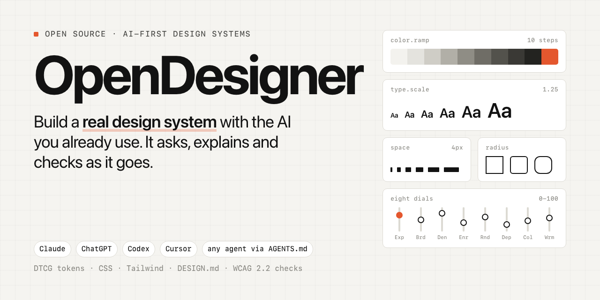
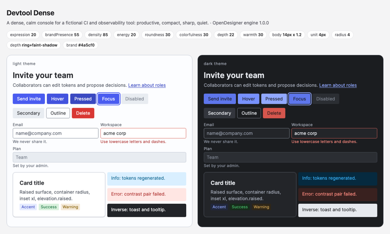
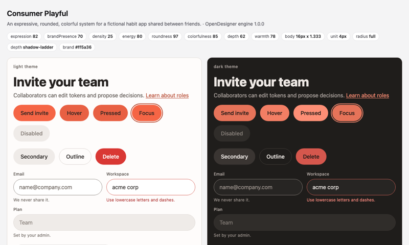
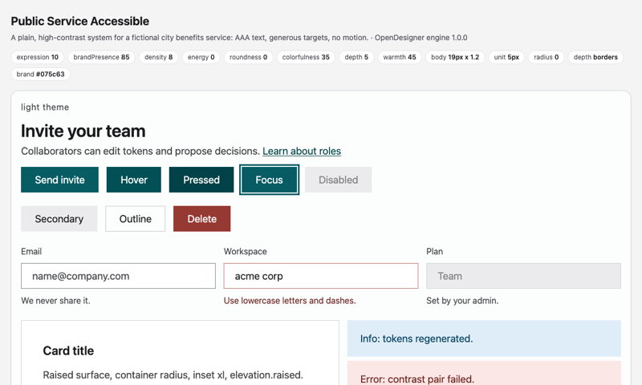

# OpenDesigner

**Make your app look good and stay consistent, with the AI you already use.**

OpenDesigner is a free, open-source helper for AI tools like Claude, ChatGPT and Codex. It helps you make a **design system**: the rules for how your app looks, such as colors, text sizes, spacing, corners and buttons. It asks simple questions one at a time, shows you choices you can see, and explains new words in plain language.

**What you get:** your rules saved as files in your project, a `DESIGN.md` page that explains them, and a preview page. About 5 questions give you a complete set that works. Go deeper only where you want to.

**To start:** add OpenDesigner to your AI tool ([Quickstart](#quickstart)), then say **"Create a design system for this project."**

- **Designers:** it does the repetitive system work: scales, tokens, states and accessibility checks. It asks you for the parts only you should make, like the logo.
- **Engineers:** each decision becomes DTCG design tokens, CSS variables, a Tailwind theme and a `DESIGN.md` that your code and AI agents can follow.

[](https://github.com/ckryptickunal/OpenDesigner/actions/workflows/ci.yml) [](LICENSE)



[Quickstart](#quickstart) · [How it works](docs/HOW-IT-WORKS.md) · [Glossary](docs/GLOSSARY.md) · [FAQ](docs/FAQ.md) · [The research](docs/RESEARCH.md) · [Privacy](docs/PRIVACY.md) · [Report a problem](#report-a-problem-or-suggest-an-improvement) · [Contributing](CONTRIBUTING.md)

## Quickstart

Pick your tool.

**Claude Code:** install the plugin from this repo's marketplace.

```
/plugin marketplace add ckryptickunal/OpenDesigner
/plugin install opendesigner@opendesigner
```

**Claude app** (claude.ai or Desktop): build the skill zip, then upload `dist/opendesigner.zip` under Customize > Skills. Code execution must be on.

```bash
git clone https://github.com/ckryptickunal/OpenDesigner && cd OpenDesigner
python3 tools/build_dist.py        # writes dist/opendesigner.zip and the three helper skills
```

**Codex, Cursor, VS Code with Copilot, Gemini CLI and other agents:** these read Agent Skills from `.agents/skills/`. Copy the four skills into your project. Hosts that support Agent Plugins can also read the root `plugin.json`.

```bash
git clone https://github.com/ckryptickunal/OpenDesigner
mkdir -p your-project/.agents/skills
cp -R OpenDesigner/.agents/skills/opendesigner* your-project/.agents/skills/
```

**ChatGPT** (web, any plan, nothing to install):
1. Create a Project.
2. Paste [`chatgpt-project/instructions.md`](chatgpt-project/instructions.md) (the part below its line) into the Project instructions.
3. Upload the five files in [`chatgpt-project/knowledge/`](chatgpt-project/knowledge/).

Then say: **"Create a design system for this project."**

> **Status:** the skills, engine, manifests and ChatGPT bundle are all in the repo. The Claude plugin manifests pass `claude plugin validate`. See [Status and roadmap](#status-and-roadmap).

## Start small, zoom in when you need to

There are four zoom levels. Nobody picks a mode: everyone starts with the sketch.

1. **Sketch.** About 5 questions, in about 3 minutes. You already get a complete, working system.
2. **Broad.** One short screen for each main area: 8 questions, about 8 minutes.
3. **Defined.** Pick one area, such as color, text, spacing, buttons or motion, and set it with real values.
4. **Detailed.** Components, patterns and the fine print of each area.

Stop whenever it's enough. Every level leaves you with files that work. Each choice is shown, explained and comes with a recommendation.

New words come in three voices: plain words first, then the designer's word and the code name on one line. All 397 terms are in the [glossary](docs/GLOSSARY.md).

## What it does

Most AI tools can make one screen look fine. Keeping a whole product consistent needs a design system. That means a spacing scale, a type scale, colors with clear roles, corner radius, shadows and motion. It also means button and form states, accessibility rules, and the reason behind each one.

OpenDesigner is an open-source AI design system generator that walks you through building one. It comes as Agent Skills: folders of instructions an AI tool reads. The same Claude skill also runs in Codex, ChatGPT, Cursor and other agents.

- **It makes what can be made well:** spacing, type, color ramps, corner radius, elevation, motion and states.
- **It asks you for what can't be:** a logo, custom icons, illustration, photography or a brand typeface. It never fakes these.
- **It learns from examples you like.** Add a website, screenshot or Figma file at any point. OpenDesigner borrows its structure and quality, never its brand.
- **Its advice comes from research you can check.** The research has 352 Decision Cards across 18 research lanes and 2,740 logged sources. It also tears down 25 public design systems (Material, Apple HIG, Carbon, Fluent, Polaris, Primer, shadcn/ui and more).
- **Code checks the result before you see it:** contrast (WCAG 2.2), touch-target sizes and scales.
- **Every decision is written down with its reason.** Your team and the next AI session can extend the system without breaking it.
- **A private log of your steps, if you say yes.** It stays on your computer and shows where the questions slow you down ([journey tracker](docs/JOURNEY-TRACKER.md)).
- **Sharing is a separate yes.** Only then does it send the maintainers an anonymous summary. It never sends your answers, names or files ([privacy](docs/PRIVACY.md)).

## What a session looks like

A shortened example of the flow. It shows the idea; it is not a recorded transcript.

```
You:    Create a design system for this project.
Model:  I read package.json (Next.js, Tailwind) and app/globals.css (14 colors, 3 radii).
        No DESIGN.md yet. Let's start with a 5-question sketch; you can zoom in after.
        First: what should people remember about this product?
You:    It should feel calm and fast.
        ...
Model:  Sketch done: a complete system with 0 errors. Three directions for
        "calm and fast", light and dark side by side: [A] [B] [C]
You:    B. Now zoom into brand assets.
Model:  Do you have a logo, an icon set or a brand typeface? [checklist]
You:    Logo yes (SVG). No icons, no typeface.
Model:  Logo checked: outlined text, readable at 16 px on light and dark.
        For icons I suggest Lucide (ISC license), matched to your type weight.
        The brand typeface stays a marked placeholder until you have one.
        Updated the tokens, CSS and Tailwind exports, DESIGN.md and the decision log.
```

## How it works

1. **Read first.** The model looks at your repo, CSS, existing tokens and any `DESIGN.md` before it asks anything.
2. **Work from a full map.** Every part of a design system is on one map: 275 nodes in 10 layers. Its 211 building blocks are each tagged as generatable, extractable, tool-assisted, designer-owned or owner input ([glossary](docs/GLOSSARY.md)) [S-V1b-091]. Owner input means a choice only your team can make, such as who the product is for. The model asks it and never invents it.
3. **Ask for what needs a person.** 14 kinds of assets need a human maker: logo, app icon, icons, illustration, photography, brand typeface, sound and more. For each one, the model asks "do you have this?" and checks what you give it. If you don't have it, it writes a designer brief or points to named open libraries with their licenses.
4. **Direction, then foundations.** Personality and platforms come first, because they shape the most. Then color, type, space, shape, depth and motion, one block at a time. Each block shows a live preview, where to use it and where not to.
5. **Learn from references at any step.** Add a website, screenshot, Figma file or brand book. Its values are pre-filled with their source, and you accept or ignore each one.
6. **Check the result.** WCAG 2.2 contrast, target sizes, focus rings and reduced motion are built in, so every generated system meets them. Lint rules and a coverage check follow. Nothing is silently skipped.
7. **Export and extend.** Tokens and docs land in your repo. Later sessions read the decision log before they change anything. At the end of each build, `engine.py review` finds values in your code that skip the tokens, and parts of `DESIGN.md` that are out of date.

The full walkthrough, with a diagram, is in [docs/HOW-IT-WORKS.md](docs/HOW-IT-WORKS.md). The complete product specification is [docs/SPEC.md](docs/SPEC.md).

## What you get

Written into your project, in files any person or AI tool can read:

| Output | For |
|---|---|
| `opendesigner/tokens/` in **DTCG 2025.10** format, with modes (light, dark and more) in one resolver file | The single source of truth for code and design tools |
| CSS variables and a **Tailwind** theme | Use the system in web code right away, including shadcn/ui |
| **Figma** variables and **Paper** tokens | Mirror the system in your design tool |
| **Swift** and **Jetpack Compose** files | Native iOS and Android apps |
| `DESIGN.md` | A readable description of the system that people and AI tools can follow |
| `decisions.md` | Every decision with its reason, source and how it was set, append-only |
| `state.json` and `preview.html` | Continue later; see every token and the core components on one page |
| A snippet for your `AGENTS.md` and a team summary | Every later agent reads the system first; your team sees what was chosen, why, and what is still open |

The full output contract is in [docs/SPEC.md](docs/SPEC.md#7-outputs). [Status and roadmap](#status-and-roadmap) says what has shipped.

## The eight dials

A dial is a slider from 0 to 100. Eight dials, plus a few raw inputs (brand color, typeface, base size, platforms, contrast target), set most of the look. Brand words like "playful" or "premium" move several dials at once.

| Dial | From | To |
|---|---|---|
| Expression | productive | expressive |
| Brand presence | native to the platform | brand-led |
| Density | spacious | compact |
| Energy | calm | energetic |
| Roundness | sharp | soft |
| Depth | flat | deep |
| Colorfulness | monochrome | vivid |
| Warmth | cool, formal | warm, friendly |

The dials were tested against 13 real systems. Dials plus raw inputs match 6 of them outright: Apple HIG, Fluent 2, Primer, GOV.UK, shadcn/ui and Blade. The other 7 also need one or two overrides or a signature asset. Formulas, recipes and known weak spots: [`synthesis/LEVERS.md`](synthesis/LEVERS.md).

## Questions people ask

- **How do I create a design system with AI?** Load OpenDesigner into your AI tool and ask for one. It interviews you and writes the tokens and docs. [More](docs/FAQ.md#how-do-i-create-a-design-system-with-ai)
- **How do I make my app look designed without a designer?** Consistency does most of the work. Use one spacing scale, a small type scale, colors with roles and one radius family. OpenDesigner makes and checks those. [More](docs/FAQ.md#how-do-i-make-my-app-look-designed-without-a-designer)
- **What are design tokens, and what is DTCG?** Tokens are design decisions with names, stored as data. DTCG is the W3C Community Group format for them (stable version 2025.10). [More](docs/FAQ.md#design-tokens-and-dtcg)
- **Does it work with Tailwind, shadcn/ui and Figma?** Yes. It exports Tailwind and CSS, shadcn/ui is one of the benchmarked systems, and Figma is both a reference source and an export target. [More](docs/FAQ.md#tools-and-hosts)
- **How is it different from Claude Design, Figma Make or tweakcn?** It is open source and runs in any model. It stores the system in open files and shows the evidence for each decision. [More](docs/FAQ.md#how-it-compares)
- **Is it accessible?** WCAG 2.2 AA contrast, target sizes, focus rings, reduced motion and text scaling are built into every generated system. [More](docs/FAQ.md#accessibility)

## Examples

Three complete systems for made-up products, made only with the engine's own commands. Each folder has `DESIGN.md`, `PRODUCT.md`, the decision log, DTCG tokens, every export and a `preview.html`.

| [Devtool Dense](examples/devtool-dense/) | [Consumer Playful](examples/consumer-playful/) | [Public Service Accessible](examples/public-service-accessible/) |
|---|---|---|
|  |  |  |
| Calm, compact, sharp: a CI console | Expressive, rounded, colorful: a habit app | Plain, high contrast, no motion: a benefits service |

Try the engine on its own, with no AI (Python 3.10+, nothing to install). This makes a sketch from a name and two feeling words:

```bash
python3 path/to/OpenDesigner/skills/opendesigner/scripts/engine.py sketch --name "Acme" --feel friendly,minimal
```

To use only the sourced defaults, run `init` and then `build` instead:

```bash
python3 path/to/OpenDesigner/skills/opendesigner/scripts/engine.py init --name "Acme"
python3 path/to/OpenDesigner/skills/opendesigner/scripts/engine.py build
```

Either way, it writes `DESIGN.md`, `PRODUCT.md` and an `opendesigner/` folder with tokens, exports and a preview.

## The research behind it

OpenDesigner's defaults are not taste. They come from this repo's research, which anyone can check:

| | |
|---|---|
| Research lanes finished | **18** (color, typography, space and layout, shape and motion, icons and data viz, brand and voice, tokens and Figma, components, benchmark, platforms, process and governance, UX laws, device classes, visual principles, tooling, how systems get made, AI distribution, community signal) |
| Decision Cards | **352**, each with options, visual effect, dependencies, token encoding, platform notes, accessibility limits and a default |
| Sources logged | **2,740** by the research lanes (3,225 in all, with the sponsorship research and the verification pass). Each was opened and logged with its URL, publisher, date, tier and verdict, including the rejected ones |
| Design systems benchmarked | **25**, with real values in 12 dimension tables |
| Interview | **193** questions on 27 screens (6 marked planned and skipped until their feature exists), ordered by a decision graph of 352 decisions and 470 dependencies |
| Independent check | **161** claims re-checked against live sources: 134 confirmed, 19 partly right, 5 wrong, 3 unverifiable. Fixes are in [`synthesis/VERIFICATION.md`](synthesis/VERIFICATION.md) |

Start with [docs/RESEARCH.md](docs/RESEARCH.md). Every claim cites a source id or says `[inferred]`. Running `python3 tools/jev_nav.py check` confirms that every cited source is logged.

## Report a problem or suggest an improvement

OpenDesigner gets better each time someone says what went wrong.

- **While you use it:** when your AI finds a gap, a bug or a confusing step, it records it with `engine.py feedback`. You can also run it yourself:

  ```bash
  python3 path/to/OpenDesigner/skills/opendesigner/scripts/engine.py feedback "the spacing question was confusing" --kind confusing
  ```

  It saves the note in `opendesigner/feedback.md` and prints a ready-to-file GitHub issue link. Kinds are `gap`, `bug`, `confusing` and `idea`. Nothing is posted until you open the link and submit it.
- **On GitHub:** [open an issue](https://github.com/ckryptickunal/OpenDesigner/issues/new/choose) and pick the form that fits, or ask in [Discussions](https://github.com/ckryptickunal/OpenDesigner/discussions).

## Status and roadmap

| Piece | Status |
|---|---|
| Research base (18 lanes), synthesis (ontology, interview, dials, decision graph) and [product specification](docs/SPEC.md) | Done |
| Independent verification of the research (V1) | Done: 161 claims checked, 49 corrections applied in the first pass ([`synthesis/VERIFICATION.md`](synthesis/VERIFICATION.md)) |
| Four skills (`opendesigner`, `-extract`, `-extend`, `-export`), knowledge files and 8 visual templates | First version in [`skills/`](skills/) |
| Host packaging: Claude plugin and marketplace, Agent Plugins `plugin.json`, claude.ai zips, ChatGPT Project bundle | In the repo; Claude manifests pass `claude plugin validate` |
| Engine: generate, validate, export (DTCG, CSS, Tailwind, Figma, Paper, Swift, Compose) | Works: [`engine.py`](skills/opendesigner/scripts/engine.py) `build` writes every format; 25 engine tests pass |
| Zoom levels (a 5-question sketch first), the three-voice glossary (397 terms), and `engine.py feedback` for reporting gaps | Works: `engine.py sketch`, `review` and `feedback`; glossary in [docs/GLOSSARY.md](docs/GLOSSARY.md) |
| Journey tracker (a private step log) and opt-in anonymous sharing | Works: the AI asks first, then the engine and the AI log each step ([`journey.py`](skills/opendesigner/scripts/journey.py)). No server collects reports yet ([privacy](docs/PRIVACY.md)) |
| Worked examples | 3 in [`examples/`](examples/) |
| Figma hands-on research (L12) | Open, [help wanted](docs/SEED-ISSUES.md) |
| Figma and Paper round-trip writers | Planned, last step of phase 1 |
| Phase 2: a stateless MCP server with MCP Apps views, so choices can be clicked inside Claude, ChatGPT, VS Code and Cursor | Planned |
| Phase 3 (optional): a standalone visual canvas | Idea |

## Contributing

All kinds of help are welcome: research corrections, new building blocks, better skills and questions, support for more AI tools, translations and examples. Start with [CONTRIBUTING.md](CONTRIBUTING.md) and the [good first issues](https://github.com/ckryptickunal/OpenDesigner/labels/good%20first%20issue). Most are research gaps with the file and sources already named.

Many people and AI sessions build OpenDesigner at the same time. They coordinate through plain files in this repo: a board of lanes, heartbeats, an inbox and an append-only decision log. [`_coordination/PROTOCOL.md`](_coordination/PROTOCOL.md) explains it, and `python3 tools/od.py status` shows who is working on what.

Questions go to [Discussions](https://github.com/ckryptickunal/OpenDesigner/discussions); see [SUPPORT.md](SUPPORT.md). Everyone follows the [Code of Conduct](CODE_OF_CONDUCT.md). For security issues, see [SECURITY.md](SECURITY.md).

## Sponsors

OpenDesigner is free and open source. Sponsorship pays for maintenance, model credits for testing across AI hosts, and the hosted MCP server. [Sponsor OpenDesigner](docs/SPONSORSHIP.md#for-sponsors)

<!-- Partners: large logos. Companies: small logos. Backers: names. Supported by: in-kind credit programs (never leave the wall empty). -->
<!-- When GitHub Sponsors is approved, point the link above at https://github.com/sponsors/ckryptickunal (see docs/SPONSORSHIP.md). -->

## License

Code, skills, templates and data files are under the [MIT license](LICENSE). Written research and documentation are under [CC BY 4.0](LICENSE-CONTENT), so you can reuse them with credit. That covers `research/`, `benchmarks/`, `sources/`, `traces/`, `synthesis/` Markdown and `docs/`. Product and design-system names in the research belong to their owners.

## Citation

If OpenDesigner or its research helps your work, cite it with [CITATION.cff](CITATION.cff). GitHub's "Cite this repository" button uses it.
