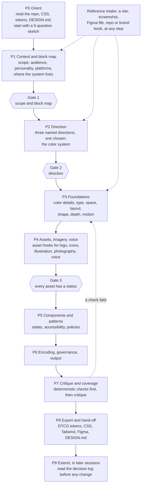

# How OpenDesigner works

OpenDesigner turns your AI assistant into a patient design-system partner. You load it into the tool you already use (Claude, ChatGPT, Codex, Cursor and others). Then the model:

- reads what you already have;
- asks only the questions that matter for your product, starting with a 5-question sketch;
- shows each choice visually where your tool allows it;
- writes the result into your repo as design tokens, a `DESIGN.md` and a decision log.

It does not replace a designer. It makes what can be made well: spacing, type scales, color ramps, radii, elevation, motion and component states. It asks you for what can't be: a logo, custom icons, illustration, photography or a brand typeface. It records every decision with its reason, so your team, a designer or the next AI session can pick it up.

This page is the easy-to-read version. The full product specification is [SPEC.md](SPEC.md), and [RESEARCH.md](RESEARCH.md) maps the evidence behind each step. Unfamiliar words are in the [glossary](GLOSSARY.md).

## The process at a glance

The diagram shows the full process from the specification: ten phases. Three of them end at a gate, where you approve before the model moves on. In practice, the skill starts with a 5-question sketch (section 2). Then, for each area you zoom into, it asks questions in this order.

Each phase groups screens of the interview in [`synthesis/QUESTIONNAIRE.md`](../synthesis/QUESTIONNAIRE.md). The screens follow the decision graph, so nothing is asked before the decisions it depends on. There are zero ordering violations across 470 dependencies. Details: [SPEC.md section 3](SPEC.md#3-the-process-as-a-model-runs-it).

## 1. Define the building blocks first

The model works from a map of everything a design system contains. The map has ten layers: context, principles, foundations, tokens, components, patterns, guardrails, delivery, governance, and the builder surface itself. It is [`synthesis/ontology.json`](../synthesis/ontology.json) (275 nodes), with a readable version in [`synthesis/ONTOLOGY.md`](../synthesis/ONTOLOGY.md).

The map has 211 building blocks outside the builder layer. Each one is tagged with who or what should make it [S-V1b-091]:

| Class | Blocks | What the model does |
|---|---|---|
| **Generatable** | 156 | Works it out from your inputs and the dials, shows it visually, lets you adjust |
| **Tool-assisted** | 23 | Recommends a named tool or library with its caveat (license, plan, platform) |
| **Owner input** | 21 | A choice only your team can make, such as scope, platforms, principles or governance. It asks you and never invents an answer |
| **Designer-owned** | 9 | Needs a human maker, such as a logo, photography, illustration, custom icons, sound or a voice guide. It opens an asset hook (below) |
| **Extractable** | 2 | Reads it from your existing product or files, and asks you to confirm |

These counts come from `ontology.json`, which is the canonical sorting (decided on 2026-09-24). Across all 275 nodes the counts are 208 generatable, 26 tool-assisted, 27 owner input, 11 designer-owned and 3 extractable. The L17 research sorted an earlier map of 207 blocks into the same five classes. Its counts were 135 generatable, 31 tool-assisted, 29 owner input, 7 designer-owned and 5 extractable [S-V1b-091].

Every block always shows a status: pending, default, decided, not applicable, awaiting asset, or assumed. Some blocks don't apply, like haptics for a web-only product. These are marked "not applicable" with a reason. The coverage check then counts them as decided, not missing.

## 2. Zoom levels: start with a sketch, go deeper where it matters

You start with a rough version of the whole system. Then you zoom in only where you need to. Nobody picks a mode.

| Level | Name | What you get | Rough size |
|---|---|---|---|
| 0 | sketch | A complete but coarse system: every token exists, and every `DESIGN.md` section is filled from sourced defaults | 5 questions, about 3 minutes |
| 1 | broad | One short screen for each foundation: style, density, color use, text, corners, depth, motion, and where the files live | 8 questions, about 8 minutes |
| 2 | defined | One area at a time, for example Color: ramps, roles, contrast | 1 to 15 questions per area |
| 3 | detailed | Components, patterns and the fine print of each area | the rest |

You can stop at any level. Every level leaves working files, and `DESIGN.md` shows how far each area has been zoomed. Each of the 193 questions has a zoom level, except the reference panel (Q-ref-01), which is open at every level. Six questions are marked planned: their feature is not built yet, so the interview skips them. The questionnaire also keeps its earlier Quick, Standard and Expert tags (10, 93 and 192 questions).

Every term is explained in three voices. Plain words come first, so a school student can follow. The designer's word and the code name sit on one line below. The [glossary](GLOSSARY.md) lists them all.

The model slows down on the decisions that shape the most others. In the decision graph, brand personality directly shapes 15 other decisions, and target platforms shape 12. It moves quickly through safe defaults.

For a high-impact question, the model:
- explains why it matters;
- shows two or three options, with real systems that use them;
- recommends one, with its source;
- says what it changes further down.

For a low-impact gap, it takes the default and labels it as an assumption instead of asking. It asks one question per message.

Every answer is recorded with how it was set. For example: chosen, confirmed default, automatic default, delegated ("you decide"), assumed, or from a reference. A recommendation you did not answer is never recorded as your decision.

## 3. Asset hooks: ask, don't fake

Some blocks can't be generated well. For each one, the model asks "do you have this?" (an asset hook). If you do, it accepts the file in useful formats and checks it. If you don't, it offers honest paths:

- commission a designer, with a written brief that carries your tokens and direction;
- use a named open library or tool, with its license terms;
- leave a placeholder slot with a brief.

A placeholder is labeled as a placeholder everywhere it appears.

There are 14 asset hooks: logo and lockups, app icon, favicon set, custom icons, illustration, photography and brand typeface. The rest are fixed brand colors, motion signature, graphic motifs, UI sounds, custom haptics, voice and tone guide, and brand book. [SPEC.md section 4](SPEC.md#4-building-block-classes-and-hooks) lists each one's formats, checks and fallbacks.

## 4. The eight dials

A dial is a slider from 0 to 100, and 50 is a sensible default. Eight dials, plus a few raw inputs (brand color, typeface, base size, platforms, contrast target), set most of the look. Three dials set the overall stance. The other five tune the character, and they follow the first three until you move them.

| Dial | 0 end | 100 end | Mainly changes |
|---|---|---|---|
| **Expression** | productive | expressive | type scale ratio, emphasis budget, hero moments, where expressive motion appears |
| **Brand presence** | native to the platform | brand-led | typeface choice, where brand color appears, share of native components |
| **Density** | spacious | compact | body size, control heights, spacing |
| **Energy** | calm | energetic | motion duration and bounce, saturation |
| **Roundness** | sharp | soft | the radius scale |
| **Depth** | flat | deep | borders, rings, tonal layers, shadows, materials |
| **Colorfulness** | monochrome | vivid | chroma of ramps and surfaces |
| **Warmth** | cool, formal | warm, friendly | neutral temperature, border softness |

Brand words such as "playful" or "premium" move several dials at once. Style presets (flat, tonal, glass, neo-brutalist) are named dial settings.

The dials were tested against 13 real systems. They are Material 3 Expressive, Apple HIG, Carbon, Fluent 2, Polaris, Atlassian, Primer, GOV.UK, shadcn/ui, Linear, Geist, Blade and Airbnb. Dials plus raw inputs reproduce the signature look of 6 of them outright. The other 7 need one or two overrides or a signature asset. The dial values were set by reading the same benchmark. So this shows the mapping is consistent, not that it predicts systems it has not seen.

Formulas, recipes and their weak spots are in [`synthesis/LEVERS.md`](../synthesis/LEVERS.md). The engine uses the machine-readable version, [`synthesis/levers.json`](../synthesis/levers.json).

Some things the model never decides for you. It asks you and records your answer for:
- your brand personality and dial positions;
- which element matters most on each screen;
- which actions get undo or confirmation.

## 5. Visual-first editing, on the best surface your tool has

Each generatable block gets a detail panel. It shows:
- what the block is, where to use it and where not to;
- its current value and source;
- a live preview on real components in every mode (light, dark, compact, reduced motion);
- which other blocks change if it changes.

The panel teaches as you edit.

How it is shown depends on your AI tool. The model picks the best option available, starting from the top of this list, and says which one it is using. It never waits on a visual to move on.

1. An OpenDesigner MCP App view (planned, Phase 2)
2. HTML the host renders: Claude custom visuals and artifacts, Claude Code artifacts, the Codex desktop browser
3. Figma or Paper, through their MCP servers
4. A local HTML preview file you open in a browser
5. The host's multiple-choice question tool
6. Plain text with hex values, ratios and numbered options, which works everywhere

The same HTML templates feed every surface: palette, type scale, spacing ruler, radius, elevation, motion, component sheet and option gallery. Every visual also prints its values as text. [SPEC.md section 3.6](SPEC.md#36-visual-surfaces-per-host) says which host gets which surface.

## 6. Reference intake, at any point

You can add an example website, screenshot, Figma file, repo or brand book whenever you like. Each reference is tagged as "our product", "inspiration" or "competitor".

The model measures what it can: color, type, spacing, radius, depth model, motion character and components. It shows every value with where it came from and how sure it is, then pre-fills it. You accept, adjust or ignore each one. A reference never decides on its own.

Hard rule: a reference gives structure and quality, never identity. OpenDesigner does not copy another brand's name, logo, brand hue, proprietary typeface, imagery or copy. It always asks how brand-led you want to be, instead of guessing from the reference.

## 7. Validate before you trust it

Rule-based checks run first, before the model gives any opinion ([`synthesis/LEVERS.md`](../synthesis/LEVERS.md) section D). They give the same result every time. Breaking an accessibility rule is an error; breaking a taste rule is a warning.

- **Built in**, so every generated system meets them:
  - WCAG 2.2 AA text contrast: 4.5:1 for body text, 3:1 for large text.
  - 3:1 contrast for borders, focus rings and other non-text parts.
  - Minimum target sizes for each input type: 24 CSS px on the web, 44pt on iOS, 48dp on Android.
  - A generated focus ring.
  - Reduced-motion and reduced-transparency modes.
  - Text that scales to 200%.
  - Inner spacing smaller than outer spacing.
- **Lint errors** block publishing unless you waive them with a written reason. Examples: targets under 24 px, fields with no label, meaning shown by color alone, and dialogs with no way out.
- **Warnings** you can override. Examples: too many type sizes or primary actions in one view, or very high colorfulness with high density. These come from practitioner advice and are labelled as guidance, not law.

The model critiques the system only after it passes, using a rubric fixed in advance. Then a coverage check shows every block's status. Nothing is silently skipped.

## 8. Export, and what lands in your repo

The source of truth is `opendesigner/state.json` plus the DTCG tokens made from it. Everything else is generated from them.

| Output | What it is for |
|---|---|
| `DESIGN.md` (project root) | The readable view of the system that you, your team and any AI tool can follow |
| `PRODUCT.md` (project root) | Product truth: audience, purpose, surfaces, principles |
| `opendesigner/tokens/` | DTCG 2025.10 design tokens (the canonical format), with modes in one resolver file |
| CSS variables, Tailwind theme | Use in web code right away, including shadcn/ui |
| Figma variables, Paper tokens | Mirror the system in your design tool |
| Swift and Jetpack Compose | Native apps |
| `opendesigner/decisions.md` | Every decision with its reason, source and what it changed, append-only |
| `opendesigner/RATIONALE.md` | One page for the team: what was chosen, why, and what is still open |
| `opendesigner/coverage.md`, asset briefs | Every block's status; briefs a designer can act on |
| `opendesigner/state.json`, `preview.html` | Continue later; see every token and the components on one page |

This is the full contract from [SPEC.md section 7](SPEC.md#7-outputs). Today the engine writes the core set: tokens, exports, `DESIGN.md`, `PRODUCT.md`, the decision log, `state.json` and the preview. The skill also writes `RATIONALE.md` from a template and, if you agree, adds a snippet to your `AGENTS.md`. The README's status table says what has shipped.

## 9. Keeping it coherent later

You may come back later to change something, maybe in a different AI tool. The extend flow (the `opendesigner-extend` skill) first reads `DESIGN.md`, the tokens and the decision log. It shows the change on the block's detail panel, with everything further down that it touches. Then it records the change as a new decision that replaces the old one. Locked decisions change only with your consent.

The engine gives the same result every time: the same `state.json` makes the same tokens on any machine. That is what lets different models extend the same system without drift. Details: [SPEC.md section 9](SPEC.md#9-harmony-and-extension-across-sessions-and-models).

## 10. When something is missing

The model may find a gap, a bug or a confusing step while it works in your project. If so, it writes it down with `engine.py feedback`. That saves the note in `opendesigner/feedback.md` and prepares a ready-to-file issue link for this repository. Nothing is posted unless you submit it.

Inside this repository, fixes go straight into the source files, then get checked and synced. See [CONTRIBUTING.md](../CONTRIBUTING.md#the-self-improvement-loop).

## 11. Your steps and your privacy

If you say yes, the model keeps a private log of your steps on your computer. It notes which questions came up, how long they took, and where you got stuck. A report from it shows where the questions can get shorter. Details: [JOURNEY-TRACKER.md](JOURNEY-TRACKER.md).

Sending an anonymous summary to the maintainers is a separate yes. It never includes your answers, names, files or anything you typed. No server collects reports yet. Details: [PRIVACY.md](PRIVACY.md).
