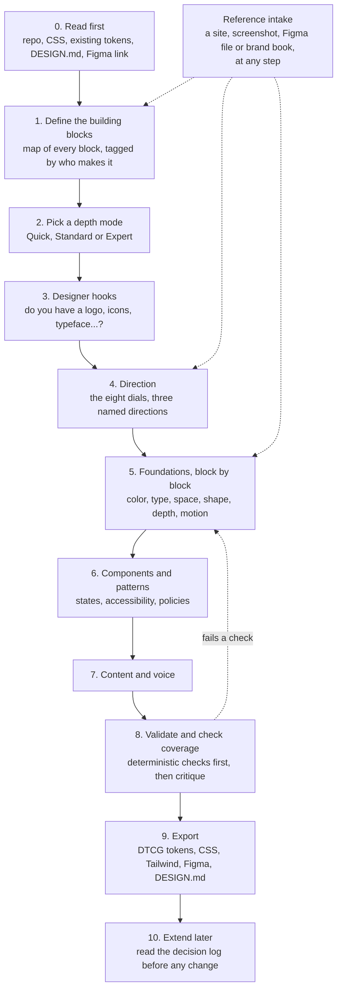

# How OpenDesigner works

OpenDesigner turns your AI assistant into a patient design-system partner. You load it into the tool you already use (Claude, ChatGPT, Codex, Cursor and others). The model reads what you already have, shows you the building blocks of a design system, asks only the questions that matter for your product, shows each choice visually where your tool allows it, and writes the result into your repo as design tokens, a `DESIGN.md` and a decision log.

It does not replace a designer. It generates what can be generated well (spacing, type scales, color ramps, radii, elevation, motion, component states), asks you for what cannot (logo, custom icons, illustration, photography, a brand typeface), and records every decision with its reason so your team, a designer or the next AI session can pick it up.

This page explains the process. The full product specification is being written in `synthesis/OPENDESIGNER-SPEC.md` (copied to `docs/SPEC.md` when it is final). The evidence behind each step is mapped in [RESEARCH.md](RESEARCH.md).

## The process at a glance

The stages come from [`research/L17-how-systems-get-made.md`](../research/L17-how-systems-get-made.md) Part I. The question order inside them comes from the decision graph, so nothing is asked before the decisions it depends on.

## 1. Define the building blocks first

Before any color or font question, the model shows the whole map of what a design system contains, in ten layers: context, principles, foundations, tokens, components, patterns, guardrails, delivery, governance, and the builder surface itself. The map is [`synthesis/ontology.json`](../synthesis/ontology.json) (271 nodes; readable version in [`synthesis/ONTOLOGY.md`](../synthesis/ONTOLOGY.md)).

Each design-system block is tagged with who or what should produce it. Of the 207 blocks classified in L17:

| Class | Blocks | What the model does |
|---|---|---|
| **Generatable** | 135 | Derives it from your inputs and the dials, shows it visually, lets you adjust |
| **Tool-assisted** | 31 | Recommends a named tool or library with its caveat (license, plan, platform) |
| **Owner input** | 29 | Asks you, because only your team can decide it (scope, platforms, governance) |
| **Designer-owned** | 7 | Opens a designer hook (below) |
| **Extractable** | 5 | Reads it from your existing product or files, and asks you to confirm |

Blocks that do not apply (haptics for a web-only product, say) are marked "not applicable" with a reason, so the coverage check counts them as decided instead of missing.

## 2. Depth modes: time goes where it matters

| Mode | Questions | For |
|---|---|---|
| **Quick** | 10 | "Give me a complete system in a few minutes." Everything else takes a sourced default and stays editable. |
| **Standard** | 92 | An engineer setting up a real product's system |
| **Expert** | 191 | Design-system leads, multi-platform or multi-brand systems |

The questions sit on 27 screens in dependency order, plus a reference panel that is open on every screen ([`synthesis/questionnaire.json`](../synthesis/questionnaire.json)). The model slows down on decisions with the most downstream effect in the decision graph (brand personality affects 15 decisions directly, target platforms 12) and moves quickly through safe defaults. For a high-impact question it explains why it matters, shows two or three options with real systems that use them, recommends one with its source, and says what it changes downstream. For a low-impact one it states the default in one line and asks you to confirm.

Every answer is recorded with how it was set: chosen, confirmed default, automatic default, or from a reference. A recommendation you did not answer is never recorded as your decision.

## 3. Designer hooks: ask, do not fake

Some blocks cannot be generated well. For each, the model asks "do you have this?", accepts the file in useful formats, checks it, and, if the answer is no, offers honest paths: commission a designer (with a written brief), use a named open library or tool (with its license terms), or leave a briefed placeholder slot. A generated stand-in is never presented as a finished brand asset.

The asset hooks from L17 Part H: logo and lockups, app icon, favicon set, custom icons, illustration, photography, brand typeface, fixed brand colors, motion signature, graphic motifs, UI sounds, custom haptics, voice and tone guide, and brand book.

## 4. The eight dials

A handful of raw inputs (brand color, typeface, base size, platforms, contrast target) plus eight dials, each 0 to 100, generate most of the look. 50 is a sensible default. Three dials set the posture; five tune character and follow the first three until you touch them.

| Dial | 0 end | 100 end | Mainly changes |
|---|---|---|---|
| **Expression** | productive | expressive | type scale ratio, emphasis budget, hero moments, where expressive motion appears |
| **Brand presence** | native to the platform | brand-led | typeface choice, where brand color appears, share of native components |
| **Density** | spacious | compact | body size, control heights, spacing |
| **Energy** | calm | energetic | motion duration and bounce, saturation |
| **Roundness** | sharp | soft | the radius scale |
| **Depth** | flat | deep | borders, rings, tonal layers, shadows, materials |
| **Colorfulness** | monochrome | vivid | chroma of ramps and surfaces |
| **Warmth** | cool, formal | warm, friendly | neutral temperature, border softness |

Brand adjectives such as "playful" or "premium" are macros that move several dials at once, and style presets (flat, tonal, glass, neo-brutalist) are named dial settings. The dials were tested against 13 real systems (Material 3 Expressive, Apple HIG, Carbon, Fluent 2, Polaris, Atlassian, Primer, GOV.UK, shadcn/ui, Linear, Geist, Blade and Airbnb): dials plus raw inputs reproduce the signature of 6 of them outright, and the other 7 need one or two overrides or a signature asset. The dial values were set by reading the same benchmark, so this shows the mapping is consistent, not that it predicts unseen systems. Formulas, recipes and their weak spots are in [`synthesis/LEVERS.md`](../synthesis/LEVERS.md); the machine-readable version the engine uses is [`synthesis/levers.json`](../synthesis/levers.json).

Some things the model never decides for you: your brand personality and dial positions, which element matters most on each screen, and which actions get undo or confirmation. It asks and records those.

## 5. Visual-first editing, on the best surface your tool has

Each generatable block gets a detail panel: what it is, where to use it, where not to, its current value and source, a live preview on real components in every mode (light, dark, compact, reduced motion), and which other blocks change if it changes. The interface teaches as you edit.

How that is shown depends on the host. The model picks the highest rung available and says which one it is using ([DC-L18-06](../research/L18-ai-first-distribution.md)):

1. An OpenDesigner MCP App view (planned, phase 2)
2. The host's canvas or artifact (for example Claude artifacts and custom visuals)
3. Figma or Paper, through their MCP servers
4. A local HTML preview file the model writes and you open
5. The host's multiple-choice question tool
6. Plain text with hex values and numbered options, which works everywhere

It never blocks on a visual.

## 6. Reference intake, at any point

You can add an example website, screenshot, Figma file, repo or brand book whenever you like. Each reference is tagged as "our product", "inspiration" or "competitor". The model extracts what it can (color, type, spacing, radius, depth model, motion character, components), shows every value with its provenance and confidence, and pre-fills; you accept, adjust or ignore each one.

Hard rule: a reference contributes structure and quality, never identity. OpenDesigner does not copy another brand's logo, name, brand color as identity, proprietary typeface, photography, illustration or copy.

## 7. Validate before you trust it

Deterministic checks run before any model critique ([`synthesis/LEVERS.md`](../synthesis/LEVERS.md) section D):

- **Enforced by construction:** WCAG 2.2 AA text contrast (4.5:1 body, 3:1 large), 3:1 non-text contrast for borders and focus rings, minimum target sizes keyed to input type (24 CSS px on the web, 44pt iOS, 48dp Android), a generated focus ring, reduced-motion and reduced-transparency modes, text that scales to 200%, inner spacing smaller than outer spacing.
- **Lint errors** that block publishing unless waived with a written reason: targets under 24 px, fields with no label, meaning shown by color alone, dialogs with no way out.
- **Warnings** you can override: too many type sizes or primary actions in one view, very high colorfulness with high density, and similar practitioner guidance, labelled as guidance rather than law.

Then a coverage check shows every block as decided, defaulted, not applicable or pending. Nothing is silently skipped.

## 8. Export, and what lands in your repo

| Output | What it is for |
|---|---|
| `tokens/` | DTCG 2025.10 design tokens (the canonical format), with modes in a resolver file |
| CSS variables, Tailwind theme | Use in web code right away |
| Figma variables, Paper tokens | Mirror the system in your design tool |
| Swift and Jetpack Compose | Native apps |
| `DESIGN.md` | The readable view of the system that you, your team and any AI session can read |
| `decisions.md` | Every decision with its reason, source and what it changed |
| `state.json` | Your answers and dial values, so a later session can continue |
| `preview.html` | A specimen of every token and a few components |

The export targets follow the engine contract in [`_coordination/REPO-PLAN.md`](../_coordination/REPO-PLAN.md). Check the README's status section for which exporters have shipped.

## 9. Keeping it coherent later

When you come back to change something, the extend flow reads `DESIGN.md`, the tokens and the decision log first, shows the change on the block's detail panel with everything downstream it touches, and records the change as a new decision. Changing the overall direction needs your explicit confirmation. This is what keeps the system harmonious months later, across different people and different AI tools.
