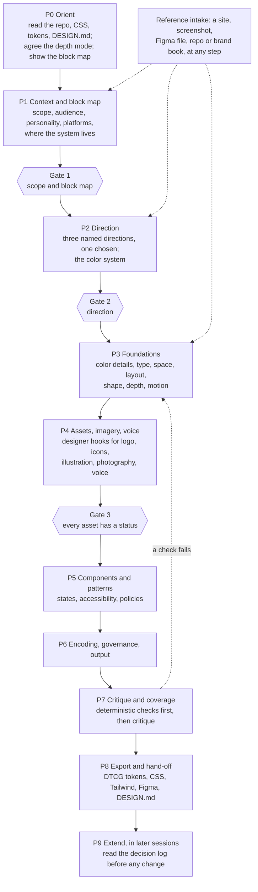

# How OpenDesigner works

OpenDesigner turns your AI assistant into a patient design-system partner. You load it into the tool you already use (Claude, ChatGPT, Codex, Cursor and others). The model reads what you already have, shows you the building blocks of a design system, asks only the questions that matter for your product, shows each choice visually where your tool allows it, and writes the result into your repo as design tokens, a `DESIGN.md` and a decision log.

It does not replace a designer. It generates what can be generated well (spacing, type scales, color ramps, radii, elevation, motion, component states), asks you for what cannot (logo, custom icons, illustration, photography, a brand typeface), and records every decision with its reason so your team, a designer or the next AI session can pick it up.

This page is the human-friendly version. The full product specification is [SPEC.md](SPEC.md); the evidence behind each step is mapped in [RESEARCH.md](RESEARCH.md).

## The process at a glance

The model runs ten phases. Three of them end at a gate where you approve before it moves on.

Each phase wraps screens of the interview in [`synthesis/QUESTIONNAIRE.md`](../synthesis/QUESTIONNAIRE.md), which are ordered by the decision graph, so nothing is asked before the decisions it depends on (zero ordering violations across 465 dependencies). Quick mode keeps only Gate 2. Details: [SPEC.md section 3](SPEC.md#3-the-process-as-a-model-runs-it).

## 1. Define the building blocks first

Before any color or font question, the model shows the whole map of what a design system contains, in ten layers: context, principles, foundations, tokens, components, patterns, guardrails, delivery, governance, and the builder surface itself. The map is [`synthesis/ontology.json`](../synthesis/ontology.json) (271 nodes; readable version in [`synthesis/ONTOLOGY.md`](../synthesis/ONTOLOGY.md)).

Each of the 207 design-system blocks is tagged with who or what should produce it:

| Class | Blocks | What the model does |
|---|---|---|
| **Generatable** | 135 | Derives it from your inputs and the dials, shows it visually, lets you adjust |
| **Tool-assisted** | 31 | Recommends a named tool or library with its caveat (license, plan, platform) |
| **Owner input** | 29 | Asks you, because only your team can decide it (scope, platforms, governance); never invents an answer |
| **Designer-owned** | 7 | Opens a designer hook (below) |
| **Extractable** | 5 | Reads it from your existing product or files, and asks you to confirm |

Every block always has a visible status: pending, default, decided, not applicable, awaiting asset, or assumed. Blocks that do not apply (haptics for a web-only product, say) are marked "not applicable" with a reason, so the coverage check counts them as decided instead of missing.

## 2. Zoom levels: start with a sketch, go deeper where it matters

You start at low resolution and zoom in only where you need to:

1. **Sketch.** About 5 questions give you a complete, working system with sourced defaults.
2. **Zoom in.** Open any area (color, type, spacing, components, motion) and decide it in more detail.
3. **Stop at any level.** Every level leaves working files, and `DESIGN.md` shows how far each area has been zoomed.

The first release of the skill offers this as three depth modes, which are becoming zoom levels you can move between area by area:

| Mode | Questions | For |
|---|---|---|
| **Quick** | 10 | A first look or a prototype. Everything else takes a sourced default and stays editable; business decisions are stored as "assumed" and confirmed before export. |
| **Standard** | 92 | An engineer setting up a real product's system |
| **Expert** | 191 | Design-system leads, multi-platform or multi-brand systems |

Every term is explained in three voices: plain words first (a school student should follow it), then the designer's term and the engineer's term, one line away. The [glossary](GLOSSARY.md) lists them all.

The model slows down on decisions with the most downstream effect in the decision graph (brand personality directly shapes 15 other decisions, target platforms 12) and moves quickly through safe defaults. For a high-impact question it explains why it matters, shows two or three options with real systems that use them, recommends one with its source, and says what it changes downstream. For a low-impact one it states the default in one line and asks you to confirm, grouping up to three small questions per turn.

Every answer is recorded with how it was set: chosen, confirmed default, automatic default, or from a reference. A recommendation you did not answer is never recorded as your decision.

## 3. Designer hooks: ask, do not fake

Some blocks cannot be generated well. For each, the model asks "do you have this?", accepts the file in useful formats, checks it, and, if the answer is no, offers honest paths: commission a designer (with a written brief that carries your tokens and direction), use a named open library or tool (with its license terms), or leave a briefed placeholder slot. A placeholder is labeled as a placeholder everywhere it appears.

The 14 asset hooks: logo and lockups, app icon, favicon set, custom icons, illustration, photography, brand typeface, fixed brand colors, motion signature, graphic motifs, UI sounds, custom haptics, voice and tone guide, and brand book. Each one's formats, checks and fallbacks are in [SPEC.md section 4](SPEC.md#4-building-block-classes-and-hooks).

## 4. The eight dials

A handful of raw inputs (brand color, typeface, base size, platforms, contrast target) plus eight dials, each 0 to 100, generate most of the look. 50 is a sensible default. Three dials set the posture; five tune character and follow the first three until you touch them.

| Dial | 0 end | 100 end | Mainly changes |
|---|---|---|---|
| **Expression** | productive | expressive | type scale ratio, emphasis budget, hero moments, where expressive motion appears |
| **Brand presence** | native to the platform | brand-led | typeface choice, where brand color appears, share of native components |
| **Density** | spacious | compact | body size, control heights, spacing |
| **Energy** | calm | energetic | motion duration and bounce, saturation |
| **Roundness** | sharp | soft | the radius scale |
| **Depth** | flat | deep | borders, rings, tonal layers, shadows, materials |
| **Colorfulness** | monochrome | vivid | chroma of ramps and surfaces |
| **Warmth** | cool, formal | warm, friendly | neutral temperature, border softness |

Brand adjectives such as "playful" or "premium" are macros that move several dials at once, and style presets (flat, tonal, glass, neo-brutalist) are named dial settings. The dials were tested against 13 real systems (Material 3 Expressive, Apple HIG, Carbon, Fluent 2, Polaris, Atlassian, Primer, GOV.UK, shadcn/ui, Linear, Geist, Blade and Airbnb): dials plus raw inputs reproduce the signature of 6 of them outright, and the other 7 need one or two overrides or a signature asset. The dial values were set by reading the same benchmark, so this shows the mapping is consistent, not that it predicts unseen systems. Formulas, recipes and their weak spots are in [`synthesis/LEVERS.md`](../synthesis/LEVERS.md); the machine-readable version the engine uses is [`synthesis/levers.json`](../synthesis/levers.json).

Some things the model never decides for you: your brand personality and dial positions, which element matters most on each screen, and which actions get undo or confirmation. It asks and records those.

## 5. Visual-first editing, on the best surface your tool has

Each generatable block gets a detail panel: what it is, where to use it, where not to, its current value and source, a live preview on real components in every mode (light, dark, compact, reduced motion), and which other blocks change if it changes. The interface teaches as you edit.

How that is shown depends on the host. The model picks the highest rung available, says which one it is using, and never blocks on a visual:

1. An OpenDesigner MCP App view (planned, Phase 2)
2. HTML the host renders: Claude custom visuals and artifacts, Claude Code artifacts, the Codex desktop browser
3. Figma or Paper, through their MCP servers
4. A local HTML preview file you open in a browser
5. The host's multiple-choice question tool
6. Plain text with hex values, ratios and numbered options, which works everywhere

The same HTML templates (palette, type scale, spacing ruler, radius, elevation, motion, component sheet, option gallery and more) feed every surface, and every visual also prints its values as text. Which host gets which surface: [SPEC.md section 3.6](SPEC.md#36-visual-surfaces-per-host).

## 6. Reference intake, at any point

You can add an example website, screenshot, Figma file, repo or brand book whenever you like. Each reference is tagged as "our product", "inspiration" or "competitor". The model measures what it can (color, type, spacing, radius, depth model, motion character, components), shows every value with its provenance and confidence, and pre-fills; you accept, adjust or ignore each one. A reference never decides on its own.

Hard rule: a reference contributes structure and quality, never identity. OpenDesigner does not copy another brand's name, logo, brand hue, proprietary typeface, imagery or copy, and it always asks how brand-led you want to be rather than inferring it from the reference.

## 7. Validate before you trust it

Deterministic checks run before any model critique ([`synthesis/LEVERS.md`](../synthesis/LEVERS.md) section D). Accessibility rules fail; taste rules warn.

- **Enforced by construction:** WCAG 2.2 AA text contrast (4.5:1 body, 3:1 large), 3:1 non-text contrast for borders and focus rings, minimum target sizes keyed to input type (24 CSS px on the web, 44pt iOS, 48dp Android), a generated focus ring, reduced-motion and reduced-transparency modes, text that scales to 200%, inner spacing smaller than outer spacing.
- **Lint errors** that block publishing unless waived with a written reason: targets under 24 px, fields with no label, meaning shown by color alone, dialogs with no way out.
- **Warnings** you can override: too many type sizes or primary actions in one view, very high colorfulness with high density, and similar practitioner guidance, labelled as guidance rather than law.

Only on a passing system does the model critique it, on a rubric fixed in advance. Then a coverage check shows every block's status. Nothing is silently skipped.

## 8. Export, and what lands in your repo

The canonical source is `opendesigner/state.json` plus the DTCG tokens it generates; everything else is a generated view.

| Output | What it is for |
|---|---|
| `DESIGN.md` (project root) | The readable view of the system that you, your team and any AI tool can follow |
| `PRODUCT.md` (project root) | Product truth: audience, purpose, surfaces, principles |
| `opendesigner/tokens/` | DTCG 2025.10 design tokens (the canonical format), with modes in one resolver file |
| CSS variables, Tailwind theme | Use in web code right away, including shadcn/ui |
| Figma variables, Paper tokens | Mirror the system in your design tool |
| Swift and Jetpack Compose | Native apps |
| `opendesigner/decisions.md` | Every decision with its reason, source and what it changed, append-only |
| `opendesigner/RATIONALE.md` | One page for the team: what was chosen, why, and what is still open |
| `opendesigner/coverage.md`, asset briefs | Every block's status; briefs a designer can act on |
| `opendesigner/state.json`, `preview.html` | Continue later; see every token and the components on one page |

This is the full contract from [SPEC.md section 7](SPEC.md#7-outputs). The first release writes the core set (tokens, exports, `DESIGN.md`, the decision log, `state.json` and the preview, plus a snippet for your `AGENTS.md`); the README's status table says what has shipped.

## 9. Keeping it coherent later

When you come back to change something, possibly in a different AI tool, the extend flow reads `DESIGN.md`, the tokens and the decision log first, shows the change on the block's detail panel with everything downstream it touches, and records it as a new decision that supersedes the old one. Locked decisions change only with your consent. The engine is deterministic: the same `state.json` produces the same tokens on any machine, which is what lets different models extend the same system without drift. Details: [SPEC.md section 9](SPEC.md#9-harmony-and-extension-across-sessions-and-models).

## 10. When something is missing

If the model finds a gap, a bug or a confusing step while working in your project, it writes it down and offers a ready-to-file issue for this repository (`engine.py feedback` prepares the link). Nothing is posted unless you submit it. Inside this repository, fixes go straight into the source files and are checked and synced; see [CONTRIBUTING.md](../CONTRIBUTING.md#the-self-improvement-loop).
