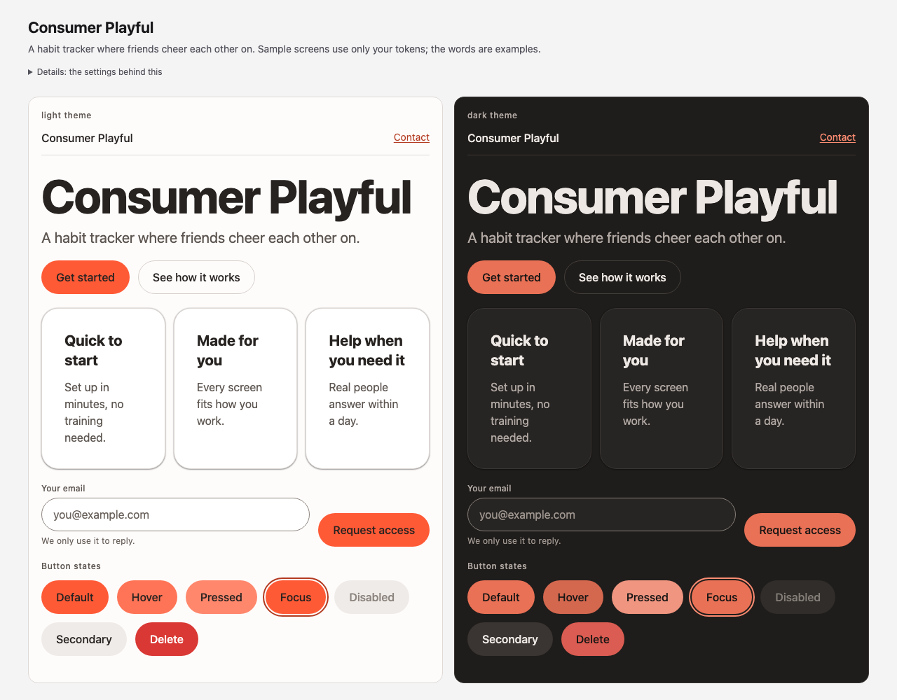

# Consumer Playful

An expressive, rounded, colorful system for a fictional habit app shared between friends.

**Dials:** expression 82 · brandPresence 70 · density 25 · energy 80 · roundness 97 · colorfulness 85 · depth 62 · warmth 78.

| What | Result |
|---|---|
| Type | body 16px, ratio 1.333, sizes 12, 16, 21, 28, 38, 51, 67, 90; weights body 400, label 500, heading 750, display 850 |
| Space | 4px unit; default density spacious (controls 40/48/56px); hit areas pointer 24px, touch 48px |
| Shape | control radius full, containers 24px, focus ring 2px |
| Depth | shadow-ladder |
| Motion | medium 280ms, spring damping 0.76 |
| Color | expressive scheme, accent solid `#ff5a36`, text minimum 4.5:1, themes light, dark |
| Validation | 0 errors, 0 warnings, 7 notes; 188 contrast pairs checked |

**Files:** `state.json` (the only input), `decisions.md` (why each choice), `tokens/` (DTCG 2025.10 + resolver, canonical), `build/` (css, tailwind, figma, paper, swift, compose, dtcg), `DESIGN.md`, `PRODUCT.md`, `preview.html`.

**Rebuild:** `python3 examples/make_examples.py consumer-playful` replays the decisions; `python3 skills/opendesigner/scripts/engine.py build --dir examples/consumer-playful` regenerates from `state.json`.

The product is fictional; no real brand's identity is copied.
