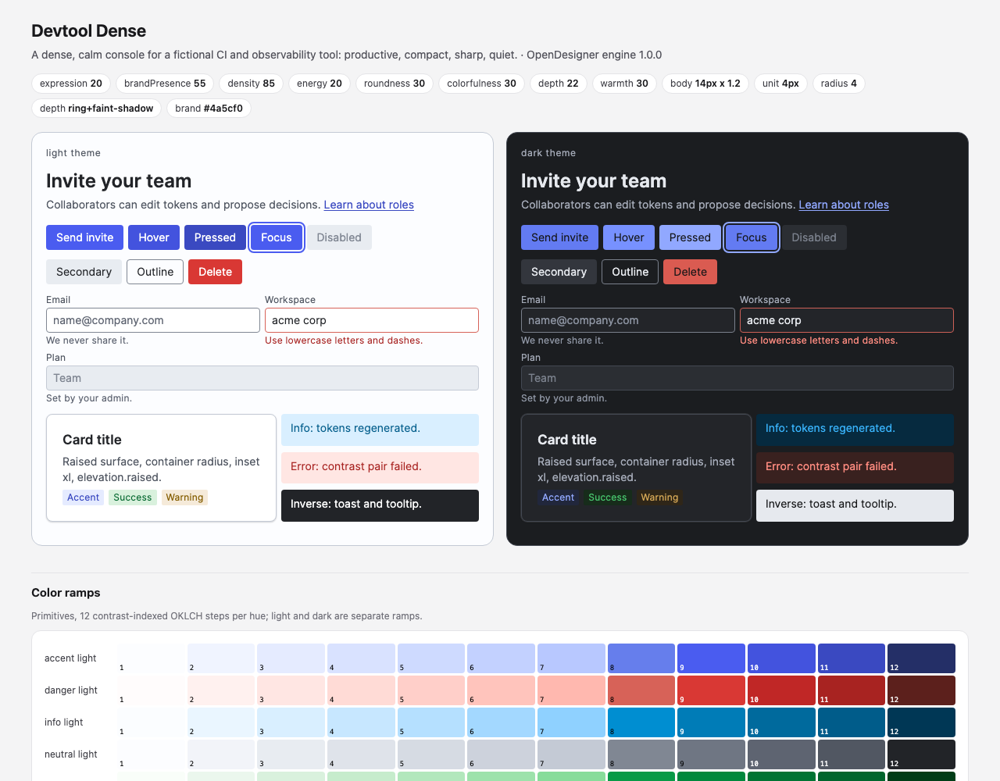

# Devtool Dense

A dense, calm console for a fictional CI and observability tool: productive, compact, sharp, quiet.

**Dials:** expression 20 · brandPresence 55 · density 85 · energy 20 · roundness 30 · colorfulness 30 · depth 22 · warmth 30.

| What | Result |
|---|---|
| Type | body 14px, ratio 1.2, sizes 12, 14, 17, 20, 24, 29, 35; weights body 400, label 400, heading 600 |
| Space | 4px unit; default density compact (controls 24/32/40px); hit areas pointer 24px |
| Shape | control radius 4, containers 8px, focus ring 2px |
| Depth | ring+faint-shadow |
| Motion | medium 220ms, spring damping 1.0 |
| Color | neutral scheme, accent solid `#4a5cf0`, text minimum 4.5:1, themes light, dark |
| Validation | 0 errors, 0 warnings, 4 notes; 152 contrast pairs checked |

**Files:** `state.json` (the only input), `decisions.md` (why each choice), `tokens/` (DTCG 2025.10 + resolver, canonical), `build/` (css, tailwind, figma, paper, swift, compose, dtcg), `DESIGN.md`, `PRODUCT.md`, `preview.html`.

**Rebuild:** `python3 examples/make_examples.py devtool-dense` replays the decisions; `python3 skills/opendesigner/scripts/engine.py build --dir examples/devtool-dense` regenerates from `state.json`.

The product is fictional; no real brand's identity is copied.
