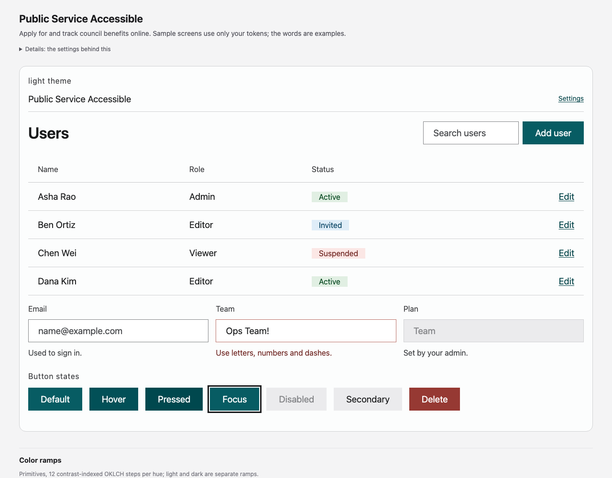

# Public Service Accessible

A plain, high-contrast system for a fictional city benefits service: AAA text, generous targets, no motion.

**Dials:** expression 10 · brandPresence 85 · density 8 · energy 0 · roundness 0 · colorfulness 35 · depth 5 · warmth 45.

| What | Result |
|---|---|
| Type | body 19px, ratio 1.2, sizes 13, 16, 19, 23, 27, 33, 39, 47; weights body 400, label 400, heading 600 |
| Space | 5px unit; default density spacious (controls 40/48/56px); hit areas pointer 48px, touch 48px |
| Shape | control radius 0, containers 0px, focus ring 3px |
| Depth | borders |
| Motion | medium 200ms, spring damping 1.0, motion off (reduced everywhere) |
| Color | neutral scheme, accent solid `#075c63`, text minimum 7.0:1, themes light |
| Validation | 0 errors, 0 warnings, 3 notes; 76 contrast pairs checked |

**Files:** `state.json` (the only input), `decisions.md` (why each choice), `tokens/` (DTCG 2025.10 + resolver, canonical), `build/` (css, tailwind, figma, paper, swift, compose, dtcg), `DESIGN.md`, `PRODUCT.md`, `preview.html`.

**Rebuild:** `python3 examples/make_examples.py public-service-accessible` replays the decisions; `python3 skills/opendesigner/scripts/engine.py build --dir examples/public-service-accessible` regenerates from `state.json`.

The product is fictional; no real brand's identity is copied.
