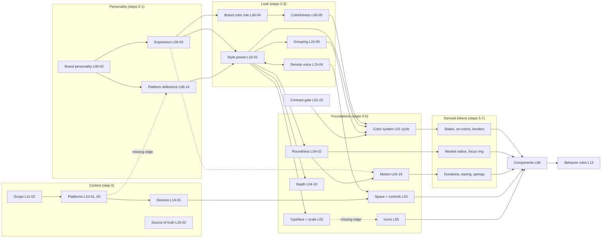

# The decision graph in plain language

Synthesis S1c. Source data: `synthesis/decision-graph.json` (built by `python3 tools/jev_nav.py graph` from every Decision Card's "Depends on" and "Affects" fields) and `synthesis/cards.json`. Dial names refer to `synthesis/LEVERS.md`.

## 1. What the graph contains

- **325 decisions** (one per Decision Card across L01 to L16), **431 dependency edges**, of which only **45 cross lanes**. Most links were written inside a lane, so cross-lane causality is thinner in the data than in reality (section 8).
- **8 dependency steps (0 to 7).** A decision's step is how far downstream it sits after each cycle is collapsed into one node. Step 0 has 89 decisions, then 58, 54, 34, 51, 26, 11 and 2.
- **12 cycles.** A cycle is a set of decisions that constrain each other, so they have to be made together. Section 4 turns each one into a builder screen.
- **48 decisions have no edges at all**: 14 in L08 (components), 8 in L07 (tokens and Figma), 8 in L09 (the benchmark cards, which restate L01 and L04 decisions), and a few elsewhere. They are real decisions whose links were not written down, not unimportant ones.

## 2. Root decisions (step 0)

The 89 roots fall into five kinds:

1. **Context roots**: what is being built, where it runs and where the truth lives. Scope (DC-L11-02, with the audit DC-L11-04 in a cycle), target platforms and posture (DC-L10-01, -02, -03, -21 in a cycle), OS version floor (DC-L10-23), source of truth and round-trip direction (DC-L16-02), theming axes (DC-L07-15). Device classes (DC-L14-01) sits at step 1, right under platforms.
2. **The personality root**: brand personality profile (DC-L06-02). It has the largest fan-out (15) and the largest downstream reach (116 decisions). In the builder this root *is* the set of dial positions.
3. **Foundation seeds that became roots because nothing upstream was linked**: base body size (DC-L02-08), base spacing unit (DC-L03-01), breakpoints (DC-L03-14), productive vs expressive typography (DC-L02-11), icon library, style, stroke and sizes (DC-L05-01, -02, -03, -05), photography (DC-L05-14), data-viz palettes (DC-L05-23). In practice these depend on density and personality; section 8 lists the missing edges.
4. **Encoding and tooling roots**: naming, units, DTCG types, Figma API choices (DC-L07-03, -05, -07, -10 to -14, -22, -24, -26 to -28; DC-L03-26; DC-L04-28; DC-L01-26). They change how tokens are written, not how the product looks.
5. **Component and behavior roots**: most L08 and L13 decisions (button hierarchy, state model, focus style, validation, feedback, navigation, overlays). Their look inputs come from foundations; their behavior inputs come from UX rules, which the graph mostly does not link yet.

## 3. The dependency steps, read as a sequence

| Step | What gets decided | Examples |
|---|---|---|
| 0 | Context and personality | scope, platforms, source of truth, brand personality |
| 1 | Posture | expressiveness and hero budget (DC-L06-03), platform deference (DC-L06-14), device classes (DC-L14-01) |
| 2 | Look direction | style preset and density voice (DC-L15-01 and DC-L15-04, a cycle), brand color role (DC-L06-04), motion personality at brand level (DC-L06-10) |
| 3 | Foundation strategies | typeface sourcing and classification (L02 cycle), roundness (DC-L04-02), depth strategy (DC-L04-10), grouping (DC-L15-05), color scheme source (DC-L06-05), hierarchy strength (DC-L15-02) |
| 4 | Foundation systems | the whole color system (21-decision cycle), type scale (DC-L02-09), line height and scripts, motion personality at token level (DC-L04-19), emphasis budget (DC-L15-03) |
| 5 | Token details | on-colors, borders and focus color, state colors, dark surfaces, durations, easings, springs, control heights, component radius mapping, letter spacing, z-index |
| 6 | Derived details | nested radius, pill and expressive shapes, choreography, enter/exit asymmetry, icon and avatar sizes, alpha colors |
| 7 | Last | focus indicator (depends on radius, color and borders), deprecation policy |

The shape matters for the builder: **personality and context first, one "look" screen, then foundation screens, then token detail that mostly derives itself.** Steps 5 to 7 are where automation pays off, because each of those decisions has several upstream constraints and few real options left.

## 4. Clusters (cycles) as builder screens

Each cycle is a set of decisions that must be edited together, so each becomes one screen or panel with live preview.

| Cycle | Decisions | Builder screen | Why they belong together |
|---|---|---|---|
| Color system (21) | DC-L01-01 to -13, -15, -18, -21 to -24, DC-L15-03, DC-L15-06 | **Color studio**: brand color, colorfulness and warmth dials, ramp preview, role mapping, light/dark side by side, contrast matrix | color space, ramp rule, neutral temperature, chroma, roles, dark mapping and contrast each constrain the others; the emphasis budget and accent proportion sit inside because they decide how much accent the ramps must serve |
| Typeface (6) | DC-L02-01, -02, -03, -04, -06, -24 | **Typeface picker**: sourcing, classification, pairing, variable axes, licensing and script coverage in one view | a face you cannot license or that lacks Devanagari is not an option, so coverage and license filter the choice |
| Line height and scripts (2) | DC-L02-13, DC-L02-25 | panel in the **Type scale** screen, previewed in Latin, Hindi, Telugu, Arabic and Japanese | line height has to fit the tallest script in scope |
| Brand typeface and localization (2) | DC-L06-07, DC-L06-24 | merged into the Typeface picker | same reason, from the brand side |
| Style and density (2) | DC-L15-01, DC-L15-04 | **Look and feel**: style presets and the Density dial on one screen | glass or minimal styles only work at low density; dense layouts need stronger signifiers |
| Platforms (4) | DC-L10-01, -02, -03, -21 | **Platforms**: targets, posture (the Brand presence dial), what is shared, framework | the framework limits what can be shared; posture depends on which platforms exist |
| Brand color per platform (2) | DC-L10-04, DC-L10-05 | tab in the Color studio | dynamic color on Android changes where brand color can live |
| Safe areas and materials (2) | DC-L10-11, DC-L10-12 | **Surfaces and materials** panel in the Depth screen | edge-to-edge layouts and translucent bars are designed together |
| Scope and audit (2) | DC-L11-02, DC-L11-04 | **Project setup** (onboarding) | what you audit depends on scope, and the audit revises scope |
| Disabled actions and validation (2) | DC-L08-10, DC-L08-17 | **Forms behavior** | whether submit is disabled depends on when errors appear |
| Validation timing and error messages (2) | DC-L13-06, DC-L13-07 | same Forms behavior screen | message pattern depends on timing |
| Destructive actions and feedback channel (2) | DC-L13-08, DC-L13-09 | **Feedback and safety** | undo needs a toast; confirmation needs a dialog |

## 5. The 12 most influential decisions

Ranked mainly by downstream reach (how many decisions change if this one changes). All 21 color-cycle decisions share a reach of 32, so the two that constrain the rest most (contrast and ramp rule) represent the cycle. DC-L14-01 is included for its fan-out of 10 even though its reach is low, because the graph links little out of L14.

| # | Decision | Reach | Fan-out | Why it matters | Dial or screen |
|---|---|---|---|---|---|
| 1 | DC-L06-02 Brand personality profile | 116 | 15 | every visual lever and the voice descend from it | all eight dials |
| 2 | DC-L06-03 Expressiveness and hero budget | 99 | 5 | flips type emphasis, color mixing, motion and containment together | Expression |
| 3 | DC-L06-14 Platform deference | 97 | 2 | decides whether the platform or the brand wins on type, shape and components (same decision as DC-L10-02 and DC-L13-17 from other lanes) | Brand presence |
| 4 | DC-L15-01 Visual style preset | 93 | 12 | the hub between brand and foundations: depth, materials, radius, borders, chroma, type classification, signifiers | Look and feel |
| 5 | DC-L15-04 Density voice | 93 | 7 | sets control heights, whitespace, density modes and signifier strength | Density |
| 6 | DC-L10-01 Target platforms (with its cycle) | 37 | 12 | native type, corners, materials, targets and token pipelines all depend on it | Platforms |
| 7 | DC-L06-04 Role of the brand color | 35 | 3 | reserved accent versus brand-flooded chrome changes every color role | Color studio |
| 8 | DC-L06-05 Color scheme source and colorfulness | 34 | 2 | static versus dynamic, and the scheme variant, set chroma for all roles | Colorfulness |
| 9 | DC-L15-05 Grouping strategy | 34 | 3 | space versus containers versus lines drives surfaces, whitespace and dividers | Look and feel |
| 10 | DC-L01-22 Contrast standard and enforcement | 32 | 5 | the constraint every ramp is solved against; 29 decisions sit upstream of it too, so it is also the main gate | Color studio (contrast matrix) |
| 11 | DC-L01-03 Ramp construction rule | 32 | 5 | decides what a step number means, and therefore dark mapping, state colors and step-distance guarantees | Color studio |
| 12 | DC-L14-01 Device classes in scope | 11 | 10 | target sizes, type by viewing distance, motion policy, safe zones and driving rules fan out from it | Platforms |

Runners-up: scope (DC-L11-02, reach 20), typeface sourcing (DC-L02-01, reach 19), source of truth (DC-L16-02, reach 18), base spacing unit (DC-L03-01, reach 15), roundness (DC-L04-02, reach 14).

## 6. Top-level flow

Dashed arrows are links the research supports but the graph does not yet encode (section 8). The `SHP --> MOT` arrow reflects an edge in the data (DC-L04-02 to DC-L04-19) that looks like an artifact of card wording; the real driver of motion personality is Expression and Energy.

## 7. Worked example: brand personality moves from calm to energetic

Setup: a web product with Expression 50, Density 50, Roundness 50, Depth 40, Warmth 50 and a blue brand color. The person moves **Energy from 20 (calm) to 85 (energetic)** and leaves Colorfulness untouched, so it follows the coupling rule. Values below were produced by running `levers.json` through the test engine.

**Path through the graph:** DC-L06-02 (personality) to DC-L06-10 (brand motion personality) and, through the style preset DC-L15-01, to DC-L04-19 (motion personality), which feeds DC-L04-20 (durations), DC-L04-21 (easing), DC-L04-22 (springs), DC-L04-23 (choreography), DC-L04-24 (enter/exit) and DC-L04-26 (haptics). In parallel, DC-L06-02 to DC-L06-05 (colorfulness) to DC-L15-06 and the color cycle (DC-L01-10 chroma, then ramps, roles and dark mode), and DC-L15-01 to DC-L02-02 to DC-L02-15 (weights). DC-L04-25 (reduced motion) overrides the motion changes for anyone who asks for less motion.

| Token or parameter | Calm (20) | Energetic (85) | Rule |
|---|---|---|---|
| `motion.spring.spatial.dampingRatio` | 1.0 | 0.72 | Energy anchors 1.0 / 0.9 / 0.8 / 0.6 (M3 and Apple values) |
| `motion.spring.spatial.stiffness` | 700 | 380 | M3 standard to M3 expressive default |
| Settle duration (Apple form) | about 237ms | about 322ms | 2 pi / sqrt(stiffness) |
| Bounce (Apple form) | 0 | 0.28 | 1 - damping ratio |
| `motion.easing.standard` | (0.2, 0, 0.38, 0.9) Carbon productive | (0.4, 0.14, 0.3, 1) Carbon expressive | Energy bands |
| Web implementation | cubic-bezier | sampled spring in CSS `linear()` | damping below 1 |
| `motion.duration.medium` | 220-264ms | 285-342ms | ladder 250-300 x 0.88 or x 1.14 |
| `motion.duration.long` | 352-440ms | 456-570ms | ladder 400-500 x multiplier |
| `motion.duration.extra` | 616ms | 798ms | 700 x multiplier |
| `motion.duration.micro`, `short` | 100, 150-200ms | unchanged | the multiplier skips small steps |
| Colorfulness (coupled) | 41 | 60.5 | +0.3 x (Energy - 50) |
| Accent chroma (HCT) | about 27 | about 40 | TonalSpot range, closer to Expressive |
| `color.surfaces` | neutral + one accent | tinted containers | Colorfulness 50-69 band |
| Accent count | 1 | 3 | Colorfulness 60+ band |
| Text step lightness, all contrast pairs | unchanged | unchanged | lightness is solved for contrast; only chroma moves |
| Dark-mode accents | 1-2 steps lighter, lower chroma | same rule, higher starting chroma | DC-L01-19 |
| `type.weight.heading` | 600 | 750 (or 700/800 on static fonts) | Energy bands [inferred] |
| Navigation chrome | recessive | neutral; brand chrome stays off because Expression 50 does not allow it | Energy band gated by Expression |
| Haptic intensity | light | strong, matched to animation | DC-L04-26 |
| Radius, spacing, type sizes, target sizes, focus ring | unchanged | unchanged | not driven by Energy |

**Guardrails that fire:** bounce 0.28 is above the 0.2 limit, so the builder warns unless the Playful macro is on (DC-L04-19). Long durations of 456-570ms are fine for full-screen moves but would trip the "standard transition over 500ms" warning if used for ordinary transitions (L13 E1). The reduced-motion mode is regenerated with the same travel removed, so accessibility does not change. Moving Colorfulness to 60 also moves the accent count to 3; the builder should show this side effect in its "what changed" panel and offer to lock Colorfulness.

**Graph gap exposed by this example:** DC-L06-10 (brand-level motion personality) has no outgoing edge to DC-L04-19 (token-level motion personality), so the data routes the change through the style preset and roundness instead. Section 8 lists the fix.

## 8. Known gaps in the graph and edges worth adding

The graph is parsed from card prose, so it misses links the research clearly supports. Adding these would make the causal paths match the levers in `LEVERS.md` [inferred list]:

| Missing edge | Reason |
|---|---|
| DC-L06-10 to DC-L04-19 | brand motion personality should drive token motion personality (the same decision seen from two lanes) |
| DC-L10-02 to DC-L06-14 (and DC-L13-17) | platform posture, platform deference and convention-vs-novelty are one decision in three lanes |
| DC-L15-04 to DC-L02-08 | density voice should drive body size (it already drives density modes, DC-L03-10) |
| DC-L06-09 to DC-L04-02 | brand shape language should drive the roundness dial |
| DC-L06-05 to DC-L01-10 | scheme colorfulness should drive chroma level directly |
| DC-L02-15 to DC-L05-03 | icon stroke follows type weight |
| DC-L06-13 to DC-L05-02 | iconography as brand translation should drive icon style; today no L05 decision is reachable from personality |
| DC-L14-03 to DC-L08-07 | target policy should drive control sizes |
| DC-L09-01 to -08 merged into their L01/L04 twins | the benchmark cards duplicate roundness, depth, color generation, density, typeface, motion and brand posture |

Remove or re-check: DC-L04-02 to DC-L04-19 (roundness driving motion personality) reads as a wording artifact.
