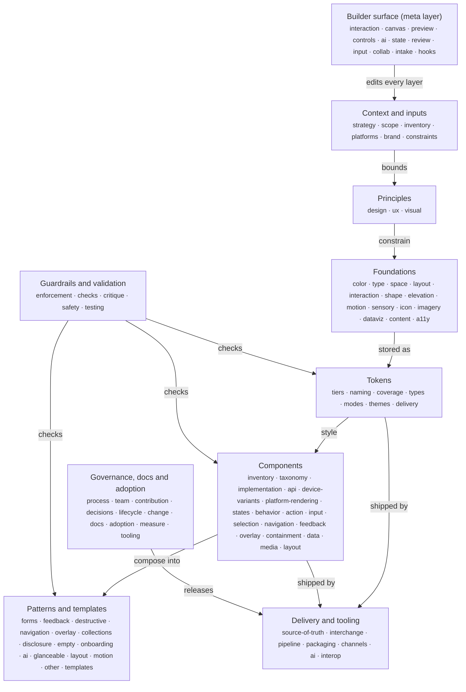

# Design-system ontology (S1a)

This file is the map of every building block of a design system, arranged in layers. The design-system builder uses it as its internal structure: each node is a place where the builder stores values, asks questions, or runs checks. It was synthesized on 2026-09-23 from research lanes L00 to L16. `synthesis/ontology.json` holds the same tree in machine-readable form. Both files come from one build over the same data, so they agree; treat `ontology.json` as the canonical copy when editing.

## Overview (top two levels)

Arrows show the main direction of influence: context decides principles, principles bound the foundations, foundations are stored as tokens, tokens style components, and components compose into patterns. Guardrails check the lower layers, delivery ships them, governance runs the whole system over time, and the builder surface is the tool the engineer uses to edit it [inferred from the dependency graph in `synthesis/decision-graph.json`, where DC-L06-02, DC-L10-01, DC-L14-01 and DC-L11-02 sit at step 0 or 1].

## How to read a node

Each node has a stable id (`layer.block.sub-block`), a plain-language definition, and these fields when they apply:
- **Decided by**: the Decision Cards (from `synthesis/cards.json`) that settle this node. Every card is owned by exactly one node, which the coverage check at the end verifies.
- **Also shaped by**: cards owned by another node that also affect this one. These do not count toward coverage.
- **Members**: catalog entries grouped at this node: component ids C01 to C64 from `research/L08-component-catalog.md`, principle ids P01 to P72 from `research/L15-visual-design-principles.md`, and pattern ids L08-P1 to L08-P13 from `research/L08-components-patterns.md`.
- **DTCG**: the DTCG 2025.10 `$type` values involved (the 13 types in L07 table A3), or a note that no type exists and the builder needs an extension.
- **Varies by platform/device**: what changes between web, iOS, Android and other platforms, or between device classes.
- **Default**: the starting value the lanes recommend, with the card it comes from.
- **Benchmark (L09)**: the shared default across the 25 benchmarked systems and where they diverge. `L09-A1.n` cites row n of the shared-patterns table and `L09-A2.n` row n of the divergence table in `benchmarks/L09-benchmark-matrix.md`; each row carries its own matrix evidence.
- **Sources**: source ids from the lane traces.

Rules followed: every claim carries a Decision Card id, a source id, or an L09 row reference, or it is tagged [inferred]. Values are copied from the cards, not invented. Card bodies are not repeated here; look them up by id in `synthesis/cards.json`.

## Layer 0: Context and inputs (`ctx`, 15 nodes)
The facts the builder collects before any visual decision: why the system exists, who and what it serves, which platforms and devices it must cover, the brand's personality, and the hard limits it must fit. In the decision graph these are the step-0 and step-1 inputs that constrain the most other decisions (DC-L06-02 constrains 15, DC-L10-01 12, DC-L14-01 10, DC-L11-02 8).
- Children: `ctx.strategy`, `ctx.scope`, `ctx.inventory`, `ctx.platforms`, `ctx.brand`, `ctx.constraints`
- Decided by: no card of its own (structural node)
- Provenance: designer-owned (an answer only the team can give (a questionnaire item), not a creative asset; the builder asks and records it [inferred])

### `ctx.strategy` Starting point and system posture
Whether the team adopts an existing system, adapts a themeable base, or creates its own, and how strict, modular and centralized the system will be (Kholmatova's parameters).
- Decided by: DC-L11-01, DC-L11-03
- DTCG: none; stored as builder metadata such as `system.origin` and `governance.posture` (DC-L11-01, DC-L11-03)
- Varies by platform/device: Open web systems rarely cover native apps: 94% of systems support web, 35% iOS, 34% Android [S-L11-030].
- Default: Small teams (1-5 people, 61% of teams) adapt an accessible headless or themeable base and spend effort on tokens and docs (DC-L11-01). Strict core, loose edges (DC-L11-03, [inferred] in the card).
- Provenance: designer-owned (an answer only the team can give (a questionnaire item), not a creative asset; the builder asks and records it [inferred])
- Sources: S-L11-006 S-L11-018 S-L11-019 S-L11-030

### `ctx.scope` Scope: products, audience and stack
Which products, audiences and technologies version 1 serves, and which it explicitly does not. The answer decides which exporters the builder runs.
- Decided by: DC-L11-02
- DTCG: none; metadata `system.platforms` and `system.frameworks` (DC-L11-02)
- Default: Scope version 1 to the products the pilot touches and list the products you will not serve (DC-L11-02).
- Provenance: designer-owned (an answer only the team can give (a questionnaire item), not a creative asset; the builder asks and records it [inferred])
- Sources: S-L11-083 S-L11-002 S-L11-030

### `ctx.inventory` Existing UI inventory (audit)
A screenshot inventory of every unique UI pattern, plus a visual and CSS audit of colors, type and spacing in the products the system will replace. It supplies shared names and candidate primitives.
- Decided by: DC-L11-04
- DTCG: none; audit findings can seed primitives, for example frequent hex values clustered into ramps ([inferred] in DC-L11-04)
- Varies by platform/device: Run one inventory per platform, because names differ (sheet, modal, dialog) (DC-L11-04).
- Default: Do the manual inventory even when automated data exists; its main value is shared vocabulary and buy-in (DC-L11-04).
- Provenance: extractable (read from the products being replaced: interface inventory, visual audit and CSS statistics; frequent values can seed primitives (DC-L11-04))
- Sources: S-L11-001 S-L11-105

### `ctx.platforms` Target platforms
The operating systems and runtimes the system must serve (web, iOS, Android, Windows, macOS and others). Platform choice decides units, native type, target sizes, materials and navigation containers downstream.
- Children: `ctx.platforms.posture`, `ctx.platforms.sharing`, `ctx.platforms.devices`, `ctx.platforms.stack`, `ctx.platforms.os-floor`
- Decided by: DC-L10-01
- DTCG: none in the Format module; a `platform` modifier in the Resolver document ([inferred] in DC-L10-01)
- Varies by platform/device: Android's large-screen rules make phone-only Android layouts no longer viable for new apps [S-L10-021]; Apple asks layouts to follow size class rather than device idiom [S-L10-013].
- Default: Web plus iOS and Android phones, with Android and iPad large-screen layouts from day one; desktop, watch or TV only with a named use case (DC-L10-01).
- Benchmark (L09): Diverges (L09-A2.10): web only (most systems), one API for web and native (Blade), per-platform ramps under one language (Fluent), native only (Apple).
- Provenance: designer-owned (an answer only the team can give (a questionnaire item), not a creative asset; the builder asks and records it [inferred])
- Sources: S-L10-020 S-L10-021 S-L10-025

#### `ctx.platforms.posture` Platform posture (native-first, brand-first or hybrid)
How far the product defers to each platform's own look and behavior versus imposing one brand look everywhere.
- Decided by: DC-L10-02, DC-L06-14
- DTCG: not a token; it decides which semantic tokens get platform overrides (DC-L10-02)
- Varies by platform/device: Apple removed the opt-out from its new design at the 27 SDKs, so brand-first chrome on iOS means custom bars and controls [S-L10-076, S-L10-075].
- Default: Coherent hybrid: share what users perceive as the brand (accent color, headline type, illustration, icon style, voice, sound) and adopt the platform's version of controls and behavior (DC-L10-02); "80% native, 20% signature" (DC-L06-14).
- Provenance: designer-owned (an answer only the team can give (a questionnaire item), not a creative asset; the builder asks and records it [inferred])
- Sources: S-L10-009 S-L10-040 S-L06-008 S-L06-043

#### `ctx.platforms.sharing` What is shared across platforms
Which layer is common to every platform: tokens, component specs, or only principles. L10's identical-versus-adapt table lists element by element what stays the same (brand hue, role names, spacing numbers, voice) and what adapts (materials, target minimums, navigation containers).
- Decided by: DC-L10-03
- DTCG: primitives and most semantic tokens shared; platform overrides at the semantic or component tier ([inferred] in DC-L10-03)
- Default: Share tokens and component specs (anatomy, variants, states, content rules); implement and document accessibility per platform (DC-L10-03).
- Provenance: designer-owned (an answer only the team can give (a questionnaire item), not a creative asset; the builder asks and records it [inferred])
- Sources: S-L10-039 S-L10-040 S-L10-053

#### `ctx.platforms.devices` Device classes in scope
Which device classes are first-class (phone, tablet and foldable, desktop, large display, watch, TV, car, spatial, voice and AI chat, kiosk, console) and which get foundations only. Device class is separate from platform, because one OS spans several classes.
- Decided by: DC-L14-01, DC-L10-24
- DTCG: none in the Format module; a resolver `context` modifier kept separate from `platform` ([inferred] in DC-L14-01)
- Varies by platform/device: Viewing distance, input precision, attention per interaction, posture, ambient light, social setting and safety are the variables that change by device (L14 Part 3, [S-L14-001, S-L14-026, S-L14-031]).
- Default: Phone, tablet/foldable and desktop/web first-class; TV, watch, car and spatial off until a named use case exists (DC-L14-01). Secondary form factors get foundations only (color, type roles, icons) plus platform templates (DC-L10-24).
- Provenance: designer-owned (an answer only the team can give (a questionnaire item), not a creative asset; the builder asks and records it [inferred])
- Sources: S-L14-001 S-L14-067 S-L10-002

#### `ctx.platforms.stack` Implementation stack
The native toolkits and cross-platform frameworks the products are built with. The stack decides token output formats and how quickly OS visual changes reach the product.
- Decided by: DC-L10-20, DC-L10-21
- DTCG: output formats rather than types: JS/TS objects for React Native, `flutter/class.dart`, `compose/object` for Compose Multiplatform [S-L10-056]
- Varies by platform/device: Compose Material 3 stable is 1.4.0; the expressive APIs are still in 1.5.0 alphas [S-L10-018].
- Default: SwiftUI (UIKit where needed) and Compose for new native work (DC-L10-20); fully native or React Native for native-first products, Flutter or Compose Multiplatform for brand-first products that accept a lag on OS changes (DC-L10-21).
- Provenance: designer-owned (an answer only the team can give (a questionnaire item), not a creative asset; the builder asks and records it [inferred])
- Sources: S-L10-018 S-L10-024 S-L10-056

#### `ctx.platforms.os-floor` OS version floor
The oldest OS versions supported and which design-language generation the system targets.
- Decided by: DC-L10-23
- DTCG: version-gated values are rare; prefer runtime fallbacks (DC-L10-23)
- Default: Support the current and previous major OS, design for the current language, and let older versions fall back to their native look (DC-L10-23).
- Provenance: designer-owned (an answer only the team can give (a questionnaire item), not a creative asset; the builder asks and records it [inferred])
- Sources: S-L10-005 S-L10-019

### `ctx.brand` Brand inputs
What the brand brings into the product: its personality, how the marketing identity relates to the product UI, and how much expression the product allows. L06 section 1 separates the expressive identity layer (logo system, campaign color, display type) from the productive product layer.
- Children: `ctx.brand.personality`, `ctx.brand.layering`, `ctx.brand.expression`
- Decided by: no card of its own (structural node)
- Provenance: designer-owned (an answer only the team can give (a questionnaire item), not a creative asset; the builder asks and records it [inferred])

#### `ctx.brand.personality` Brand personality profile
Brand traits expressed as a few slider positions (for example playful to serious, minimal to rich). This is the single most influential input: L06's lever matrix maps each adjective pair to concrete foundation settings.
- Decided by: DC-L06-02
- DTCG: not a token; metadata such as `$extensions.brand.personality` ([inferred] in DC-L06-02)
- Default: Ask for traits first, then 4-7 sliders, then show 2-3 generated style tiles to choose from (DC-L06-02).
- Provenance: designer-owned (traits and slider positions come from the team; the builder then generates 2-3 style tiles from them (DC-L06-02))
- Sources: S-L06-070 S-L06-071 S-L06-078

#### `ctx.brand.layering` Brand-to-product layering
Whether marketing (expressive) and product (productive) surfaces share one system with modes, or run as separate systems.
- Decided by: DC-L06-01
- DTCG: a `layer` mode axis rather than duplicate tokens, for example Carbon's productive easing [0.2, 0, 0.38, 0.9] versus expressive [0.4, 0.14, 0.3, 1] as `cubicBezier` (DC-L06-01)
- Default: One system, productive by default, expressive opt-in (DC-L06-01).
- Provenance: designer-owned (an answer only the team can give (a questionnaire item), not a creative asset; the builder asks and records it [inferred])
- Sources: S-L06-001 S-L06-002 S-L06-110

#### `ctx.brand.expression` Expressiveness level and hero-moment budget
How much brand expression the product allows, and how many signature moments get expressive type, shape or motion.
- Decided by: DC-L06-03
- DTCG: expressive variants as a mode or parallel set, for example `font.display.emphasized` (typography) and `shape.corner.expressive.*` (dimension) ([inferred] naming in DC-L06-03)
- Varies by platform/device: M3 Expressive is Android and Compose first [S-L06-009].
- Default: Productive everywhere plus "one or two hero moments", following Material's own rule (DC-L06-03).
- Provenance: designer-owned (an answer only the team can give (a questionnaire item), not a creative asset; the builder asks and records it [inferred])
- Sources: S-L06-002 S-L06-009

### `ctx.constraints` Hard constraints
Limits the system must fit that are not taste choices: the design tool's plan tier, the legal accessibility target, supported locales and scripts.
- Decided by: DC-L07-27
- Also shaped by: DC-L01-22, DC-L11-19, DC-L06-24, DC-L02-24
- DTCG: n/a
- Varies by platform/device: Figma MCP limits by plan: Starter 20 calls a month; Dev/Full seats 200 a day on Professional and Organization, 600 on Enterprise [S-L07-049].
- Default: Ask for the Figma plan first and grey out architectures it cannot hold: Professional allows 10 modes per collection, Organization 20 (DC-L07-27, [S-L07-014]).
- Provenance: designer-owned (facts about the team's plan, legal target and locales; the Figma plan tier gates architectures (DC-L07-27) [inferred for the rest])
- Sources: S-L07-014 S-L07-015 S-L07-049

## Layer 1: Principles (`prin`, 18 nodes)
The rules that decide what "good" means before any value is picked. Three kinds live here: the team's own design principles, UX behavior rules drawn from laws and heuristics, and visual design principles. Tokens and components decide how a product looks; this layer decides whether it works and holds together (L13 overview, L15 overview).
- Children: `prin.design`, `prin.ux`, `prin.visual`
- Decided by: no card of its own (structural node)
- Provenance: generatable (shipped as builder defaults and presets rather than authored per system (L13 Part E1 level 1, L15 section 3 automate stance) [inferred for this layer as a whole])

### `prin.design` Design principles
A short, ranked list of statements the team uses as tie-breakers when two good options conflict. L06 keeps four kinds apart: brand or design-language principles, product experience principles, system principles, and content or voice principles.
- Decided by: DC-L06-15, DC-L11-05
- DTCG: none; stored as ordered records with `beats` relationships and do/don't examples ([inferred] in DC-L06-15 and DC-L11-05)
- Default: 3-5 principles, each naming the value it outranks and testable with a "would this screen pass?" question; avoid words every product could claim (DC-L06-15, DC-L11-05). Date-stamp them, since principles pages go stale first (L06 section 5.1, [S-L06-055, S-L06-057]).
- Provenance: designer-owned (principles are written by the team and ranked by what they outrank (DC-L06-15, DC-L11-05))
- Sources: S-L06-004 S-L06-077 S-L11-008

### `prin.ux` UX behavior rules
Laws and heuristics turned into checkable rules. Each rule links a principle (for example Fitts's law) to a concrete check (no target below 24x24 CSS px) and to the place it applies (token, component, pattern, content or flow). L13 proposes this as a layer of its own on top of tokens and components.
- Children: `prin.ux.laws`, `prin.ux.heuristics`, `prin.ux.rules`, `prin.ux.timing`, `prin.ux.familiarity`, `prin.ux.inclusion`, `prin.ux.ethics`
- Decided by: no card of its own (structural node)
- DTCG: no DTCG type; rules need their own model that references tokens, kept in `$extensions` or a sibling file (L13 Part E3, [inferred])
- Provenance: generatable (shipped as builder defaults and presets rather than authored per system (L13 Part E1 level 1, L15 section 3 automate stance) [inferred for this layer as a whole])
- Sources: S-L13-001 S-L13-030 S-L13-098

#### `prin.ux.laws` Laws of UX catalog
The 30 laws on lawsofux.com, each graded for evidence: research-backed (R), research-backed at origin but extrapolated to UI (R-), contested (C), heuristic (H), or pop analogy (P). Zeigarnik and choice overload are weak, and Miller's 7 plus or minus 2 does not limit menu length (L13 top findings, [S-L13-040, S-L13-045, S-L13-048]).
- Decided by: no card of its own (structural node)
- Default: Show each rule's evidence grade in the UI so users see how solid it is (L13 Part E3, [inferred]).
- Provenance: generatable (shipped as builder defaults and presets rather than authored per system (L13 Part E1 level 1, L15 section 3 automate stance) [inferred for this layer as a whole])
- Sources: S-L13-001 S-L13-040 S-L13-045 S-L13-048 S-L13-050

#### `prin.ux.heuristics` Heuristic consensus set
The eight principles on which Nielsen, Norman, Shneiderman, Tognazzini and the Laws of UX agree: visible status and feedback, consistency and conventions, error prevention, reversal and user control, recognition over recall, plain language, minimalism with progressive disclosure, and efficiency for experts. Most can be partly machine-checked (L13 Part B6).
- Decided by: no card of its own (structural node)
- Provenance: generatable (shipped as builder defaults and presets rather than authored per system (L13 Part E1 level 1, L15 section 3 automate stance) [inferred for this layer as a whole])
- Sources: S-L13-030 S-L13-035 S-L13-037 S-L13-038

#### `prin.ux.rules` Behavior-rule model and automation boundary
The record format for a behavior rule (id, principle, evidence grade, scope, check kind, severity, override policy, exceptions, sources) and the four levels at which the builder applies it: default, lint error, warning, or human judgment. It also lists rules the builder must not automate, such as a "max 7 navigation items" cap (L13 Parts E1 to E3).
- Decided by: no card of its own (structural node)
- DTCG: no DTCG type; rule checks reference token paths such as `{size.target.min}` (L13 Part E3)
- Default: Lint errors block publishing unless overridden with a written reason: target below 24x24 CSS px, field without a programmatic label, meaning by color only, dialog without a dismiss path, pre-checked consent (L13 Part E1, [S-L13-098, S-L13-071]).
- Provenance: generatable (shipped as builder defaults and presets rather than authored per system (L13 Part E1 level 1, L15 section 3 automate stance) [inferred for this layer as a whole])
- Sources: S-L13-098 S-L13-071 S-L13-108 S-L00-036

#### `prin.ux.timing` Response-time ladder
The reconciled thresholds for how fast the interface must respond: 16 ms per frame, 50 ms to acknowledge input, 100 ms to feel instant, 200 ms for a good INP, 400 ms (Doherty), 1 s before focus breaks, 10 s before attention is lost. Each band maps to a feedback pattern (L13 top finding 3).
- Decided by: no card of its own (structural node)
- Also shaped by: DC-L13-01
- DTCG: duration (the ladder can ship as tokens, L13 top finding 3)
- Varies by platform/device: Cars require a response within 0.25 s and a spinner past 2 s [S-L14-036].
- Provenance: generatable (shipped as builder defaults and presets rather than authored per system (L13 Part E1 level 1, L15 section 3 automate stance) [inferred for this layer as a whole])
- Sources: S-L13-031 S-L13-032 S-L13-033 S-L13-051 S-L13-003

#### `prin.ux.familiarity` Convention versus novelty
How far the product follows established platform and industry conventions (Jakob's law) versus inventing its own behavior.
- Decided by: DC-L13-17
- DTCG: none; expressed through platform presets (DC-L13-17)
- Varies by platform/device: Users expect their own platform's idiom; iOS developers push back on porting M3 Expressive (DC-L13-17, COMMUNITY-SIGNAL section d).
- Default: Conventional behavior with a custom skin; never override standard shortcuts; be novel only where it is the differentiator, and test it (DC-L13-17).
- Provenance: designer-owned (novelty versus convention is a human-judgment item in L13's automation boundary (L13 Part E1 level 4))
- Sources: S-L13-006 S-L13-036

#### `prin.ux.inclusion` Inclusive design stance
The accessibility floor and which situational and permanent constraints the system designs for, such as older users, low vision or one-handed use.
- Decided by: DC-L13-14
- DTCG: accessibility modes as resolver contexts (contrast, density, motion) ([inferred] in DC-L13-14)
- Varies by platform/device: OS settings such as Dynamic Type, font scale, Reduce Motion and Increase Contrast must flow into tokens (DC-L13-14, DC-L10-16).
- Default: WCAG 2.2 AA as the floor; the questionnaire asks about situational constraints and turns on larger targets, a contrast theme or captions (DC-L13-14).
- Provenance: generatable (the WCAG 2.2 AA floor is a default; situational constraints come from questionnaire answers (DC-L13-14))
- Sources: S-L13-037 S-L13-038 S-L13-098

#### `prin.ux.ethics` Deceptive-pattern policy
Which manipulative patterns the system forbids and which of them the builder can detect automatically.
- Decided by: DC-L13-15
- DTCG: none; lint rules in `$extensions` or config ([inferred] in DC-L13-15)
- Default: Enforce what a machine can detect: pre-checked marketing or consent boxes, unequal emphasis on accept and reject, re-prompting after a dismissal (DC-L13-15).
- Provenance: generatable (machine-detectable deceptive patterns ship as lint defaults (DC-L13-15))
- Sources: S-L13-071 S-L13-108 S-L13-110

### `prin.visual` Visual design principles
The catalog of 72 visual principles (hierarchy, CRAP, Gestalt, whitespace, color, type pairing, polish, aesthetics), each with an evidence grade and a builder stance: automate by construction, guide with warnings, or expose as a user control (L15 sections 1 and 3).
- Children: `prin.visual.style`, `prin.visual.hierarchy`, `prin.visual.grouping`, `prin.visual.composition`, `prin.visual.signifiers`, `prin.visual.polish`, `prin.visual.aesthetics`
- Members: P15, P19
- Decided by: no card of its own (structural node)
- Default: Automate principles with strong evidence and one right answer; expose those that encode personality; guide anything that depends on a specific screen's content (L15 section 3, [inferred] in the lane).
- Provenance: generatable (shipped as builder defaults and presets rather than authored per system (L13 Part E1 level 1, L15 section 3 automate stance) [inferred for this layer as a whole])
- Sources: S-L15-001 S-L15-016 S-L15-038 S-L15-047

#### `prin.visual.style` Visual style direction
The overall style preset (flat, tonal, glass, soft, neo-brutalist, maximal) that sets many primitives at once, such as shadows, border widths and radius.
- Decided by: DC-L15-01
- DTCG: no DTCG type for a preset; builder metadata that writes `shadow`, `dimension` and `color` primitives (DC-L15-01)
- Varies by platform/device: iOS 26 and later give standard components Liquid Glass automatically; custom glass should be sparing [S-L15-073]; web glass needs `backdrop-filter` and a solid fallback ([inferred] in DC-L15-01).
- Default: Flat 2.0 with strong signifiers; keep fashionable styles for marketing surfaces (DC-L15-01).
- Provenance: generatable (a preset writes shadow, border and radius primitives from one choice (DC-L15-01))
- Sources: S-L15-004 S-L15-005 S-L15-073

#### `prin.visual.hierarchy` Hierarchy strength and emphasis budget
How dramatic the contrast between levels is (size ratio, weights, text-color tiers) and how many elements may claim top emphasis on one view.
- Members: P01-P13, P50, P51
- Decided by: DC-L15-02, DC-L15-03
- DTCG: generator metadata feeding `dimension` (font sizes), `fontWeight` and `color` (text tiers); the emphasis budget is lint configuration, not tokens (DC-L15-02, DC-L15-03)
- Varies by platform/device: Hierarchy must survive Dynamic Type and Android font scaling [S-L15-055].
- Default: Balanced: ratio 1.25, two weights, three text colors (DC-L15-02); strict budget on app surfaces with one primary action per view (DC-L15-03). Adjacent levels at least about 10% apart in size or 200 apart in weight ([inferred] in DC-L15-02).
- Provenance: generatable (ratio, weights and text tiers are computed from one strength setting (DC-L15-02); the emphasis budget is lint configuration (DC-L15-03))
- Sources: S-L15-001 S-L15-002 S-L15-038 S-L15-067

#### `prin.visual.grouping` Grouping strategy
Whether related items are grouped by space, by containers, or by lines. Gestalt grouping is the best-evidenced visual principle; common region overpowers proximity, which overpowers similarity (L15 finding 2).
- Members: P16, P23-P30, P32
- Decided by: DC-L15-05
- DTCG: `dimension` (inset and stack spacing, divider width) and `color` (container surface); container depth is lint configuration (DC-L15-05)
- Varies by platform/device: iOS grouped tables use grouped background colors for regions [S-L15-054].
- Default: Space first; containers only when content types mix, items sit in a grid, or spacing cannot be controlled; lines for long lists; inner-to-outer spacing at 1:2 or more (DC-L15-05).
- Provenance: generatable (shipped as builder defaults and presets rather than authored per system (L13 Part E1 level 1, L15 section 3 automate stance) [inferred for this layer as a whole])
- Sources: S-L15-010 S-L15-012 S-L15-016

#### `prin.visual.composition` Composition, balance and alignment
The layout model at the principle level (column grid, hierarchical, bento) and the default alignment axis. L03 owns the concrete columns, gutters and breakpoints.
- Members: P14, P17, P18, P20, P21, P31, P35-P38
- Decided by: DC-L15-07, DC-L15-08
- DTCG: `number` (grid columns) and `dimension` (gutters, margins); alignment and tile spans are component props, not tokens (DC-L15-07, DC-L15-08)
- Varies by platform/device: Use logical start and end so right-to-left layouts mirror correctly [S-L15-053].
- Default: Column grid for app surfaces, hierarchical or bento for marketing features (DC-L15-07); start-aligned everywhere, centered only for single-focus moments with short text (DC-L15-08). Golden ratio stays an optional preset because its evidence is weak (L15 finding 5).
- Provenance: generatable (shipped as builder defaults and presets rather than authored per system (L13 Part E1 level 1, L15 section 3 automate stance) [inferred for this layer as a whole])
- Sources: S-L15-053 S-L15-052 S-L15-062

#### `prin.visual.signifiers` Interactive signifier strength
How clearly interactive elements announce that they can be clicked or tapped (fills, underlines, borders, depth).
- Members: P63
- Decided by: DC-L15-09
- DTCG: component tokens such as `button.primary.background` (color), `link.text-decoration` (no DTCG type; string), `input.border.width` (dimension) ([inferred] in DC-L15-09)
- Varies by platform/device: Liquid Glass controls float above content and can lose affordance over busy content [S-L15-007].
- Default: Balanced, with strong signifiers forced for primary actions; go minimal only when density is low, layouts are conventional and key actions already stand out (DC-L15-09).
- Provenance: generatable (shipped as builder defaults and presets rather than authored per system (L13 Part E1 level 1, L15 section 3 automate stance) [inferred for this layer as a whole])
- Sources: S-L15-004 S-L15-006 S-L15-007

#### `prin.visual.polish` Optical correction and polish
Small optical fixes that make a UI feel finished: optical centering, overshoot, icon optical size, nested radii, one light source, fewer borders.
- Members: P55-P62, P64-P66
- Decided by: DC-L15-10
- DTCG: `dimension` (icon keylines; inner radius computed as outer radius minus inset) ([inferred] in DC-L15-10)
- Varies by platform/device: SF Symbols already match text weights; Material icons ship with keylines; custom web icon sets vary (DC-L15-10).
- Default: Auto-correct known cases and suggest fixes for custom assets (DC-L15-10).
- Provenance: generatable (shipped as builder defaults and presets rather than authored per system (L13 Part E1 level 1, L15 section 3 automate stance) [inferred for this layer as a whole])
- Sources: S-L15-055 S-L15-058 S-L15-059

#### `prin.visual.aesthetics` Aesthetics and complexity readouts
What "looks good" means empirically: judgments form in 17-50 ms, appeal peaks at moderate visual complexity and moderate colorfulness, and aesthetics multiply usability rather than replace it (L15 findings 3 and 4).
- Members: P67-P72
- Decided by: no card of its own (structural node)
- Also shaped by: DC-L15-11
- Default: Restrained default plus an optional computed complexity and colorfulness readout; never use attractiveness scores as a usability signal (L15 finding 3, L13 Part E2).
- Provenance: generatable (complexity and colorfulness are computed from a screenshot, as Aalto Interface Metrics does (L15 finding 3, [S-L15-080]))
- Sources: S-L15-044 S-L15-047 S-L15-042 S-L15-080 S-L13-053

## Layer 2: Foundations (`found`, 123 nodes)
The visual, sensory and verbal raw material every screen is made of: color, typography, space, layout, shape, depth, motion, sound and haptics, icons, imagery, data visualization, content, accessibility, and interaction and input. Each foundation is a set of scales and roles that tokens store and components consume (L11 phase 5).
- Children: `found.color`, `found.type`, `found.space`, `found.layout`, `found.interaction`, `found.shape`, `found.elevation`, `found.motion`, `found.sensory`, `found.icon`, `found.imagery`, `found.dataviz`, `found.content`, `found.a11y`
- Decided by: no card of its own (structural node)
- Provenance: generatable (computed from a few inputs by scales and formulas; values can also be read from a reference site or from Figma variables through `get_variable_defs` (L16 A1) [inferred for this layer as a whole])

### `found.color` Color
Every color decision, from how ramps are generated to which semantic roles exist, how modes remap them, and how contrast is guaranteed.
- Children: `found.color.space`, `found.color.ramp`, `found.color.neutral`, `found.color.alpha`, `found.color.brand`, `found.color.character`, `found.color.roles`, `found.color.states`, `found.color.modes`, `found.color.personalization`, `found.color.contrast`, `found.color.expressive`
- Decided by: no card of its own (structural node)
- DTCG: color (value object with one of 14 color spaces, optional alpha and hex fallback; Figma imports only sRGB and HSL) (L07 A3, A7)
- Benchmark (L09): Shared (L09-A1.3): neutral surfaces, one saturated accent and status colors in all but one of 24 systems (Material 3 tints surfaces with the primary hue). Diverges (L09-A2.3): monochrome plus one accent (Uber, Polaris, Geist) versus tonal tinted surfaces (Material) versus brand fields (Encore).
- Provenance: generatable (ramps and roles are generated from a seed color with contrast targets (DC-L01-04, DC-L09-03); theme generators need only about 3 inputs (DC-L06-06); colors are also readable from a reference [inferred])
- Sources: S-L01-004 S-L01-006 S-L09-005

#### `found.color.space` Color space and gamut
The color model used to build and interpolate ramps (sRGB, OKLCH, HCT, LCH) and the gamut the product targets (sRGB or Display P3).
- Decided by: DC-L01-01, DC-L01-05
- DTCG: color (value object with one of 14 color spaces, optional alpha and hex fallback; Figma imports only sRGB and HSL) (L07 A3, A7)
- Varies by platform/device: Web accepts `oklch()`, `lab()` and `color(display-p3 ...)` with `@media (color-gamut)`; Android and Material tooling expects HCT through Material Color Utilities; iOS asset catalogs hold colors per color space (DC-L01-01, DC-L01-05).
- Default: OKLCH for web-first systems, HCT when the system must feed Material dynamic color (DC-L01-01); sRGB hex primitives with optional P3 overrides for accents only (DC-L01-05).
- Benchmark (L09): Diverges (L09-A2.6): sRGB versus OKLCH versus HCT versus P3.
- Provenance: generatable (ramps and roles are generated from a seed color with contrast targets (DC-L01-04, DC-L09-03); theme generators need only about 3 inputs (DC-L06-06); colors are also readable from a reference [inferred])
- Sources: S-L01-008 S-L01-046 S-L01-049 S-L01-013

#### `found.color.ramp` Ramp generation and step meaning
How tonal ramps are produced, how many steps they have, how steps are numbered, and what a step number promises (lightness, tone, or contrast against a background). Step numbers mean different things in different systems: Tailwind lightness varies by hue, Spectrum keeps equal contrast per step, Material uses HCT tone (BOARD cross-lane note from L01).
- Decided by: DC-L01-02, DC-L01-03, DC-L01-04, DC-L09-03
- DTCG: color (value object with one of 14 color spaces, optional alpha and hex fallback; Figma imports only sRGB and HSL) (L07 A3, A7)
- Varies by platform/device: Material's tone numbering is built into Material Color Utilities and Android dynamic color, so keep tone names as aliases if you target it; Apple exposes no public numbered ramps (DC-L01-02).
- Default: 11-12 steps for hues and 12-13 for neutrals; 100-based numbering if steps may be inserted later, 1-12 if every step has a fixed job (DC-L01-02). Tone- or contrast-indexed steps (DC-L01-03). Offer three generator modes: preset, seed-based and contrast-targeted (DC-L01-04). Generate from a seed in OKLCH with contrast-checked steps and let users pin exact brand hexes to the nearest step (DC-L09-03).
- Benchmark (L09): Shared (L09-A1.4): 10-12 step ramps in 12 systems; builder default 12 steps with a fixed job per step, exportable to a 50-950 scale. Diverges (L09-A2.6): hand-picked hex versus seed algorithms (HCT, HSV, LCH) versus contrast targets (Leonardo, USWDS grades, APCA steps).
- Provenance: generatable (ramps and roles are generated from a seed color with contrast targets (DC-L01-04, DC-L09-03); theme generators need only about 3 inputs (DC-L06-06); colors are also readable from a reference [inferred])
- Sources: S-L01-002 S-L01-006 S-L01-008 S-L01-040 S-L09-563 S-L09-616

#### `found.color.neutral` Neutral ramp
The gray ramp that carries most surfaces, borders and text: its temperature (pure, warm or cool tint), resolution, and usage bands.
- Members: P45
- Decided by: DC-L01-06, DC-L01-07
- DTCG: color (value object with one of 14 color spaces, optional alpha and hex fallback; Figma imports only sRGB and HSL) (L07 A3, A7)
- Varies by platform/device: Apple system grays are defined per appearance and should not be hard-coded; Apple exposes four label levels and separators instead of a ramp (DC-L01-06, DC-L01-07).
- Default: A slight hue-matched tint (OKLCH chroma about 0.01-0.03 at mid steps) for branded products, pure gray for image- or data-critical tools (DC-L01-06); 12-13 solid neutrals plus 4-5 alpha neutrals, with bands for backgrounds, borders and text (DC-L01-07).
- Benchmark (L09): Shared (L09-A1.3): one neutral ramp in the builder default.
- Provenance: generatable (ramps and roles are generated from a seed color with contrast targets (DC-L01-04, DC-L09-03); theme generators need only about 3 inputs (DC-L06-06); colors are also readable from a reference [inferred])
- Sources: S-L01-010 S-L01-013 S-L01-036

#### `found.color.alpha` Transparent (alpha) colors
Semi-transparent colors used where the background varies, such as hover fills, borders and scrims.
- Decided by: DC-L01-27
- DTCG: color (value object with one of 14 color spaces, optional alpha and hex fallback; Figma imports only sRGB and HSL) (L07 A3, A7)
- Varies by platform/device: On macOS, some transparency on custom neutral backgrounds lets them pick up desktop tinting; Liquid Glass supplies its own translucency (DC-L01-27).
- Default: 4-5 alpha neutrals for hover, borders and scrims; solid colors for text, because contrast must be certifiable (DC-L01-27).
- Provenance: generatable (ramps and roles are generated from a seed color with contrast targets (DC-L01-04, DC-L09-03); theme generators need only about 3 inputs (DC-L06-06); colors are also readable from a reference [inferred])
- Sources: S-L01-005 S-L01-014 S-L01-018

#### `found.color.brand` Brand and accent color
How many accent colors exist, what job the brand color does in the product (reserved accent, signature surface, or whole fields), how a brand hex is adapted for UI contrast, and where it is placed on each platform.
- Members: P39, P42
- Decided by: DC-L01-08, DC-L01-09, DC-L06-04, DC-L10-04, DC-L15-06
- DTCG: color (value object with one of 14 color spaces, optional alpha and hex fallback; Figma imports only sRGB and HSL) (L07 A3, A7)
- Varies by platform/device: On macOS a user-chosen accent replaces the app accent unless set to multicolor (DC-L01-08). On Apple 26+ platforms, brand color goes into content, not custom glass (DC-L06-04). Default placement: accent on actions and brand in content on Apple, a brand seed on Android, freer use on web (DC-L10-04).
- Default: One brand accent plus neutrals plus status colors, with an optional secondary only when it has a job (DC-L01-08); brand as a reserved accent (DC-L06-04); anchor a ramp on the brand hex and map `bg.brand` to the nearest step giving 4.5:1 with white or black text (DC-L01-09); neutral plus one accent with analogous surface tints (DC-L15-06). The 60-30-10 rule has weak evidence and stays an optional soft check (L15 finding 5).
- Benchmark (L09): Shared (L09-A1.3): one accent ramp. Diverges (L09-A2.3): accent only on actions, on containers, or on whole surfaces.
- Provenance: extractable (the brand hex comes from the existing identity (logo, site, guidelines); the UI adaptation of that hex is a formula (DC-L01-09))
- Sources: S-L01-004 S-L01-013 S-L06-008 S-L10-009 S-L15-048

#### `found.color.character` Palette character (chroma and scheme variant)
How muted or vivid the palette is overall, and which scheme variant shapes it (for example Material's TonalSpot, Fidelity or Vibrant).
- Members: P40, P41, P43, P46
- Decided by: DC-L01-10, DC-L06-05
- DTCG: color (value object with one of 14 color spaces, optional alpha and hex fallback; Figma imports only sRGB and HSL) (L07 A3, A7)
- Varies by platform/device: Android apps using dynamic color get the 2025 spec's higher-chroma palettes automatically; iOS has no wallpaper-driven scheme (DC-L01-10, DC-L06-05).
- Default: Tonal (moderate chroma) for productivity products, vivid for consumer and marketing; low chroma on large areas (DC-L01-10). Static brand with TonalSpot-like colorfulness for most brands, Fidelity when the brand hue is a legal or recognition asset (DC-L06-05).
- Provenance: generatable (ramps and roles are generated from a seed color with contrast targets (DC-L01-04, DC-L09-03); theme generators need only about 3 inputs (DC-L06-06); colors are also readable from a reference [inferred])
- Sources: S-L01-010 S-L01-011 S-L06-082

#### `found.color.roles` Semantic color roles
The named jobs colors do (background, text, border, icon, per role such as accent, neutral, danger) and the emphasis levels within each role. Components reference roles, never raw values.
- Children: `found.color.roles.surface`, `found.color.roles.foreground`, `found.color.roles.status`, `found.color.roles.border`
- Decided by: DC-L01-11, DC-L01-12
- DTCG: color (value object with one of 14 color spaces, optional alpha and hex fallback; Figma imports only sRGB and HSL) (L07 A3, A7)
- Varies by platform/device: Apple and Android expose system semantic colors (UIKit and SwiftUI colors; Android `colorPrimary`, `colorOnPrimary`); a cross-platform system maps its roles onto them (DC-L01-11).
- Default: A property by role by emphasis by state grammar (Atlassian and Primer style) with explicit on-colors for bold fills (DC-L01-11); three emphasis levels (subtle, default, bold) plus an on-bold foreground (DC-L01-12).
- Benchmark (L09): Shared (L09-A1.1): a semantic layer over raw values in 24 of 25 systems.
- Provenance: generatable (ramps and roles are generated from a seed color with contrast targets (DC-L01-04, DC-L09-03); theme generators need only about 3 inputs (DC-L06-06); colors are also readable from a reference [inferred])
- Sources: S-L01-004 S-L01-013 S-L01-030

#### `found.color.roles.surface` Surface roles
The background tiers that stack in a UI (base, raised, overlay, sunken) and their light and dark values. L04's surface roles for elevation (DC-L04-13) describe the same tiers from the depth side.
- Decided by: DC-L01-13
- Also shaped by: DC-L04-13
- DTCG: color (value object with one of 14 color spaces, optional alpha and hex fallback; Figma imports only sRGB and HSL) (L07 A3, A7)
- Varies by platform/device: iOS switches base to elevated backgrounds automatically, so custom backgrounds can break it; macOS desktop tinting tints window backgrounds (DC-L01-13).
- Default: 4-5 surface tiers named by role and mapped separately for light and dark (DC-L01-13).
- Provenance: generatable (ramps and roles are generated from a seed color with contrast targets (DC-L01-04, DC-L09-03); theme generators need only about 3 inputs (DC-L06-06); colors are also readable from a reference [inferred])
- Sources: S-L01-004 S-L01-014

#### `found.color.roles.foreground` Foreground and text colors
Text and icon colors by emphasis (primary, secondary, placeholder, disabled, inverse) and the on-colors that sit on bold fills.
- Decided by: DC-L01-14
- DTCG: color (value object with one of 14 color spaces, optional alpha and hex fallback; Figma imports only sRGB and HSL) (L07 A3, A7)
- Varies by platform/device: Apple label colors adapt to vibrancy automatically; prefer them over custom text colors (DC-L01-14).
- Default: Solid tokens for primary, secondary, tertiary or placeholder, disabled and inverse text, plus an on-color for each bold fill; secondary text must still pass 4.5:1 on the lowest surface it sits on (DC-L01-14).
- Provenance: generatable (ramps and roles are generated from a seed color with contrast targets (DC-L01-04, DC-L09-03); theme generators need only about 3 inputs (DC-L06-06); colors are also readable from a reference [inferred])
- Sources: S-L01-004 S-L01-014 S-L01-022

#### `found.color.roles.status` Status and feedback colors
Colors that signal success, warning, danger and information.
- Decided by: DC-L01-15
- DTCG: color (value object with one of 14 color spaces, optional alpha and hex fallback; Figma imports only sRGB and HSL) (L07 A3, A7)
- Varies by platform/device: Color meaning is cultural: red is positive in Chinese stock apps (DC-L01-15).
- Default: Four statuses (success, warning, danger, info), each with subtle and bold levels plus text and icon colors, always paired with an icon (DC-L01-15).
- Benchmark (L09): Shared (L09-A1.3): four status ramps (success, warning, danger, info).
- Provenance: generatable (ramps and roles are generated from a seed color with contrast targets (DC-L01-04, DC-L09-03); theme generators need only about 3 inputs (DC-L06-06); colors are also readable from a reference [inferred])
- Sources: S-L01-004 S-L01-013 S-L01-023

#### `found.color.roles.border` Border, outline and focus colors
Colors for decorative and interactive boundaries and the focus indicator color. L04 and L08 own the focus ring's geometry (see `found.interaction.focus`).
- Decided by: DC-L01-16
- DTCG: color (value object with one of 14 color spaces, optional alpha and hex fallback; Figma imports only sRGB and HSL) (L07 A3, A7)
- Varies by platform/device: macOS has `keyboardFocusIndicatorColor`; browsers in forced-colors mode replace border and outline colors with system colors (DC-L01-16).
- Default: Three border strengths (subtle decorative, default interactive at 3:1, strong) plus one focus color per mode (DC-L01-16).
- Provenance: generatable (ramps and roles are generated from a seed color with contrast targets (DC-L01-04, DC-L09-03); theme generators need only about 3 inputs (DC-L06-06); colors are also readable from a reference [inferred])
- Sources: S-L01-013 S-L01-048

#### `found.color.states` Interaction state colors
How hover, pressed, selected and disabled colors are derived from resting colors: by shifting ramp steps, or by overlaying a translucent state layer.
- Decided by: DC-L01-17
- Also shaped by: DC-L04-17, DC-L08-09
- DTCG: color (value object with one of 14 color spaces, optional alpha and hex fallback; Figma imports only sRGB and HSL) (L07 A3, A7)
- Varies by platform/device: Android and Compose use state layers natively; web often uses `color-mix()`; Windows reverses the direction of the shift (DC-L01-17).
- Default: Per-role state tokens from a ramp step shift (hover plus 1 step, pressed plus 2 steps toward higher contrast), with an overlay fallback for dynamic or user colors (DC-L01-17).
- Provenance: generatable (ramps and roles are generated from a seed color with contrast targets (DC-L01-04, DC-L09-03); theme generators need only about 3 inputs (DC-L06-06); colors are also readable from a reference [inferred])
- Sources: S-L01-002 S-L01-065 S-L01-033

#### `found.color.modes` Color modes and appearance
The alternative color mappings a system ships (light, dark, dimmed, high contrast, colorblind-safe) and how each platform and device class selects among them. Dark mode is always a separate mapping, not an inversion (BOARD cross-lane note from L01).
- Children: `found.color.modes.dark`, `found.color.modes.contrast`, `found.color.modes.appearance`
- Decided by: no card of its own (structural node)
- DTCG: color values per resolver context; modes live in the DTCG Resolver module, not the Format (L07 A4)
- Benchmark (L09): Shared (L09-A1.6): light and dark as baseline modes in 21 of 25 systems; high contrast as an optional third mode.
- Provenance: generatable (ramps and roles are generated from a seed color with contrast targets (DC-L01-04, DC-L09-03); theme generators need only about 3 inputs (DC-L06-06); colors are also readable from a reference [inferred])
- Sources: S-L01-006 S-L01-014 S-L07-004

#### `found.color.modes.dark` Dark mode mapping
How each semantic role is remapped for dark backgrounds, how dark the base surface is, how chroma changes in dark, and whether a dimmed theme exists.
- Decided by: DC-L01-18, DC-L01-19
- DTCG: color (value object with one of 14 color spaces, optional alpha and hex fallback; Figma imports only sRGB and HSL) (L07 A3, A7)
- Varies by platform/device: Apple asks apps to follow the system setting; web uses `prefers-color-scheme` or `light-dark()`; watchOS and visionOS have no Dark Mode setting (DC-L01-18, DC-L01-19).
- Default: Shared hue ramps with a mirrored mapping plus separate dark neutral ramps, mapped by role so each token keeps its contrast (DC-L01-18); dark base between #121212 and #1a1a1a (or tone 4-6) with a slight tint, accents one or two steps lighter and lower in chroma (DC-L01-19).
- Provenance: generatable (ramps and roles are generated from a seed color with contrast targets (DC-L01-04, DC-L09-03); theme generators need only about 3 inputs (DC-L06-06); colors are also readable from a reference [inferred])
- Sources: S-L01-006 S-L01-014 S-L01-047

#### `found.color.modes.contrast` Accessibility color themes
Extra themes for users who need more contrast or different hue separation: contrast levels, high contrast, forced colors, and colorblind-safe variants.
- Decided by: DC-L01-20
- DTCG: color (value object with one of 14 color spaces, optional alpha and hex fallback; Figma imports only sRGB and HSL) (L07 A3, A7)
- Varies by platform/device: Android offers Material contrast levels; Apple has Increase Contrast and Reduce Transparency; web has forced colors (DC-L01-20).
- Default: Light and dark plus a component layer that survives forced colors (borders, not only fills or shadows); high contrast as the first extra mode; colorblind themes for data-dense or status-heavy products (DC-L01-20).
- Benchmark (L09): Contrast has become a mode axis: Material has 3 contrast levels, Primer high-contrast and colorblind themes, Atlassian increased contrast (L07 A8, [S-L07-104, S-L07-110, S-L07-108]).
- Provenance: generatable (ramps and roles are generated from a seed color with contrast targets (DC-L01-04, DC-L09-03); theme generators need only about 3 inputs (DC-L06-06); colors are also readable from a reference [inferred])
- Sources: S-L01-006 S-L01-014 S-L01-048

#### `found.color.modes.appearance` Appearance modes by platform and device
Which appearance modes each platform and device class uses and who controls the switch (system setting, in-app override, ambient light).
- Decided by: DC-L10-17, DC-L14-09
- DTCG: none beyond resolver contexts (L07 A4)
- Varies by platform/device: Liquid Glass bars flip light and dark with the content underneath regardless of app mode (DC-L10-17); TV color varies by set, so avoid subtle differences (DC-L14-09).
- Default: System-following light and dark on phone, tablet, desktop and web; dark only on watch; an in-app override only on web, in addition to following the system (DC-L10-17); automatic day and night in the car (DC-L14-09).
- Provenance: generatable (ramps and roles are generated from a seed color with contrast targets (DC-L01-04, DC-L09-03); theme generators need only about 3 inputs (DC-L06-06); colors are also readable from a reference [inferred])
- Sources: S-L10-010 S-L10-027 S-L14-010 S-L14-026

#### `found.color.personalization` Dynamic and personalized color
Whether the product lets the OS or the user recolor it (Android wallpaper-based dynamic color, macOS accent, Apple icon looks) or keeps a fixed brand palette.
- Decided by: DC-L01-21, DC-L10-05
- DTCG: color (value object with one of 14 color spaces, optional alpha and hex fallback; Figma imports only sRGB and HSL) (L07 A3, A7)
- Varies by platform/device: Android applies dynamic color through `DynamicColors`; Apple needs light and dark variants even for single-appearance apps; web has no dynamic color hook ([inferred] in DC-L10-05).
- Default: Static brand color with optional dynamic color on Android behind a user setting, and accent-only tinting on Apple glass (DC-L01-21); dynamic color for utility apps and fixed brand for brand-led consumer apps (DC-L10-05).
- Provenance: generatable (ramps and roles are generated from a seed color with contrast targets (DC-L01-04, DC-L09-03); theme generators need only about 3 inputs (DC-L06-06); colors are also readable from a reference [inferred])
- Sources: S-L01-058 S-L10-019 S-L10-008

#### `found.color.contrast` Contrast and color independence
The contrast standard and level every color pair must meet, how it is enforced, and the rule that meaning never depends on color alone.
- Members: P44, P47
- Decided by: DC-L01-22, DC-L01-23, DC-L02-23
- DTCG: none for the rule itself; checks run on `color` token pairs per resolver permutation (L07 Part C)
- Varies by platform/device: Apple asks for at least 4.5:1 and to strive for 7:1; Material role pairs guarantee at least 3:1 (DC-L01-22). Color meaning varies by culture (DC-L01-23).
- Default: WCAG 2.2 AA for all pairs, AAA for high-contrast modes, APCA as an advisory lint on body text, tested as pairs in every mode at build time (DC-L01-22); every color-coded meaning also gets an icon, text or shape, and body links are underlined (DC-L01-23); three text emphasis levels verified in every mode (DC-L02-23). WCAG 3 is still a draft, so WCAG 2.2 is the enforceable target (BOARD note from L01).
- Benchmark (L09): Shared (L09-A1.11): WCAG AA is the stated floor in all 11 systems that state a target; Radix and Geist add APCA as a second opinion.
- Provenance: generatable (ramps and roles are generated from a seed color with contrast targets (DC-L01-04, DC-L09-03); theme generators need only about 3 inputs (DC-L06-06); colors are also readable from a reference [inferred])
- Sources: S-L01-014 S-L01-018 S-L01-050 S-L02-012 S-L09-563 S-L09-626

#### `found.color.expressive` Gradients and expressive color
Brand gradients, campaign colors and other expressive color used outside core UI controls.
- Decided by: DC-L01-25
- DTCG: gradient (stops only; no kind such as linear or radial and no angle, so geometry needs an extension) (L07 A5)
- Varies by platform/device: CSS supports `in oklab` and `in oklch` gradient interpolation; Apple app icons use gradient backgrounds in Icon Composer (DC-L01-25).
- Default: No gradients on interactive components; brand gradients allowed on marketing and illustration surfaces, interpolated in OKLab (DC-L01-25).
- Provenance: generatable (gradients interpolate in OKLab between palette colors (DC-L01-25); campaign gradients from a brand identity are designer-owned [inferred])
- Sources: S-L01-066 S-L01-015 S-L07-002

### `found.type` Typography
Typefaces, the type scale and its roles, text metrics, text layout, responsive and accessible text behavior, and support for non-Latin scripts.
- Children: `found.type.typeface`, `found.type.roles`, `found.type.scale`, `found.type.metrics`, `found.type.text-layout`, `found.type.responsive`, `found.type.scaling`, `found.type.i18n`, `found.type.numerals`
- Decided by: no card of its own (structural node)
- DTCG: typography composite (fontFamily, fontSize, fontWeight, letterSpacing, lineHeight as a unitless multiplier), plus fontFamily, fontWeight, dimension and number as atomic tokens; no text case, decoration, paragraph spacing or font style (L07 A3, A5)
- Benchmark (L09): Shared (L09-A1.8): 11-15 named, hand-tuned styles; body 14px for tools and 16px for general products. Diverges (L09-A2.4, A2.5): body 13px (Polaris, SLDS) to 19px (GOV.UK); system stack versus open neutral versus custom brand face.
- Provenance: generatable (scale, metrics and roles follow ratios and rules (DC-L02-09, DC-L02-13) [inferred for the typography branch as a whole])
- Sources: S-L02-001 S-L02-006 S-L09-403

#### `found.type.typeface` Typeface
Which font families the system uses and why: where they come from, their personality, how many there are, their variable axes, and how they load.
- Children: `found.type.typeface.sourcing`, `found.type.typeface.personality`, `found.type.typeface.families`, `found.type.typeface.axes`, `found.type.typeface.delivery`
- Decided by: no card of its own (structural node)
- Provenance: tool-assisted (the system stack or an open-source face such as Inter or Noto is chosen, not drawn (DC-L02-01, DC-L09-05); a custom brand typeface is designer-owned (L06 section 1, BRIEF.md))

#### `found.type.typeface.sourcing` Typeface sourcing and platform mapping
Whether the system uses each platform's system font, an open-source neutral face, or a custom brand face, and which roles get which face on each platform.
- Decided by: DC-L02-01, DC-L06-07, DC-L09-05, DC-L10-06
- DTCG: fontFamily (string or fallback array; Figma imports a single name only) (L07 A3, A7)
- Varies by platform/device: System fonts give dynamic optical sizes, automatic tracking and Dynamic Type for free on Apple platforms (DC-L02-01); custom fonts on iOS must support Dynamic Type and Bold Text (DC-L06-07); Apple's SF is system-only and custom fonts must be bundled (DC-L09-05); Apple exposes system fonts through `Font.Design` constants (DC-L10-06).
- Default: System stack for productivity tools and internal apps; one brand face, ideally open-source and variable, when brand recognition is a goal (DC-L02-01). Brand face for display and headline roles, system font for body, label and caption on native platforms (DC-L06-07, DC-L10-06). Inter or the system stack for a neutral start (DC-L09-05).
- Benchmark (L09): Diverges (L09-A2.5): system stack (Apple, Fluent, Ant, Radix) versus open neutral (Inter, Roboto) versus custom brand face (Plex, Adobe Clean, Uber Move, Cereal, Spotify Mix, Geist, GDS Transport).
- Provenance: tool-assisted (the system stack or an open-source face such as Inter or Noto is chosen, not drawn (DC-L02-01, DC-L09-05); a custom brand typeface is designer-owned (L06 section 1, BRIEF.md))
- Sources: S-L02-001 S-L06-008 S-L09-213 S-L10-011

#### `found.type.typeface.personality` Typeface classification and personality
The type class (neo-grotesque, humanist, geometric, serif, rounded) chosen to express the brand, and legibility vetoes on that choice.
- Decided by: DC-L02-02, DC-L06-08
- DTCG: fontFamily (L07 A3)
- Varies by platform/device: Only system faces are guaranteed per platform; everything else ships with the app or loads over the web (DC-L02-02). SF Pro has a rounded variant and optical sizes natively (DC-L06-08).
- Default: A neo-grotesque or humanist sans with a large x-height for UI, vetoed if it fails the confusable-pairs test (DC-L02-02); pick the class from the modern-heritage and friendly-authoritative sliders (DC-L06-08).
- Provenance: generatable (type class is picked from the personality sliders through L06's lever matrix (DC-L06-08))
- Sources: S-L02-011 S-L02-047 S-L06-019 S-L06-031

#### `found.type.typeface.families` Families, pairing and monospace
How many families the system uses, how they pair, and which monospace and numeric faces exist for code and data.
- Members: P48, P49, P52, P53, P54
- Decided by: DC-L02-03, DC-L02-05
- DTCG: fontFamily (L07 A3)
- Varies by platform/device: Native apps bundle fonts; the web pays for each family in download time (DC-L02-03). Web gets tabular figures through `font-variant-numeric: tabular-nums` (DC-L02-05).
- Default: One UI family plus one mono (2 total), with an optional serif or display face for marketing (DC-L02-03); the system mono stack plus tabular numerals in table cells (DC-L02-05).
- Provenance: tool-assisted (the system stack or an open-source face such as Inter or Noto is chosen, not drawn (DC-L02-01, DC-L09-05); a custom brand typeface is designer-owned (L06 section 1, BRIEF.md))
- Sources: S-L02-008 S-L02-042 S-L02-043

#### `found.type.typeface.axes` Variable axes and optical sizing
Use of variable-font axes such as weight, optical size and grade.
- Decided by: DC-L02-04
- DTCG: no DTCG type for variation axes; weight maps to fontWeight, other axes need an extension (L07 A5, [inferred])
- Varies by platform/device: Apple applies optical size automatically for system fonts; Windows XAML and CSS `font-optical-sizing: auto` match optical size to font size (DC-L02-04).
- Default: A variable font with weight and optical-size axes, with optical size tied to font size (DC-L02-04).
- Provenance: generatable (optical size follows font size automatically (DC-L02-04))
- Sources: S-L02-001 S-L02-022 S-L02-026

#### `found.type.typeface.delivery` Font licensing and loading
How fonts are licensed, packaged and loaded, and what that costs in performance.
- Decided by: DC-L02-06
- DTCG: none (delivery concern)
- Varies by platform/device: Native apps bundle fonts at build time; the web downloads them at runtime ([inferred] in DC-L02-06).
- Default: WOFF2, one variable file per family, `font-display: swap` with a metric-adjusted fallback, subsets per script; budget at most 2 families (DC-L02-06).
- Provenance: tool-assisted (the system stack or an open-source face such as Inter or Noto is chosen, not drawn (DC-L02-01, DC-L09-05); a custom brand typeface is designer-owned (L06 section 1, BRIEF.md))
- Sources: S-L02-042 S-L02-045

#### `found.type.roles` Type roles and emphasis
The named text styles by job (display, headline, title, body, label, code) and the emphasized variant within each style.
- Decided by: DC-L02-07, DC-L02-12
- DTCG: typography composite per role; Figma holds composites as text styles (L07 A3, A6)
- Varies by platform/device: Using Apple's style names maps to `UIFont.TextStyle` and gets Dynamic Type for free (DC-L02-07); SwiftUI `.bold()` keeps Dynamic Type for emphasis (DC-L02-12).
- Default: A role by size matrix (display, headline, title, body, label, plus code) over a numeric size ramp (DC-L02-07); one emphasized weight per style, emphasis by weight first, color second, italics only in running text (DC-L02-12).
- Benchmark (L09): Shared (L09-A1.8): builder default of 13 styles (display, headline x3, title x3, body x3, label x3).
- Provenance: generatable (scale, metrics and roles follow ratios and rules (DC-L02-09, DC-L02-13) [inferred for the typography branch as a whole])
- Sources: S-L02-001 S-L02-006 S-L02-007

#### `found.type.scale` Type scale
The base body size, the method and ratio that generate the other sizes, the number of steps, and whether there is a separate expressive scale for marketing.
- Decided by: DC-L02-08, DC-L02-09, DC-L02-10, DC-L02-11
- DTCG: dimension (font sizes; px or rem only) (L07 A3)
- Varies by platform/device: HIG minimums: iOS 11pt, macOS 10pt, tvOS 23pt, visionOS 12pt, watchOS 12pt; Windows 14px semibold or 12px regular (DC-L02-08). Expressive fluid type is web-centric ([inferred] in DC-L02-11).
- Default: Web app body 14px with 16px for long-form reading; iOS 17pt; Android 14sp or 16sp (DC-L02-08). A ratio-generated ramp rounded to even pixels, then hand-adjusted: 1.125-1.2 for dense apps, 1.25 for mixed, 1.333 and up for editorial (DC-L02-09). 8-10 sizes and 12-15 semantic styles; merge sizes less than about 10% apart (DC-L02-10). One productive scale plus 3-4 expressive display styles (DC-L02-11).
- Benchmark (L09): Shared (L09-A1.8): only Carbon and Ant use a formula; the rest hand-tune. Material and Spectrum 2 sizes follow 14 x 1.125^n (BOARD note from L02). Diverges (L09-A2.4): body 13 to 19px.
- Provenance: generatable (scale, metrics and roles follow ratios and rules (DC-L02-09, DC-L02-13) [inferred for the typography branch as a whole])
- Sources: S-L02-001 S-L02-005 S-L02-009 S-L09-403 S-L09-540

#### `found.type.metrics` Text metrics
Line height, letter spacing, the weight palette, and paragraph spacing.
- Decided by: DC-L02-13, DC-L02-14, DC-L02-15, DC-L02-16
- Also shaped by: DC-L03-25
- DTCG: number (unitless line height), dimension (letter spacing), fontWeight; paragraph spacing has no DTCG slot in the typography composite (L07 A3, A5)
- Varies by platform/device: Android clips the first and last line to the font's default height while web and iOS use half-leading (DC-L02-13); iOS tracks SF automatically (DC-L02-14); iOS Bold Text raises weights system-wide and custom fonts must honor it (DC-L02-15).
- Default: Line heights rounded to 4px: about 1.5 for 12-16px, 1.4 for 18-24px, 1.25 for 28-40px, 1.1-1.15 for 48px and up (DC-L02-13). Tracking 0 at body, +0.02-0.05em at 11-12px and all caps, -0.01 to -0.02em from about 32px (DC-L02-14). Three weights: 400 body, 500-600 labels, 600-700 headings; light only at 32px and up (DC-L02-15). Paragraph spacing equal to body size (DC-L02-16).
- Provenance: generatable (scale, metrics and roles follow ratios and rules (DC-L02-09, DC-L02-13) [inferred for the typography branch as a whole])
- Sources: S-L02-001 S-L02-006 S-L02-051

#### `found.type.text-layout` Text layout (measure, alignment, casing, truncation)
How text blocks are shaped: maximum line length, alignment, capitalization style of UI text, and what happens when text overflows.
- Decided by: DC-L02-17, DC-L02-18
- DTCG: no DTCG type for measure, case or truncation; measure can be a dimension in ch-like units only through an extension (L07 A5, [inferred])
- Varies by platform/device: Windows text controls default to ellipsis trimming; iOS labels can set unlimited lines (DC-L02-18).
- Default: Maximum prose width about 65-70 characters for Latin, 35-40 for CJK (DC-L02-17); start-aligned, sentence case, wrap first then ellipsis with access to the full text; all caps only for 11-12px labels (DC-L02-18).
- Provenance: generatable (scale, metrics and roles follow ratios and rules (DC-L02-09, DC-L02-13) [inferred for the typography branch as a whole])
- Sources: S-L02-016 S-L02-022 S-L02-049

#### `found.type.responsive` Responsive and device-distance type
How type sizes change across breakpoints, platforms and viewing distances (fixed, stepped, fluid, or distance modes).
- Decided by: DC-L02-19, DC-L02-20, DC-L14-04
- DTCG: dimension values per resolver context; DTCG has no conditional or fluid value such as `clamp()` (L07 A5)
- Varies by platform/device: Units differ: pt on Apple, sp for Android text, dp for other Android sizes, epx on Windows, px or rem on web (DC-L02-20). Figma cannot express `clamp()` (DC-L02-19). Official body sizes grow with distance: watch 16pt, phone 17pt, Mac 13pt, TV 29pt (L14 invariant I-3). Wear text of 20sp and up does not scale; visionOS points are angles (DC-L14-04).
- Default: Fixed body and UI text; fluid or stepped only for display and headline styles on the web (DC-L02-19). One semantic scale with platform modes, mobile about 1.15-1.2x desktop; never below 11pt/sp on mobile or 12px on the web (DC-L02-20). Distance modes seeded from each platform's defaults (DC-L14-04).
- Provenance: generatable (scale, metrics and roles follow ratios and rules (DC-L02-09, DC-L02-13) [inferred for the typography branch as a whole])
- Sources: S-L02-001 S-L02-022 S-L14-012 S-L14-021

#### `found.type.scaling` Text scaling and legibility
Support for the user's text-size setting (Dynamic Type, Android font scale, browser zoom) and robustness to user text-spacing overrides, including dyslexia considerations.
- Decided by: DC-L02-21, DC-L10-07, DC-L02-22
- DTCG: dimension in scalable units (rem on web; sp on Android through the platform build) (L07 A3, DC-L10-08)
- Varies by platform/device: iOS Dynamic Type to AX5, Android to 200%, web 200% zoom; macOS has no Dynamic Type; Wear OS does not scale text of 20sp and up (L14 invariant I-6). React Native respects Dynamic Type through `dynamicTypeRamp` (DC-L10-07).
- Default: Every text token in scalable units, no fixed-height text containers, tested at AX5, 200% font scale and 200% zoom (DC-L02-21); full scaling with no cap on body text and a documented cap of about 1.5x only for fixed chrome such as tab labels (DC-L10-07); body line height at least 1.4-1.5 and a confusable-pairs check (DC-L02-22).
- Provenance: generatable (scale, metrics and roles follow ratios and rules (DC-L02-09, DC-L02-13) [inferred for the typography branch as a whole])
- Sources: S-L02-028 S-L10-011 S-L10-064 S-L02-049

#### `found.type.i18n` Scripts, fallbacks and script metrics
Which writing systems the type must cover, the fallback font stacks for each, and script-specific adjustments to line height, size, tracking, emphasis and direction.
- Decided by: DC-L02-24, DC-L02-25
- DTCG: fontFamily fallback arrays; per-script metrics need resolver contexts or extensions (L07 A3, A5, [inferred])
- Varies by platform/device: Web `unicode-range` subsets let one family resolve to several script files, and `font-size-adjust` can normalize x-height across fallbacks (DC-L02-24). Android's line clipping is riskier for tall scripts (DC-L02-25).
- Default: For an India-facing product: brand Latin face plus Noto Sans for each Indic script, falling back to Kohinoor on Apple and Nirmala UI on Windows (DC-L02-24); about +7% line height for Indic and CJK, +30% for Telugu and Burmese, no tracking, italics or all caps for non-Latin scripts (DC-L02-25).
- Provenance: tool-assisted (fallback stacks are chosen from Noto and OS faces (DC-L02-24); script metric adjustments are percentages (DC-L02-25))
- Sources: S-L02-042 S-L02-021 S-L02-051 S-L02-055

#### `found.type.numerals` Numerals
Tabular versus proportional and lining versus oldstyle figures, and native digits for other scripts.
- Decided by: DC-L02-26
- DTCG: no DTCG type for font features; needs an extension (L07 A5)
- Varies by platform/device: Web uses `font-variant-numeric`; iOS and Android monospaced-digit features were not verified ([inferred] in DC-L02-26).
- Default: Proportional lining figures in text, tabular lining figures in tables and any live-updating number (DC-L02-26).
- Provenance: generatable (scale, metrics and roles follow ratios and rules (DC-L02-09, DC-L02-13) [inferred for the typography branch as a whole])
- Sources: S-L02-043 S-L02-049

### `found.space` Space, sizing and density
The spacing scale and its semantic uses, the size scales for controls and media, and density: how tightly the whole UI is packed.
- Children: `found.space.base`, `found.space.scale`, `found.space.semantic`, `found.space.responsive`, `found.space.whitespace`, `found.space.rhythm`, `found.space.sizing`, `found.space.density`
- Decided by: no card of its own (structural node)
- DTCG: dimension (px or rem only; dp and pt map to px and translators convert) (L07 A3, DC-L03-01)
- Benchmark (L09): Shared (L09-A1.2): a 4px base with the ladder 4, 8, 12, 16, 24, 32, 40, 48, 64 plus 0 and 2, in 17 of 22 systems with a published scale; builder default 0, 2, 4, 8, 12, 16, 20, 24, 32, 40, 48, 64, 80, 96. Values converge; base unit and naming differ (BOARD note from L03).
- Provenance: generatable (the whole ladder follows from a base unit and a progression rule (DC-L03-01, DC-L03-02))
- Sources: S-L03-001 S-L03-003 S-L03-009 S-L03-010

#### `found.space.base` Base spacing unit
The grid unit every spacing and sizing value is a multiple of.
- Decided by: DC-L03-01
- DTCG: dimension (px or rem only; dp and pt map to px and translators convert) (L07 A3, DC-L03-01)
- Varies by platform/device: Android uses dp and iOS pt; on the web, rem makes spacing follow the user's font-size preference (DC-L03-01).
- Default: 4 as the grid and 8 as the rhythm: name the scale on an 8 base but keep 2, 4, 6 and 12 for component internals (DC-L03-01).
- Provenance: generatable (the whole ladder follows from a base unit and a progression rule (DC-L03-01, DC-L03-02))
- Sources: S-L03-001 S-L03-038

#### `found.space.scale` Spacing scale
The ordered list of spacing values, including fine steps below the base unit and negative values for overlaps.
- Decided by: DC-L03-02, DC-L03-06
- DTCG: dimension (px or rem only; dp and pt map to px and translators convert) (L07 A3, DC-L03-01)
- Varies by platform/device: The same numbers work on every platform as px, dp or pt; negative margins are native on the web while SwiftUI and Compose use offsets ([inferred] in DC-L03-06).
- Default: A hybrid scale of about 12-15 steps: 0, 2, 4, 6, 8, 12, 16, 20, 24, 32, 40, 48, 64, 80, which is Atlassian's exact set (DC-L03-02); fine steps 2, 4, 6 and negatives for the same steps up to 32; keep 1px for borders (DC-L03-06).
- Benchmark (L09): Shared (L09-A1.2): nine common steps. The real differences are base (4 or 8) and naming, not values (L03 table A).
- Provenance: generatable (the whole ladder follows from a base unit and a progression rule (DC-L03-01, DC-L03-02))
- Sources: S-L03-001 S-L03-003 S-L03-010

#### `found.space.semantic` Semantic spacing (inset, gap, layout)
Named spacing jobs: inset (padding inside a component), gap (stack and inline spacing between siblings), and layout (margins, pane spacers, section spacing), plus the shape of an inset (square, squish, stretch).
- Decided by: DC-L03-04, DC-L03-05
- DTCG: dimension (px or rem only; dp and pt map to px and translators convert) (L07 A3, DC-L03-01)
- Varies by platform/device: Use leading and trailing (logical `padding-block` and `padding-inline` on the web) so right-to-left layouts swap automatically (DC-L03-04, DC-L03-05).
- Default: Three semantic families (inset, gap, layout); parents own spacing (DC-L03-04). Squish insets (vertical half of horizontal) for pill-like controls, stretch for inputs; control height equals line box plus twice the block padding (DC-L03-05).
- Provenance: generatable (the whole ladder follows from a base unit and a progression rule (DC-L03-01, DC-L03-02))
- Sources: S-L03-006 S-L03-030 S-L03-029

#### `found.space.responsive` Responsive spacing
Whether spacing values change with the window size.
- Decided by: DC-L03-17
- DTCG: dimension values per breakpoint context (L07 A4)
- Varies by platform/device: On native platforms, margins come from system layout guides and the window size class (DC-L03-17).
- Default: Only layout-level spacing (margins, pane spacers, section gaps) changes by breakpoint; component spacing changes only with density, never with breakpoint (DC-L03-17).
- Provenance: generatable (the whole ladder follows from a base unit and a progression rule (DC-L03-01, DC-L03-02))
- Sources: S-L03-026 S-L03-028

#### `found.space.whitespace` Whitespace personality and grouping
How airy or tight the product feels, expressed as the ratio between spacing inside a group and spacing between groups.
- Decided by: DC-L03-24
- Also shaped by: DC-L15-05
- DTCG: dimension (px or rem only; dp and pt map to px and translators convert) (L07 A3, DC-L03-01)
- Varies by platform/device: Mobile has less room; Material recommends more generous spacing on desktop (DC-L03-24).
- Default: Inner-to-outer spacing ratio at least 1:2, and 1:3 to 1:4 for airy brands; group implicitly and add borders only where interactivity or scanning needs them (DC-L03-24).
- Provenance: generatable (the whole ladder follows from a base unit and a progression rule (DC-L03-01, DC-L03-02))
- Sources: S-L03-028 S-L03-061

#### `found.space.rhythm` Vertical rhythm
How line heights and vertical spacing snap to a shared grid, and how layouts survive user text-spacing overrides.
- Decided by: DC-L03-25
- Also shaped by: DC-L02-16
- DTCG: dimension (px or rem only; dp and pt map to px and translators convert) (L07 A3, DC-L03-01)
- Varies by platform/device: Native platforms size text boxes differently from CSS, and trimming behaves differently ([inferred] in DC-L03-25).
- Default: Snap line heights and spacing to 4px; measure spacing from the text box (Carbon's approach) rather than a strict baseline grid on the web; use CSS `text-box` as progressive enhancement (DC-L03-25).
- Provenance: generatable (the whole ladder follows from a base unit and a progression rule (DC-L03-01, DC-L03-02))
- Sources: S-L03-039 S-L03-076 S-L03-077

#### `found.space.sizing` Size scales
Shared size ladders for interactive controls and for media such as icons and avatars, so that everything placed side by side lines up.
- Children: `found.space.sizing.controls`, `found.space.sizing.media`
- Decided by: no card of its own (structural node)
- Provenance: generatable (the whole ladder follows from a base unit and a progression rule (DC-L03-01, DC-L03-02))

#### `found.space.sizing.controls` Control height scale
The small, medium and large heights shared by buttons, inputs, selects and other inline controls.
- Decided by: DC-L03-07, DC-L08-07
- DTCG: dimension (px or rem only; dp and pt map to px and translators convert) (L07 A3, DC-L03-01)
- Varies by platform/device: Desktop pointer controls can go to 24-32; touch keeps a 44pt (iOS) or 48dp (Android) target even when the visual control is smaller (DC-L03-07); HIG hit region 44 x 44pt, 60 x 60 on visionOS (DC-L08-07).
- Default: Three sizes, sm 32, md 40, lg 48, for touch-inclusive products and 24, 32, 40 for pointer-first desktop tools, on multiples of 8 (DC-L03-07); one shared height scale for all inline controls and no mixed sizes in a group (DC-L08-07).
- Benchmark (L09): Diverges (L09-A2.4): control heights 28-32 in dense systems versus 40-48 in touch systems.
- Provenance: generatable (the whole ladder follows from a base unit and a progression rule (DC-L03-01, DC-L03-02))
- Sources: S-L03-029 S-L03-033 S-L08-039 S-L08-061

#### `found.space.sizing.media` Icon and avatar size scales
The size ladders for icons and avatars.
- Decided by: DC-L03-08
- Also shaped by: DC-L05-05
- DTCG: dimension (px or rem only; dp and pt map to px and translators convert) (L07 A3, DC-L03-01)
- Varies by platform/device: Material Symbols and SF Symbols scale with text, so icon tokens can be set relative to text size where platforms support it ([inferred] in DC-L03-08).
- Default: Icons 16, 20, 24, 32; avatars 16, 20, 24, 32, 40, 48, 64 (Primer's hybrid); icon size equals body line height minus 0-4px ([inferred] in DC-L03-08).
- Provenance: generatable (the whole ladder follows from a base unit and a progression rule (DC-L03-01, DC-L03-02))
- Sources: S-L03-063 S-L03-059

#### `found.space.density` Density
How much content fits in a given area, and who controls it. Density changes layout, not just padding (BOARD note from L03). Six lanes decide parts of density; they are gathered here and split into voice, strategy and device context.
- Children: `found.space.density.voice`, `found.space.density.strategy`, `found.space.density.context`
- Decided by: no card of its own (structural node)
- Also shaped by: DC-L03-11
- DTCG: dimension values per `density` resolver context (L07 A4, DC-L03-11)
- Benchmark (L09): Diverges (L09-A2.4): body 13px (Polaris, SLDS), 14px (Carbon, Atlassian, Ant, Primer), 16px (Material, Radix, Mantine), 17pt (iOS), 19px (GOV.UK).
- Provenance: generatable (the whole ladder follows from a base unit and a progression rule (DC-L03-01, DC-L03-02))
- Sources: S-L03-029 S-L09-403 S-L09-540

#### `found.space.density.voice` Density voice and base size
The product-wide density personality (compact, comfortable, spacious) and the body size and control height that come with it.
- Members: P22, P33, P34
- Decided by: DC-L15-04, DC-L09-04
- DTCG: dimension and typography values per density context (L07 A4)
- Varies by platform/device: Touch surfaces cannot go as dense as pointer surfaces; target minimums stay fixed (DC-L15-04). iOS default hit target 44pt; WCAG 2.2 SC 2.5.8 sets a 24 CSS px floor (DC-L09-04).
- Default: Comfortable for app surfaces, spacious for marketing, compact as a user option for data-heavy tools (DC-L15-04); 14px body with 32px controls for B2B tools and 16px with 40px for everything else, as a density mode rather than two systems (DC-L09-04).
- Provenance: generatable (the whole ladder follows from a base unit and a progression rule (DC-L03-01, DC-L03-02))
- Sources: S-L15-003 S-L15-004 S-L09-303 S-L09-145

#### `found.space.density.strategy` Density strategy and modes
Who sets density (the system, the product, or the user) and which components get a compact mode.
- Decided by: DC-L03-10, DC-L08-13
- DTCG: dimension values per density context (L07 A4)
- Varies by platform/device: Salesforce density does not apply to its mobile app; Material says density should not change automatically across breakpoints or orientation (DC-L03-10). Mobile rarely offers compact ([inferred] in DC-L08-13).
- Default: Fixed comfortable density for consumer products; for enterprise and data products, component sizes plus a user-level compact mode that shrinks insets, stacks and row heights by one step (DC-L03-10), applied only to data-heavy components such as tables, lists, menus and trees (DC-L08-13).
- Provenance: generatable (the whole ladder follows from a base unit and a progression rule (DC-L03-01, DC-L03-02))
- Sources: S-L03-029 S-L03-070 S-L08-063

#### `found.space.density.context` Density by device class
How information density follows viewing distance and input rather than pixel count.
- Decided by: DC-L14-13
- DTCG: values per `context` resolver modifier ([inferred] in DC-L14-01)
- Varies by platform/device: Watch: at most 3 glyph buttons or 2 text buttons in a row; TV: phone-level density; car: minimal; spatial: sparse with 16pt spacing (L14 Part 4).
- Default: Density follows viewing distance and input; a 65-inch TV is a far-away phone (DC-L14-13).
- Provenance: generatable (the whole ladder follows from a base unit and a progression rule (DC-L03-01, DC-L03-02))
- Sources: S-L14-006 S-L14-009 S-L14-026

### `found.layout` Layout
How screens are divided and adapt: breakpoints, column grids, containers and maximum widths, responsive and adaptive behavior, and safe areas. Canonical layouts and app shells are patterns (`pat.layout`); stacking order is in `found.elevation.stacking`.
- Children: `found.layout.breakpoints`, `found.layout.grid`, `found.layout.containers`, `found.layout.adaptation`, `found.layout.safe-areas`
- Decided by: no card of its own (structural node)
- DTCG: dimension and number; no breakpoint or media-condition type (L07 A5)
- Provenance: generatable (breakpoints, grids and containers start from platform presets such as Material's (DC-L03-14, DC-L03-15); insets come from the platform at runtime (DC-L10-11))
- Sources: S-L03-025 S-L03-026 S-L03-032

#### `found.layout.breakpoints` Breakpoints
The window widths at which layouts change.
- Decided by: DC-L03-14
- Also shaped by: DC-L07-28
- DTCG: no breakpoint type; breakpoints become resolver contexts or dimension tokens (DC-L07-28, L07 A5)
- Varies by platform/device: Android uses `WindowSizeClass`; iOS uses size classes, not device idiom; web uses rem-based media queries (DC-L03-14). Material renamed window size classes to breakpoints in May 2026 (BOARD note from L03).
- Default: Material's five width breakpoints for cross-platform products, Tailwind's set for web-only products (DC-L03-14).
- Provenance: generatable (breakpoints, grids and containers start from platform presets such as Material's (DC-L03-14, DC-L03-15); insets come from the platform at runtime (DC-L10-11))
- Sources: S-L03-021 S-L03-025 S-L03-032

#### `found.layout.grid` Column grid
Columns, gutters and margins at each breakpoint.
- Decided by: DC-L03-15
- DTCG: number (columns) and dimension (gutters, margins) (DC-L15-07)
- Varies by platform/device: Native mobile rarely uses visible column grids; Material and Apple use margins, panes and layout guides (DC-L03-15).
- Default: Web product: 4, 8 and 12 columns (compact, medium, expanded and up), gutter 16-24, margin 16 at compact and 24 at medium and up, matching Material (DC-L03-15).
- Provenance: generatable (breakpoints, grids and containers start from platform presets such as Material's (DC-L03-14, DC-L03-15); insets come from the platform at runtime (DC-L10-11))
- Sources: S-L03-026 S-L03-054

#### `found.layout.containers` Containers and maximum content width
How content is framed inside the window: centered reading columns, navigation plus content, or fluid data surfaces, and their maximum widths.
- Decided by: DC-L03-16
- DTCG: dimension (px or rem only; dp and pt map to px and translators convert) (L07 A3, DC-L03-01)
- Varies by platform/device: visionOS keeps content centered at very large window sizes; Android 16 ignores orientation and aspect-ratio locks at 600dp and up, so apps must fill the window (DC-L03-16).
- Default: Reading surfaces centered with a maximum of about 1280px and a 40-80 character measure; product surfaces with left navigation and left-aligned content; data surfaces fluid (DC-L03-16).
- Provenance: generatable (breakpoints, grids and containers start from platform presets such as Material's (DC-L03-14, DC-L03-15); insets come from the platform at runtime (DC-L10-11))
- Sources: S-L03-025 S-L03-032 S-L03-037

#### `found.layout.adaptation` Responsive and adaptive strategy
How layouts respond to size: reflowing within a layout (responsive), switching layouts at breakpoints (adaptive), and whether components respond to their container or to the viewport.
- Decided by: DC-L03-22, DC-L03-21, DC-L10-10
- DTCG: none (behavior); breakpoint values as above
- Varies by platform/device: Android 16 and later ignore orientation and resizability locks at 600dp and up, and 17 removes the opt-out; iPadOS 26 windowing makes arbitrary sizes common (DC-L10-10). Container queries are CSS only; native layouts get the same effect from layout APIs (DC-L03-21).
- Default: Responsive inside panes, adaptive between breakpoints, using Material's show-and-hide, levitate and reflow vocabulary (DC-L03-22); viewport breakpoints for page layout and container queries for components (DC-L03-21); Material breakpoints on Android and web, size classes on Apple, and a list-detail template that becomes two panes at expanded (DC-L10-10).
- Provenance: generatable (breakpoints, grids and containers start from platform presets such as Material's (DC-L03-14, DC-L03-15); insets come from the platform at runtime (DC-L10-11))
- Sources: S-L03-053 S-L03-055 S-L10-020 S-L10-025

#### `found.layout.safe-areas` Safe areas, insets and edge policy
Where interactive content may go relative to screen edges, notches, system bars, hinges and TV overscan.
- Decided by: DC-L03-20, DC-L10-11, DC-L14-10
- DTCG: none; insets come from the platform at runtime (DC-L10-11)
- Varies by platform/device: Web needs `viewport-fit=cover` (DC-L03-20); Material components handle insets automatically (DC-L10-11); TV keeps the outer 5% free, round watches use percentage margins, foldable hinges get no controls (L14 invariant I-8); Xbox boxes apps into the TV-safe area by default (DC-L14-10).
- Default: Backgrounds edge to edge; interactive content inside the platform insets plus the normal margin; nothing on a hinge (DC-L03-20, DC-L10-11); nothing to read or select in the outer 5% on TV (DC-L14-10).
- Provenance: generatable (breakpoints, grids and containers start from platform presets such as Material's (DC-L03-14, DC-L03-15); insets come from the platform at runtime (DC-L10-11))
- Sources: S-L03-079 S-L10-023 S-L14-023 S-L14-026

### `found.interaction` Interaction and input
The input methods the system supports (touch, pointer, keyboard, remote, gaze, voice, rotary) and the foundations that depend on them: target sizes, target spacing and the focus indicator. L14 shows these follow input precision, not device.
- Children: `found.interaction.modalities`, `found.interaction.targets`, `found.interaction.focus`
- Decided by: no card of its own (structural node)
- DTCG: dimension (px or rem only; dp and pt map to px and translators convert) (L07 A3, DC-L03-01)
- Provenance: generatable (floors are fixed platform numbers keyed to input (DC-L03-12, DC-L14-03); the focus ring follows a formula (DC-L04-09))
- Sources: S-L14-012 S-L03-035 S-L10-012

#### `found.interaction.modalities` Input modalities
Which inputs each surface must support and how density and targets switch between them.
- Decided by: DC-L10-15
- DTCG: none; selects values per context (L07 A4)
- Varies by platform/device: Fluent asks for 44x44 on iOS and web and 48x48 on Android; Compose Material components enforce 48dp automatically (DC-L10-15). Every function must work with more than one input (L14 invariant I-4).
- Default: Touch targets on all mobile and web surfaces (44 CSS px on web even though AA is 24) plus a pointer density mode for desktop (DC-L10-15).
- Provenance: generatable (floors are fixed platform numbers keyed to input (DC-L03-12, DC-L14-03); the focus ring follows a formula (DC-L04-09))
- Sources: S-L10-036 S-L10-039 S-L10-072 S-L14-081

#### `found.interaction.targets` Target size and spacing
The minimum hit area for interactive elements and the minimum spacing between adjacent targets, keyed to input precision.
- Decided by: DC-L03-12, DC-L14-03, DC-L03-13
- DTCG: dimension (px or rem only; dp and pt map to px and translators convert) (L07 A3, DC-L03-01)
- Varies by platform/device: Pointer 20-28pt or 24px; finger 44-48; remote and gaze 56-66; hands in a moving car 64-76dp (L14 invariant I-2). Web detects input with `pointer: coarse | fine` (DC-L14-03, DC-L03-13).
- Default: Web 24px visual minimum with a 44px hit area on coarse pointers, iOS 44pt, Android 48dp; visuals may shrink with density, hit areas never do (DC-L03-12). Key targets to input, not device (DC-L14-03). 8px between adjacent controls on desktop, 12px on touch (DC-L03-13).
- Provenance: generatable (floors are fixed platform numbers keyed to input (DC-L03-12, DC-L14-03); the focus ring follows a formula (DC-L04-09))
- Sources: S-L03-035 S-L03-029 S-L10-073 S-L14-043

#### `found.interaction.focus` Focus indicator
The visible ring or highlight that shows which element has keyboard, remote or switch focus: thickness, offset, color and shape. L04 and L08 each decided it; they agree.
- Decided by: DC-L04-09, DC-L08-11
- Also shaped by: DC-L01-16
- DTCG: border composite (color, width, style) or dimension plus color; offset is a dimension (L07 A3)
- Varies by platform/device: Web uses `:focus-visible` with `outline` and `outline-offset`; iOS and Android rely on system focus for keyboards and switch control; tvOS focus uses Liquid Glass (DC-L04-09, DC-L08-11). Focus must change a physical property, not only color, so high-contrast modes keep it (L14 invariant I-5).
- Default: A 2px solid ring with 2px offset, radius equal to the component radius plus the offset, a color with 3:1 on every surface (often a two-tone ring), and a forced-colors fallback (DC-L04-09, DC-L08-11).
- Provenance: generatable (floors are fixed platform numbers keyed to input (DC-L03-12, DC-L14-03); the focus ring follows a formula (DC-L04-09))
- Sources: S-L04-016 S-L08-069 S-L14-089

### `found.shape` Shape and borders
Corner radius (scale, personality, per-component roles, geometry, nesting, expressive shapes) and the borders, strokes and dividers that outline things.
- Children: `found.shape.radius`, `found.shape.personality`, `found.shape.roles`, `found.shape.geometry`, `found.shape.expressive`, `found.shape.border`
- Decided by: no card of its own (structural node)
- DTCG: dimension (L07 A3); Carbon v12 beta adds radius tokens (BOARD note from L04/L07)
- Benchmark (L09): Shared (L09-A1.7): a small radius scale with a 4-8px control default in 16 of 23 systems, median 6; builder scale 0, 2, 4, 6, 8, 12, 16, 24, full. Diverges most of all (L09-A2.1): control radius 0 (GOV.UK, Carbon v11), 4-8 (most), 12 (Airbnb), pill (Material, Spectrum 2, SLDS Cosmos); every 2025-2026 revision got rounder.
- Provenance: generatable (the radius scale follows a rhythm and a factor slider (DC-L04-01, DC-L09-01); inner radii are computed (DC-L04-05))
- Sources: S-L04-003 S-L04-016 S-L09-101

#### `found.shape.radius` Radius scale and default control radius
The ordered set of corner radii and the default radius for controls.
- Decided by: DC-L04-01, DC-L09-01
- DTCG: dimension (L07 A3); Carbon v12 beta adds radius tokens (BOARD note from L04/L07)
- Varies by platform/device: Compose uses `RoundedCornerShape(dp)`; iOS uses continuous corners and container-relative shapes; web uses `border-radius` (DC-L04-01). iOS 26 and later expect concentric corners; Material Expressive adds 20, 32 and 48 and shape morphing on press (DC-L09-01).
- Default: 7 steps plus full on a 4px rhythm: 0, 2, 4, 8, 12, 16, 24, full; radius grows with component size (DC-L04-01). 6px controls and 8-12px containers, with a radius factor slider as in Radix (0, 0.75, 1, 1.5, full) (DC-L09-01).
- Benchmark (L09): Shared (L09-A1.7) and diverges (L09-A2.1) as above; Mantine 9 doubled its default radius from 4 to 8px (L09 overview, [S-L09-646]).
- Provenance: generatable (the radius scale follows a rhythm and a factor slider (DC-L04-01, DC-L09-01); inner radii are computed (DC-L04-05))
- Sources: S-L04-004 S-L04-035 S-L09-101 S-L09-646

#### `found.shape.personality` Roundness and brand shape language
The overall roundness dial (sharp, subtle, rounded, pill) and whether the brand contributes a signature shape.
- Decided by: DC-L04-02, DC-L06-09
- DTCG: dimension (L07 A3); Carbon v12 beta adds radius tokens (BOARD note from L04/L07)
- Varies by platform/device: On iOS the system decides much of this: controls become capsules and concentric with the hardware (DC-L04-02); platform shapes may override brand radii ([inferred] in DC-L06-09).
- Default: Subtle (4-6px controls, 8-12px containers) is the safest cross-audience default; sharp only when density and precision are brand values (DC-L04-02). Derive one radius family from the logo's curvature and allow shape variety only in hero moments (DC-L06-09).
- Provenance: generatable (one roundness dial (DC-L04-02); a signature shape derived from logo curvature needs the logo (DC-L06-09))
- Sources: S-L04-007 S-L04-038 S-L06-009 S-L06-030

#### `found.shape.roles` Radius roles per component
Semantic radius roles (detail, control, container, overlay, person) that map the scale onto component types.
- Decided by: DC-L04-03
- DTCG: dimension (L07 A3); Carbon v12 beta adds radius tokens (BOARD note from L04/L07)
- Varies by platform/device: Fluent and Apple warn against rounding corners that touch the screen edge (DC-L04-03).
- Default: Small detail 2-4px, control 4-8px or full, container 8-12px, overlay or sheet 12-16px or more, person full (DC-L04-03).
- Provenance: generatable (the radius scale follows a rhythm and a factor slider (DC-L04-01, DC-L09-01); inner radii are computed (DC-L04-05))
- Sources: S-L04-007 S-L04-016 S-L04-038

#### `found.shape.geometry` Corner geometry and nesting
Whether corners are circular arcs or continuous curvature (squircles), and how inner radii derive from outer radii when shapes nest.
- Members: P61
- Decided by: DC-L04-04, DC-L04-05
- DTCG: no DTCG type for corner smoothing; needs an extension. Inner radius is a computed alias (DC-L15-10)
- Varies by platform/device: iOS continuous corners are native and `ConcentricRectangle` exists from iOS 26; web has `corner-shape` with a `border-radius` fallback; Android uses `RoundedPolygon` (DC-L04-04, DC-L04-05).
- Default: Circular arcs on the web, with `corner-shape: squircle` as progressive enhancement if parity with iOS matters; 60% smoothing in Figma (DC-L04-04). Inner radius equals the larger of outer radius minus padding and the smallest non-zero radius, derived automatically (DC-L04-05).
- Provenance: generatable (the radius scale follows a rhythm and a factor slider (DC-L04-01, DC-L09-01); inner radii are computed (DC-L04-05))
- Sources: S-L04-035 S-L04-054 S-L04-057

#### `found.shape.expressive` Full-round and expressive shapes
Pills and the expressive shape library (for example Material 3 Expressive's 35 shapes and shape morphing).
- Decided by: DC-L04-06
- DTCG: dimension for `radius.full`; arbitrary shapes and morphs have no DTCG type (L07 A5, [inferred])
- Varies by platform/device: Compose ships the shape library natively; web needs SVG `clip-path: path()` or masks; iOS morphing is system-driven through `GlassEffectContainer` (DC-L04-06).
- Default: Ship `radius.full`; add expressive shapes only for playful brands targeting Android and Material, limited to 1-3 signature uses (DC-L04-06).
- Provenance: tool-assisted (the expressive shape library ships in Compose, and web needs SVG clip paths (DC-L04-06))
- Sources: S-L04-005 S-L04-038 S-L06-009

#### `found.shape.border` Border widths and dividers
The stroke width scale for borders, selection and emphasis, and when dividers separate content. L03 and L04 both decided the width scale; they agree on 1, 2, 4.
- Members: P64
- Decided by: DC-L04-07, DC-L03-09, DC-L04-08
- DTCG: dimension (width), strokeStyle, and the border composite (color, width, style); Figma lacks inset, outset and double strokes (L07 A3, DC-L04-07)
- Varies by platform/device: Fluent uses thicker strokes on mobile (DC-L04-07); hairlines may render thinner than one physical pixel in pt and dp contexts ([inferred] in DC-L03-09); Apple separators are vibrant (DC-L04-08).
- Default: 1px default, 2px for selected and focus, 4px for emphasis, with inset box-shadow borders for states that change width so layout does not jump (DC-L04-07, DC-L03-09). Space first, then a surface change, then 1px subtle lines; lines in dense data views (DC-L04-08).
- Provenance: generatable (the radius scale follows a rhythm and a factor slider (DC-L04-01, DC-L09-01); inner radii are computed (DC-L04-05))
- Sources: S-L04-007 S-L04-052 S-L03-009 S-L04-032

### `found.elevation` Elevation, materials and opacity
How surfaces separate in depth: the depth model, elevation levels, shadow recipes, surface roles, stacking order, translucent materials, and opacity including state layers and scrims.
- Children: `found.elevation.depth-model`, `found.elevation.scale`, `found.elevation.shadow`, `found.elevation.surfaces`, `found.elevation.stacking`, `found.elevation.materials`, `found.elevation.opacity`
- Decided by: no card of its own (structural node)
- DTCG: shadow composite (one or an array of color, offsetX, offsetY, blur, spread, inset), color, number (opacity); no blur or material type (L07 A3, A5)
- Benchmark (L09): Shared (L09-A1.12): a 1px ring plus soft shadow for cards in 6 modern systems, and lighter surfaces for higher elevation in dark mode (Atlassian, Material, Apple, Encore, Linear). Diverges (L09-A2.2): shadow ladders, tonal layers (Carbon, Material, Encore, Linear), borders only (GOV.UK, Primer), glass (Apple, Airbnb).
- Provenance: generatable (shadow recipes and opacity steps are formulas over elevation level (DC-L04-11, DC-L04-12, DC-L04-17); platform materials are supplied by the OS (DC-L10-12))
- Sources: S-L04-017 S-L04-018 S-L09-104

#### `found.elevation.depth-model` Depth model
The primary way surfaces separate: flat with borders, shadows, tonal color steps, or translucent material.
- Decided by: DC-L04-10, DC-L09-02
- DTCG: shadow, color, border (L07 A3)
- Varies by platform/device: Android is tonal by default in M3; iOS uses materials, not shadow tokens; Windows uses Mica plus layer fills and strokes; the web can use any (DC-L04-10, DC-L09-02).
- Default: Hybrid: flat surfaces with borders for in-page containers, shadows only for things that float (menus, popovers, dialogs, drag states), lighter surfaces in dark mode (DC-L04-10); light mode 1px ring plus a 3-level soft shadow, dark mode a lighter surface per level; tonal or borders for data-dense tools (DC-L09-02).
- Benchmark (L09): Diverges (L09-A2.2) as above.
- Provenance: generatable (shadow recipes and opacity steps are formulas over elevation level (DC-L04-11, DC-L04-12, DC-L04-17); platform materials are supplied by the OS (DC-L10-12))
- Sources: S-L04-012 S-L04-032 S-L04-058 S-L09-104

#### `found.elevation.scale` Elevation levels
How many elevation levels exist and which components sit at each.
- Decided by: DC-L04-11
- DTCG: shadow (L07 A3)
- Varies by platform/device: Android elevation in dp drives both the platform shadow and, in M3, tonal color (DC-L04-11).
- Default: 4 semantic levels (sunken, default, raised, overlay) backed by 4-6 shadow primitives (DC-L04-11).
- Provenance: generatable (shadow recipes and opacity steps are formulas over elevation level (DC-L04-11, DC-L04-12, DC-L04-17); platform materials are supplied by the OS (DC-L10-12))
- Sources: S-L04-017 S-L04-058

#### `found.elevation.shadow` Shadow recipe
How shadows are built: number of layers, color, softness, and how they change in dark mode.
- Members: P62
- Decided by: DC-L04-12
- DTCG: shadow composite; Figma holds it as an effect style, not a variable (L07 A3, A7)
- Varies by platform/device: Android shadows come from elevation plus a light-source model; Apple guidance favors materials over layer shadows (DC-L04-12).
- Default: Two layers (a 1px contact shadow plus a soft blur scaled to elevation), neutral-tinted, alpha 8-24% in light mode; in dark mode double the alpha and add a 1px highlight or ring (DC-L04-12).
- Provenance: generatable (shadow recipes and opacity steps are formulas over elevation level (DC-L04-11, DC-L04-12, DC-L04-17); platform materials are supplied by the OS (DC-L10-12))
- Sources: S-L04-006 S-L04-017 S-L04-018

#### `found.elevation.surfaces` Surface roles for elevation
The surface tiers seen from the depth side, including how much lighter each tier gets in dark mode. The same tiers appear as color roles in `found.color.roles.surface`.
- Decided by: DC-L04-13
- Also shaped by: DC-L01-13
- DTCG: color (L07 A3)
- Default: 4 surfaces (sunken, default, raised, overlay) with 3-5% lightness steps in dark mode, based on Atlassian's dark hex steps ([inferred] in DC-L04-13).
- Provenance: generatable (shadow recipes and opacity steps are formulas over elevation level (DC-L04-11, DC-L04-12, DC-L04-17); platform materials are supplied by the OS (DC-L10-12))
- Sources: S-L04-017 S-L04-069

#### `found.elevation.stacking` Stacking order (z-index layers)
The named order in which overlapping layers stack (sticky headers, dropdowns, scrims, modals, popovers, toasts). L03 and L04 each decided this; the builder keeps one scale.
- Decided by: DC-L04-14, DC-L03-23
- DTCG: number (no layer type) (L07 A3)
- Varies by platform/device: A web concept; native platforms manage window and sheet stacking themselves, and the web top layer (`popover`, `dialog`) reduces the need for z-index (DC-L04-14, DC-L03-23).
- Default: Semantic names spaced by 100, in the order base, sticky, dropdown, overlay or scrim, modal, popover or tooltip, toast, skip link (DC-L04-14); 6-8 named layers with gaps of 100 so new layers can slot in (DC-L03-23).
- Provenance: generatable (shadow recipes and opacity steps are formulas over elevation level (DC-L04-11, DC-L04-12, DC-L04-17); platform materials are supplied by the OS (DC-L10-12))
- Sources: S-L04-022 S-L04-050 S-L03-037

#### `found.elevation.materials` Translucent materials
Glass, blur and vibrancy effects, where they are used, and the opaque fallbacks for users who reduce transparency.
- Decided by: DC-L04-15, DC-L10-12, DC-L04-16
- DTCG: no DTCG type for blur or material; needs an extension (L07 A5, [inferred]). Figma holds blur in effect styles (L07 A6)
- Varies by platform/device: iOS uses `glassEffect` and `GlassEffectContainer`; Windows uses Mica and Acrylic; the web uses `backdrop-filter` with feature detection (DC-L04-15, DC-L04-16). visionOS window glass cannot be modified; Liquid Glass follows the iOS 27 transparency slider, Reduce Transparency and Increase Contrast (DC-L10-12).
- Default: Opaque by default on web products; glass only for floating navigation or overlays (DC-L04-15); the platform material for chrome on native (glass on Apple, Mica on Windows, tonal on Android) and solid surfaces on web (DC-L10-12); every translucent token ships with an opaque twin (DC-L04-16).
- Provenance: generatable (shadow recipes and opacity steps are formulas over elevation level (DC-L04-11, DC-L04-12, DC-L04-17); platform materials are supplied by the OS (DC-L10-12))
- Sources: S-L04-011 S-L04-038 S-L10-008 S-L10-032

#### `found.elevation.opacity` Opacity, state layers and scrims
The opacity values used for state overlays and disabled content, and the dimming layer behind modal content.
- Decided by: DC-L04-17, DC-L04-18
- Also shaped by: DC-L01-17
- DTCG: number (opacity) and color with alpha (L07 A3)
- Varies by platform/device: Android ripples use the state-layer model; iOS mostly uses system highlight dimming (DC-L04-17); Android M3 uses the scrim color role and Windows uses Smoke (DC-L04-18).
- Default: Material's numbers as a baseline (0.08, 0.10, 0.10, 0.16, 0.38), stronger overlays in dark mode (DC-L04-17); scrim 40-50% near-black in light mode and 50-60% in dark mode, tinted toward the neutral hue (DC-L04-18).
- Provenance: generatable (shadow recipes and opacity steps are formulas over elevation level (DC-L04-11, DC-L04-12, DC-L04-17); platform materials are supplied by the OS (DC-L10-12))
- Sources: S-L04-003 S-L04-010 S-L04-070

### `found.motion` Motion
How the interface moves: motion personality, duration and easing scales, springs, interruptibility, reduced motion, and how motion differs by platform and device.
- Children: `found.motion.personality`, `found.motion.duration`, `found.motion.easing`, `found.motion.springs`, `found.motion.interruptibility`, `found.motion.reduced`, `found.motion.platform`
- Decided by: no card of its own (structural node)
- DTCG: duration, cubicBezier, transition; no spring, keyframe or choreography type (DTCG issue #429 open), so springs need an extension (L07 A3, A5)
- Benchmark (L09): Shared (L09-A1.5): core durations in the 100-300ms band in all 16 systems with motion tokens, a 6-8 step ladder, ease-out for entering. Diverges (L09-A2.7): no motion (GOV.UK), bezier ladders (most), springs (Material, Apple, Airbnb, Atlassian, Paste), productive and expressive modes (Carbon, Material).
- Provenance: generatable (duration and easing ladders are presets, and springs are sampled to CSS `linear()` (DC-L04-20, DC-L04-21, DC-L04-22))
- Sources: S-L04-003 S-L04-014 S-L07-048 S-L09-105

#### `found.motion.personality` Motion personality and model
How motion feels (quick and invisible or physical and playful), whether there are productive and expressive modes, and where expressive motion is allowed.
- Members: P32
- Decided by: DC-L04-19, DC-L06-10, DC-L09-06
- DTCG: cubicBezier, duration, and a spring extension (L07 A5)
- Varies by platform/device: iOS system components carry Apple's physics; M3 components read the theme's MotionScheme (DC-L04-19). Springs are native in SwiftUI and Compose; CSS needs `linear()` approximations or JavaScript (DC-L06-10, DC-L09-06).
- Default: Productive motion for 90% of interactions and expressive for 1-3 hero moments per flow, with bounce at or below 0.2 (damping ratio 0.8 or higher) (DC-L04-19); 7 durations from 50 to 500ms, ease-out enter, ease-in exit, and an optional expressive mode that uses springs for spatial moves only (DC-L09-06).
- Benchmark (L09): Diverges (L09-A2.7) as above.
- Provenance: generatable (duration and easing ladders are presets, and springs are sampled to CSS `linear()` (DC-L04-20, DC-L04-21, DC-L04-22))
- Sources: S-L04-033 S-L06-002 S-L09-105

#### `found.motion.duration` Duration scale
The named ladder of animation durations.
- Decided by: DC-L04-20
- DTCG: duration (ms or s; Figma imports seconds only) (L07 A3, A7)
- Varies by platform/device: On iOS prefer springs with a perceptual duration; WinUI uses 83, 167 and 250ms control defaults (DC-L04-20).
- Default: Six semantic steps: instant 0, micro 100, short 150-200, medium 250-300, long 400-500, extra 700; exits about 20-35% shorter than enters (DC-L04-20).
- Benchmark (L09): Shared (L09-A1.5): builder durations 50, 100, 150, 200, 300, 400, 500.
- Provenance: generatable (duration and easing ladders are presets, and springs are sampled to CSS `linear()` (DC-L04-20, DC-L04-21, DC-L04-22))
- Sources: S-L04-013 S-L04-037

#### `found.motion.easing` Easing set
The named timing curves for standard, entering, exiting and linear motion.
- Decided by: DC-L04-21
- DTCG: cubicBezier (x in [0,1], y unbounded so overshoot is allowed); Figma easing variables can also hold springs (L07 A3, A6)
- Varies by platform/device: Android interpolators can be paths; iOS prefers springs; the web supports `cubic-bezier()` and `linear()` (DC-L04-21).
- Default: Four curves: standard (0.2, 0, 0, 1), enter (0, 0, 0, 1) or (0.05, 0.7, 0.1, 1), exit (0.3, 0, 1, 1), and linear only for spinners and progress (DC-L04-21).
- Benchmark (L09): Shared (L09-A1.5): enter (0, 0, 0.2, 1) or (0.2, 0, 0, 1), exit (0.4, 0, 1, 1).
- Provenance: generatable (duration and easing ladders are presets, and springs are sampled to CSS `linear()` (DC-L04-20, DC-L04-21, DC-L04-22))
- Sources: S-L04-003 S-L04-013 S-L04-064

#### `found.motion.springs` Springs and physics
Spring-based motion defined by damping and stiffness (or duration and bounce) instead of fixed curves.
- Decided by: DC-L04-22
- DTCG: no DTCG spring type; store as an extension and pre-sample to `linear()` for CSS (DC-L04-22, L07 A5)
- Varies by platform/device: Compose `spring(dampingRatio, stiffness)`; Android Views use DynamicAnimation; SwiftUI `Spring(duration:bounce:)` (DC-L04-22).
- Default: Store springs as damping ratio and stiffness plus a derived duration and bounce for Apple, with pre-sampled `linear()` for CSS; critically damped springs for UI transitions (DC-L04-22).
- Provenance: generatable (duration and easing ladders are presets, and springs are sampled to CSS `linear()` (DC-L04-20, DC-L04-21, DC-L04-22))
- Sources: S-L04-060 S-L04-064 S-L07-033

#### `found.motion.interruptibility` Enter and exit asymmetry and interruptibility
How exits differ from enters and what happens when a transition is interrupted midway.
- Decided by: DC-L04-24
- DTCG: duration and cubicBezier; the transition composite does not say which property animates (DTCG issue #103) (L07 A3)
- Varies by platform/device: SwiftUI springs retarget natively; CSS transitions reverse from their current value while keyframe animations do not ([inferred] in DC-L04-24).
- Default: Exit about 70-80% of the enter duration with the accelerate curve; never block input during a transition longer than about 100ms ([inferred] in DC-L04-24).
- Provenance: generatable (duration and easing ladders are presets, and springs are sampled to CSS `linear()` (DC-L04-20, DC-L04-21, DC-L04-22))
- Sources: S-L04-013 S-L04-037

#### `found.motion.reduced` Reduced motion
What happens to motion when the user asks the OS to reduce it.
- Decided by: DC-L04-25
- DTCG: duration and cubicBezier values per a `motion` resolver context (L07 Part C)
- Varies by platform/device: Every major OS has a setting (iOS and macOS Accessibility > Motion, Windows Animation effects, Android Remove animations) and the web has `prefers-reduced-motion` (DC-L04-25). Motion is optional, never the only signal, and never flashes more than three times a second (L14 invariant I-13).
- Default: Treat WCAG 2.3.3 as a requirement even though it is AAA; build reduced motion as a token mode; keep feedback such as color and opacity and remove movement (DC-L04-25).
- Benchmark (L09): Shared (L09-A1.5): reduced motion swaps moves for fades.
- Provenance: generatable (duration and easing ladders are presets, and springs are sampled to CSS `linear()` (DC-L04-20, DC-L04-21, DC-L04-22))
- Sources: S-L04-049 S-L04-067 S-L14-081

#### `found.motion.platform` Motion by platform and device class
Which transitions the OS owns (navigation, back, sheets), which motion the brand owns, and how the motion budget shrinks on constrained devices.
- Decided by: DC-L10-14, DC-L14-08
- DTCG: values per `platform` and `context` resolver modifiers (L07 A4)
- Varies by platform/device: watchOS layout animations have built-in easing that cannot be turned off; Flutter lacks the M3 motion physics system (DC-L10-14). Cars ban on-screen animation in templated categories; visionOS needs slower, calmer motion in the periphery (DC-L14-08, L14 Part 4).
- Default: OS-owned navigation transitions and back behavior, shared brand motion for in-content micro-interactions as springs, system haptics only (DC-L10-14); the motion budget shrinks as attention narrows or the display wraps the body (DC-L14-08).
- Provenance: generatable (duration and easing ladders are presets, and springs are sampled to CSS `linear()` (DC-L04-20, DC-L04-21, DC-L04-22))
- Sources: S-L10-024 S-L10-088 S-L14-032 S-L14-079

### `found.sensory` Sound and haptics
Non-visual feedback: haptic patterns and UI sounds (earcons).
- Children: `found.sensory.haptics`, `found.sensory.sound`
- Decided by: no card of its own (structural node)
- DTCG: no DTCG type for haptic or sound assets; needs an extension or asset references (L07 A5, BOARD note from L05)
- Provenance: generatable (computed from a few inputs by scales and formulas; values can also be read from a reference site or from Figma variables through `get_variable_defs` (L16 A1) [inferred for this layer as a whole])
- Sources: S-L04-043 S-L04-044

#### `found.sensory.haptics` Haptic vocabulary
The small set of semantic haptic events (success, warning, error, selection, toggle, impact) and when they fire.
- Decided by: DC-L04-26
- DTCG: no DTCG type; map semantic names to platform haptic APIs (DC-L04-26)
- Varies by platform/device: Android `performHapticFeedback` respects the user's touch-feedback setting and needs no permission, while `VibrationEffect` does (DC-L04-26). Platform haptic vocabularies are compared in L04 table G1.
- Default: At most about 6 semantic events, used sparingly (DC-L04-26).
- Provenance: generatable (semantic events map to platform haptic APIs (DC-L04-26))
- Sources: S-L04-045 S-L04-046

#### `found.sensory.sound` UI sounds
Whether the product plays sounds for events, and which ones.
- Decided by: DC-L04-27
- DTCG: no DTCG type; asset references (L07 A5)
- Varies by platform/device: iOS apps must pick the right audio session category so they respect the silent switch (DC-L04-27).
- Default: No UI sounds on web and productivity apps; sounds only for rare, meaningful events on mobile, games or spatial platforms, always with a mute option (DC-L04-27).
- Provenance: designer-owned (custom earcons or a sonic logo need a sound designer (L06 section 1); the default is no UI sounds (DC-L04-27))
- Sources: S-L04-072 S-L04-074

### `found.icon` Iconography
The UI icon set: where it comes from, its style and construction, sizes, states, color, pairing with labels, naming, tiers beyond UI icons, delivery, and how it maps to platform symbol sets.
- Children: `found.icon.source`, `found.icon.style`, `found.icon.construction`, `found.icon.sizes`, `found.icon.states`, `found.icon.labels`, `found.icon.color`, `found.icon.naming`, `found.icon.delivery`, `found.icon.tiers`, `found.icon.platform`
- Decided by: no card of its own (structural node)
- DTCG: no DTCG type for icons, images or aspect ratios; the builder needs its own asset-reference convention (BOARD note from L05; file type is only a future DTCG candidate, L07 A5)
- Provenance: generatable (size, state, color and labeling rules are formulas and conventions (DC-L05-05, DC-L05-06, DC-L05-08) [inferred for the branch as a whole])
- Sources: S-L05-001 S-L05-003 S-L05-010

#### `found.icon.source` Icon library strategy
Whether the system adopts an existing icon library, extends one, or draws its own.
- Decided by: DC-L05-01
- DTCG: no DTCG type for icons, images or aspect ratios; the builder needs its own asset-reference convention (BOARD note from L05; file type is only a future DTCG candidate, L07 A5)
- Varies by platform/device: Cross-platform products often use SF Symbols on iOS and a matching set elsewhere; Fluent ships one set to Android, iOS, macOS, Flutter and SVG (DC-L05-01).
- Default: The platform-native set on native apps and one open-source set on web; custom icons only for domain concepts the library lacks (DC-L05-01).
- Provenance: tool-assisted (adopt a platform-native or open-source icon set; draw custom icons only for missing domain concepts, which is designer work (DC-L05-01, BRIEF.md))
- Sources: S-L05-001 S-L05-002 S-L05-006

#### `found.icon.style` Icon style and brand match
Outline, filled or duotone, rounded or sharp, and how the icon style reflects the brand and the type.
- Decided by: DC-L05-02, DC-L06-13
- DTCG: no DTCG type for icons, images or aspect ratios; the builder needs its own asset-reference convention (BOARD note from L05; file type is only a future DTCG candidate, L07 A5)
- Varies by platform/device: On iOS the component chooses the variant (tab bars prefer fill, toolbars outline) (DC-L05-02); SF Symbols and Material Symbols carry platform identity ([inferred] in DC-L06-13).
- Default: Outlined at rest, filled when selected; corner style matched to the radius family (DC-L05-02); icon stroke matched to the body text stem weight at the icon's size (DC-L06-13).
- Provenance: tool-assisted (style comes with the chosen library's variants, matched to the radius family and text stem weight (DC-L05-02, DC-L06-13))
- Sources: S-L05-003 S-L05-010 S-L06-088

#### `found.icon.construction` Stroke, grid and keylines
The construction rules for drawing icons: stroke weight, corners and terminals, the pixel grid, keyline shapes, live area and padding.
- Members: P28
- Decided by: DC-L05-03, DC-L05-04
- DTCG: dimension for keylines and stroke width (DC-L15-10); the drawing itself is an asset (BOARD note from L05)
- Varies by platform/device: SF Symbols weight follows the adjacent font weight; Material Symbols expose weight through `font-variation-settings` (DC-L05-03); SF custom symbols use Apple's template with margins (DC-L05-04).
- Default: Stroke so icon weight visually equals body text weight, roughly 1.5px for 14-16px regular text (DC-L05-03); Material's 24/20/2 construction unless the master size is 16 or 32, pixel-aligned at the smallest shipped size (DC-L05-04).
- Provenance: designer-owned (grids, keylines and stroke rules matter when drawing custom icons, which needs a designer (DC-L05-04, BRIEF.md))
- Sources: S-L05-003 S-L05-010 S-L05-017

#### `found.icon.sizes` Icon sizes and optical sizing
The icon size ladder and how icon size pairs with adjacent text.
- Members: P56, P60
- Decided by: DC-L05-05
- Also shaped by: DC-L03-08
- DTCG: dimension (L07 A3)
- Varies by platform/device: Material uses a 48dp target for a 24dp icon, 40dp for 20dp when mouse and keyboard are primary; Carbon touch targets at least 44px; SF Symbols scale with text (DC-L05-05).
- Default: 16, 20 and 24 (plus 12 and 32 if needed), paired to the adjacent text's line height (DC-L05-05).
- Provenance: generatable (size, state, color and labeling rules are formulas and conventions (DC-L05-05, DC-L05-06, DC-L05-08) [inferred for the branch as a whole])
- Sources: S-L05-003 S-L05-010 S-L05-016

#### `found.icon.states` Icon states
How icons show selected, active, disabled and emphasized states.
- Decided by: DC-L05-06
- DTCG: color (state colors come from `found.color.states`)
- Varies by platform/device: On iOS the system updates standard components, so selected artwork is usually not shipped; on web a FILL-axis variable font can animate the swap (DC-L05-06).
- Default: Outline at rest, filled plus accent color when selected (two cues, so it survives color blindness); hover and pressed feedback on the container, not the icon (DC-L05-06).
- Provenance: generatable (size, state, color and labeling rules are formulas and conventions (DC-L05-05, DC-L05-06, DC-L05-08) [inferred for the branch as a whole])
- Sources: S-L05-003 S-L05-012

#### `found.icon.labels` Icons with labels
When icons need text, and how icon and label align and space.
- Decided by: DC-L05-07
- Also shaped by: DC-L08-08
- DTCG: dimension for icon-to-label gap (L07 A3)
- Varies by platform/device: Apple's HIG lists standard SF Symbols for common actions (trash, xmark, checkmark) that can go unlabeled in toolbars (DC-L05-07).
- Default: Label everything in navigation; icon-only allowed for about a dozen universal actions (search, close, more, add, delete, edit, share, settings), each with an accessible name and tooltip (DC-L05-07).
- Provenance: generatable (size, state, color and labeling rules are formulas and conventions (DC-L05-05, DC-L05-06, DC-L05-08) [inferred for the branch as a whole])
- Sources: S-L05-003 S-L05-010 S-L05-027

#### `found.icon.color` Icon color and rendering mode
Which colors icons use and whether multicolor or hierarchical rendering is allowed.
- Decided by: DC-L05-08
- DTCG: color (L07 A3)
- Varies by platform/device: System colors let SF Symbols adapt to dark mode, vibrancy and accessibility settings automatically; Material recommends grade -25 for light icons on dark backgrounds (DC-L05-08).
- Default: One neutral icon color aliased to secondary text, semantic colors only on status icons, no decorative multicolor in UI chrome (DC-L05-08).
- Provenance: generatable (size, state, color and labeling rules are formulas and conventions (DC-L05-05, DC-L05-06, DC-L05-08) [inferred for the branch as a whole])
- Sources: S-L05-010 S-L05-014

#### `found.icon.naming` Icon metaphors, naming and localization
How icons are named, which metaphors are used, and how icons behave in right-to-left locales and other markets.
- Decided by: DC-L05-09
- DTCG: no DTCG type for icons, images or aspect ratios; the builder needs its own asset-reference convention (BOARD note from L05; file type is only a future DTCG candidate, L07 A5)
- Varies by platform/device: SF Symbols 8 adds semantic search, so designers find symbols by describing them (DC-L05-09).
- Default: Name assets by shape, expose a function-alias layer in the component API, record right-to-left behavior per icon, and test metaphors in each launch market (DC-L05-09).
- Provenance: generatable (size, state, color and labeling rules are formulas and conventions (DC-L05-05, DC-L05-06, DC-L05-08) [inferred for the branch as a whole])
- Sources: S-L05-006 S-L05-012 S-L05-018

#### `found.icon.delivery` Icon delivery
How icons ship to each platform: source format, generated packages, file naming.
- Decided by: DC-L05-10
- DTCG: no DTCG type for icons, images or aspect ratios; the builder needs its own asset-reference convention (BOARD note from L05; file type is only a future DTCG candidate, L07 A5)
- Varies by platform/device: iOS takes vector PDF or SVG or custom SF Symbols (PNG needs @2x and @3x); Android uses vector drawables; web uses inline SVG with `fill="currentColor"` (DC-L05-10).
- Default: SVG as source of truth, generated per-framework components and native packages, files named `<name>_<size>_<style>`, with size and color controlled by tokens rather than baked in (DC-L05-10).
- Provenance: tool-assisted (an SVG source generates per-framework components and native packages (DC-L05-10); exporters such as Supernova's svg-to-react exist (L07 A9, [S-L07-193]))
- Sources: S-L05-010 S-L05-012 S-L05-013

#### `found.icon.tiers` Icon tiers beyond UI icons
Pictograms and spot icons: larger, more detailed icon tiers used on marketing and onboarding surfaces.
- Decided by: DC-L05-11
- DTCG: no DTCG type for icons, images or aspect ratios; the builder needs its own asset-reference convention (BOARD note from L05; file type is only a future DTCG candidate, L07 A5)
- Varies by platform/device: Mostly web and marketing; native apps use SF Symbols at large scales or custom symbols ([inferred] in DC-L05-11).
- Default: Add a pictogram tier only with marketing surfaces, drawn with the UI icon's stroke logic scaled up (IBM and Dropbox) (DC-L05-11).
- Provenance: designer-owned (pictograms and spot icons are drawn to match the UI icon logic (DC-L05-11))
- Sources: S-L05-017 S-L05-049

#### `found.icon.platform` Icons across platforms
Which actions use each platform's own glyphs and which use the brand icon set.
- Decided by: DC-L10-25
- DTCG: no DTCG type for icons, images or aspect ratios; the builder needs its own asset-reference convention (BOARD note from L05; file type is only a future DTCG candidate, L07 A5)
- Varies by platform/device: Share, back, more and settings glyphs differ between iOS and Android and users recognize their own platform's version ([inferred] in DC-L10-25).
- Default: Platform-standard glyphs for system actions (share, back, close, more, search, settings) and a brand icon set for product-specific concepts (DC-L10-25).
- Provenance: tool-assisted (system actions use SF Symbols and Material Symbols (DC-L10-25))
- Sources: S-L10-038 S-L10-044

### `found.imagery` Imagery, illustration and brand marks
Photography, image ratios and loading, text over images, illustration, rich media, graphic motifs, and the brand's marks inside the product (app icon, logo, favicon).
- Children: `found.imagery.photo`, `found.imagery.ratios`, `found.imagery.text-on-image`, `found.imagery.loading`, `found.imagery.illustration`, `found.imagery.rich-media`, `found.imagery.motifs`, `found.imagery.brand-marks`
- Decided by: no card of its own (structural node)
- DTCG: no DTCG type for icons, images or aspect ratios; the builder needs its own asset-reference convention (BOARD note from L05; file type is only a future DTCG candidate, L07 A5)
- Provenance: designer-owned (imagery, illustration and brand marks need a human creator (BRIEF.md, L06 section 1) [inferred for the branch as a whole])
- Sources: S-L05-011 S-L05-047 S-L06-003

#### `found.imagery.photo` Photography art direction
The rules for choosing and treating photos: subjects, perspective, light, color treatment and casting.
- Decided by: DC-L05-14
- DTCG: no DTCG type for icons, images or aspect ratios; the builder needs its own asset-reference convention (BOARD note from L05; file type is only a future DTCG candidate, L07 A5)
- Varies by platform/device: Photos ship as JPEG or HEIC on Apple platforms with an embedded color profile (DC-L05-14).
- Default: Write a one-paragraph photo brief (subjects, perspective, light, color treatment, casting) before commissioning or buying stock (DC-L05-14).
- Provenance: designer-owned (a photo brief guides commissioning or stock purchase (DC-L05-14))
- Sources: S-L05-011 S-L05-013 S-L05-036

#### `found.imagery.ratios` Aspect ratios and cropping
The allowed image aspect ratios and which component slot uses which.
- Decided by: DC-L05-15
- DTCG: no aspect-ratio type (ratio is only a future DTCG candidate) (L07 A5)
- Varies by platform/device: Web sets `width` and `height` or CSS `aspect-ratio` to reserve space; Apple bitmaps need @2x and @3x on iOS (DC-L05-15).
- Default: 3-5 ratios (16:9, 3:2, 4:3, 1:1, optionally 2:1), one per component slot (DC-L05-15).
- Provenance: generatable (a fixed set of 3-5 ratios assigned per slot (DC-L05-15))
- Sources: S-L05-047 S-L05-068

#### `found.imagery.text-on-image` Text and UI on images
How text stays legible when placed over photos: overlays, scrims, protection gradients.
- Members: P66
- Decided by: DC-L05-16
- DTCG: color with alpha or gradient for scrims (L07 A3)
- Default: Text beside images by default; when overlay is required (heroes), a scrim token tested for contrast against the worst-case region (DC-L05-16).
- Provenance: generatable (a scrim token plus a contrast test on the worst-case region (DC-L05-16))
- Sources: S-L05-072 S-L05-083

#### `found.imagery.loading` Image loading and placeholders
What shows while images load or when they fail.
- Decided by: DC-L05-17
- DTCG: color (placeholder fill)
- Varies by platform/device: On the web, reserve space so layout shift (CLS) stays at or below 0.1 for 75% of visits (DC-L05-17).
- Default: Always reserve the final box; a neutral placeholder fill for images, skeletons only for container components (DC-L05-17).
- Provenance: generatable (reserved boxes and neutral placeholder fills (DC-L05-17))
- Sources: S-L05-068 S-L05-071

#### `found.imagery.illustration` Illustration style and tiers
The illustration style (derived from brand, icon stroke and radius), the character system if any, and the tiers where illustrations appear (hero, spot, empty state, pattern).
- Decided by: DC-L05-19, DC-L06-12, DC-L05-20
- DTCG: no DTCG type for icons, images or aspect ratios; the builder needs its own asset-reference convention (BOARD note from L05; file type is only a future DTCG candidate, L07 A5)
- Varies by platform/device: Apple app icons prefer illustration to photos (DC-L05-19); animated illustrations have format and performance costs ([inferred] in DC-L06-12).
- Default: Derive illustration geometry from the icon stroke, corner radius and brand palette, with one primary style (DC-L05-19); one style used in empty, error, success and onboarding states, with humor restricted in errors (DC-L06-12); neutral spots for routine empty states, colorful spots only for first run and celebration, hero work kept in marketing (DC-L05-20).
- Provenance: designer-owned (illustration style and characters need an illustrator; geometry can be derived from icon stroke, radius and palette (DC-L05-19, DC-L06-12))
- Sources: S-L05-049 S-L05-057 S-L06-014 S-L06-027

#### `found.imagery.rich-media` Emoji, 3D, animated icons and Lottie
Rich media assets beyond static images: emoji, stickers, 3D, animated icons and Lottie files.
- Decided by: DC-L05-21
- DTCG: no DTCG type for icons, images or aspect ratios; the builder needs its own asset-reference convention (BOARD note from L05; file type is only a future DTCG candidate, L07 A5)
- Varies by platform/device: Apple asks to apply symbol animations judiciously and consider the app's tone (DC-L05-21).
- Default: Animate icons only to confirm an action or show ongoing status; keep 3D and Lottie for onboarding, celebration and marketing (DC-L05-21).
- Provenance: tool-assisted (emoji sets, Lottie and 3D assets come from named libraries and tools such as Fluent Emoji (DC-L05-21, [S-L05-062]))
- Sources: S-L05-010 S-L05-062 S-L05-090

#### `found.imagery.motifs` Graphic devices and motifs
Signature shapes, patterns, crops, frames and gradients carried over from the brand identity.
- Decided by: DC-L06-11
- DTCG: no DTCG type for icons, images or aspect ratios; the builder needs its own asset-reference convention (BOARD note from L05; file type is only a future DTCG candidate, L07 A5)
- Varies by platform/device: Apple puts brand content on the welcome or onboarding screen, not the launch screen (DC-L06-11).
- Default: Graphic devices only on expressive surfaces (marketing, onboarding, empty states, hero moments) (DC-L06-11).
- Provenance: designer-owned (graphic devices come from the brand identity (DC-L06-11))
- Sources: S-L06-008 S-L06-024 S-L06-030

#### `found.imagery.brand-marks` App icon, logo and favicon
The brand's marks inside the product: the app icon system per platform, logo placement, and favicons.
- Decided by: DC-L05-12, DC-L05-13
- DTCG: no DTCG type for icons, images or aspect ratios; the builder needs its own asset-reference convention (BOARD note from L05; file type is only a future DTCG candidate, L07 A5)
- Varies by platform/device: Apple app icons are layered for Liquid Glass and must stay consistent across appearances; Android uses adaptive icons with a monochrome layer for themed icons (DC-L05-12); SVG favicons work in modern browsers and `.ico` remains for legacy (DC-L05-13).
- Default: One glyph of 1-3 filled shapes on a solid or gradient background, exported as Apple layers, Android foreground, background and monochrome layers, and a maskable PWA icon, checked in tinted and monochrome modes first (DC-L05-12); a symbol-only logo at 24-32px in the app bar, the full lockup on sign-in and marketing (DC-L05-13).
- Provenance: designer-owned (the logo and app icon glyph need a designer; exporting Apple icon layers uses Icon Composer (DC-L05-12, DC-L05-13, [S-L01-015]))
- Sources: S-L05-011 S-L05-040 S-L05-042

### `found.dataviz` Data visualization
Charts as part of the system: which chart types exist, their colors, their anatomy and tokens, and how they stay accessible.
- Children: `found.dataviz.scope`, `found.dataviz.color`, `found.dataviz.anatomy`, `found.dataviz.a11y`
- Decided by: no card of its own (structural node)
- DTCG: color (palettes) and the standard text, border and dimension types for chart chrome; no chart-specific types (DC-L05-24)
- Provenance: generatable (chart palettes and chrome derive from existing color and text tokens (DC-L05-23, DC-L05-24))
- Sources: S-L05-075 S-L05-077 S-L05-083

#### `found.dataviz.scope` Chart scope and library
Which chart types the system supports and which chart library it themes.
- Decided by: DC-L05-22
- DTCG: none (scope decision)
- Varies by platform/device: Web-first in most systems; native apps theme platform chart frameworks with the same tokens ([inferred] in DC-L05-22).
- Default: 5-6 chart types (bar, line, area, stacked bar, donut or meter, scatter) plus a KPI big number; theme an existing library rather than building one (DC-L05-22).
- Provenance: tool-assisted (theme an existing chart library rather than build one (DC-L05-22))
- Sources: S-L05-075 S-L05-076 S-L05-078

#### `found.dataviz.color` Data-visualization palettes
Categorical, sequential, diverging and status palettes for charts. L01 summarized this and L05 owns it; both cards live here.
- Decided by: DC-L05-23, DC-L01-24
- DTCG: color (L07 A3)
- Varies by platform/device: The same tokens must reach web chart libraries and native chart frameworks; Carbon flips sequential lightness by theme (DC-L05-23); Apple suggests wide color for data and status indicators on P3 displays (DC-L01-24).
- Default: One brand chart color plus grey by default; a 6-8 step categorical sequence in fixed order, ordered for neighbor contrast; one sequential ramp per primary hue and one diverging ramp, per mode (DC-L05-23, DC-L01-24).
- Provenance: generatable (chart palettes and chrome derive from existing color and text tokens (DC-L05-23, DC-L05-24))
- Sources: S-L05-075 S-L05-086 S-L01-024 S-L01-056

#### `found.dataviz.anatomy` Chart anatomy and tokens
The parts of a chart (axes, gridlines, labels, legends, tooltips) and the tokens they use.
- Decided by: DC-L05-24
- DTCG: existing color, dimension and typography tokens; chart-specific tokens only for marks and interaction states (DC-L05-24)
- Varies by platform/device: On mobile, Carbon allows a hidden legend behind a "View legends" button (DC-L05-24).
- Default: Map chart chrome to existing text and border tokens; add chart tokens only for marks and interaction states (DC-L05-24).
- Provenance: generatable (chart palettes and chrome derive from existing color and text tokens (DC-L05-23, DC-L05-24))
- Sources: S-L05-083 S-L05-091

#### `found.dataviz.a11y` Chart accessibility
How charts work without relying on color and for screen-reader users.
- Decided by: DC-L05-25
- DTCG: none (rules and structure)
- Default: Every chart has a title that states the insight, direct labels or a legend with shape cues, a text summary, and a "view as table" option (DC-L05-25).
- Provenance: generatable (chart palettes and chrome derive from existing color and text tokens (DC-L05-23, DC-L05-24))
- Sources: S-L05-034 S-L05-035 S-L05-083

### `found.content` Content and voice
The words in the product: voice, tone by situation, grammar and capitalization, microcopy for components, terminology, localization readiness, readability targets and scannable structure. Voice stays the same across platforms; terminology for platform features adapts (L10 identical-versus-adapt table).
- Children: `found.content.voice`, `found.content.tone`, `found.content.mechanics`, `found.content.microcopy`, `found.content.terminology`, `found.content.localization`, `found.content.readability`, `found.content.scannability`
- Decided by: no card of its own (structural node)
- DTCG: no DTCG type; content rules are text records and lint configuration (L07 A5, [inferred])
- Provenance: generatable (mechanics, readability and structure rules ship as presets and lints (DC-L06-20, DC-L13-13) [inferred for the branch as a whole])
- Sources: S-L06-014 S-L06-060 S-L10-009

#### `found.content.voice` Voice
The brand's consistent personality in words, described as a few traits.
- Decided by: DC-L06-18
- DTCG: no DTCG type; content rules are text records and lint configuration (L07 A5, [inferred])
- Varies by platform/device: Voice is platform-independent; mechanics may follow platform conventions such as Apple's capitalization (DC-L06-18).
- Default: 3-4 traits, each with a "but not" and 3 copy examples (DC-L06-18).
- Provenance: designer-owned (voice traits and copy examples need a human writer (DC-L06-18))
- Sources: S-L06-013 S-L06-070

#### `found.content.tone` Tone by situation
How the voice shifts by context: errors, success, onboarding, notifications.
- Decided by: DC-L06-19
- DTCG: no DTCG type; content rules are text records and lint configuration (L07 A5, [inferred])
- Varies by platform/device: Notifications and lock-screen copy need shorter, context-aware tone (DC-L06-19).
- Default: Errors serious, respectful and matter-of-fact; success as warm as the brand allows; humor used sparingly (DC-L06-19).
- Provenance: designer-owned (tone by situation is a writing decision (DC-L06-19))
- Sources: S-L06-052 S-L06-060

#### `found.content.mechanics` Grammar, mechanics and capitalization
The house rules for capitalization, contractions, pronouns, punctuation, numbers and dates.
- Decided by: DC-L06-20, DC-L06-21
- DTCG: no DTCG type; content rules are text records and lint configuration (L07 A5, [inferred])
- Varies by platform/device: Microsoft reserves capitals for its product names (DC-L06-20); OS locale settings override hard-coded formats ([inferred] in DC-L06-21).
- Default: Sentence case everywhere (DC-L06-20); contractions yes except negative contractions in high-stakes flows, "you" for the user, "we" sparingly, no exclamation marks in errors (DC-L06-21).
- Provenance: generatable (mechanics, readability and structure rules ship as presets and lints (DC-L06-20, DC-L13-13) [inferred for the branch as a whole])
- Sources: S-L06-047 S-L06-056 S-L06-048

#### `found.content.microcopy` Component microcopy
The wording rules each component ships with: button labels, empty-state text, error text, confirmations.
- Decided by: DC-L06-22
- DTCG: no DTCG type; content rules are text records and lint configuration (L07 A5, [inferred])
- Varies by platform/device: Platform-standard labels (Cancel, OK, Done) follow OS conventions ([inferred] in DC-L06-22).
- Default: Every component spec ships its microcopy rules with examples (DC-L06-22).
- Provenance: generatable (starter microcopy rules ship with each component; product copy is written by people (DC-L06-22) [inferred for the split])
- Sources: S-L06-051 S-L06-052

#### `found.content.terminology` Terminology and inclusive language
The word list: preferred terms, banned terms, and inclusive-language rules.
- Decided by: DC-L06-23
- DTCG: no DTCG type; content rules are text records and lint configuration (L07 A5, [inferred])
- Varies by platform/device: Platform terms differ by input method, such as tap versus click ([inferred] in DC-L06-23).
- Default: A 20-50 term glossary from day one, with copy linted against it ([inferred] in DC-L06-23).
- Provenance: designer-owned (the glossary is the team's own vocabulary (DC-L06-23))
- Sources: S-L06-046 S-L06-054

#### `found.content.localization` Localization readiness
Rules that let the UI survive translation: text expansion, right-to-left, locale formats.
- Decided by: DC-L06-24
- DTCG: no DTCG type; content rules are text records and lint configuration (L07 A5, [inferred])
- Varies by platform/device: The OS supplies fallback fonts per script; test the brand face against them ([inferred] in DC-L06-24).
- Default: Never fix a label width to English length; budget 2-3x for labels under 10 characters (DC-L06-24).
- Provenance: generatable (mechanics, readability and structure rules ship as presets and lints (DC-L06-20, DC-L13-13) [inferred for the branch as a whole])
- Sources: S-L06-101 S-L06-050

#### `found.content.readability` Readability and plain language
Reading-level targets and length limits for labels and messages.
- Decided by: DC-L13-13
- DTCG: no DTCG type; content rules are text records and lint configuration (L07 A5, [inferred])
- Varies by platform/device: Avoid platform-specific verbs such as tap and click in shared strings ([inferred] in DC-L13-13).
- Default: Grade 6-8 for consumer products and 10-12 for expert tools; button labels 2-4 words, verb first (DC-L13-13).
- Provenance: generatable (mechanics, readability and structure rules ship as presets and lints (DC-L06-20, DC-L13-13) [inferred for the branch as a whole])
- Sources: S-L13-036 S-L13-091

#### `found.content.scannability` Content hierarchy for scanning
How content is structured so people can scan it: headings, front-loading, bold terms, lists.
- Decided by: DC-L13-04
- DTCG: no DTCG type; content rules are text records and lint configuration (L07 A5, [inferred])
- Varies by platform/device: The same on all platforms; mobile shortens lines and raises heading frequency ([inferred] in DC-L13-04).
- Default: A heading for every section, front-loaded first paragraphs, sparing bold, bullets for lists of three or more (DC-L13-04).
- Provenance: generatable (mechanics, readability and structure rules ship as presets and lints (DC-L06-20, DC-L13-13) [inferred for the branch as a whole])
- Sources: S-L13-062

### `found.a11y` Accessibility
The conformance target, who owns which accessibility guarantees, and the OS accessibility settings the system must honor. Specific accessibility rules live with the foundation they bound: contrast (`found.color.contrast`), text scaling (`found.type.scaling`), reduced motion (`found.motion.reduced`), targets (`found.interaction.targets`), focus (`found.interaction.focus`), charts (`found.dataviz.a11y`).
- Children: `found.a11y.settings`
- Decided by: DC-L11-19
- Also shaped by: DC-L13-14, DC-L14-14
- DTCG: none for the program; accessibility modes are resolver contexts (L07 Part C)
- Varies by platform/device: Native targets have their own guidance (Apple HIG, Material) (DC-L11-19). WCAG 3 is still a draft, so WCAG 2.2 is the enforceable target (BOARD note from L01).
- Default: WCAG 2.2 AA; the system guarantees component-level behavior and contrast-safe token pairs, while product teams own page-level criteria and content (DC-L11-19).
- Benchmark (L09): Shared (L09-A1.11): WCAG AA is the stated floor in all 11 systems that state a target.
- Provenance: generatable (the AA target and the checks are defaults; ownership between system and product teams is a team decision (DC-L11-19) [inferred for the split])
- Sources: S-L11-091 S-L11-092 S-L11-093

#### `found.a11y.settings` Platform accessibility settings
The OS settings the system must respond to: text size, bold text, increased contrast, reduced transparency, reduced motion, forced colors, screen readers.
- Decided by: DC-L10-16
- DTCG: values per accessibility resolver context (contrast, motion, transparency) (L07 A4)
- Varies by platform/device: Apple system colors ship light, dark and increased-contrast values in both modes; React Native `PlatformColor` picks up theme and high-contrast changes (DC-L10-16).
- Default: Honor every listed setting, with high contrast and reduced transparency as first-class token modes; never convey a boundary by shadow or translucency alone (DC-L10-16, L14 invariant I-7).
- Provenance: generatable (the AA target and the checks are defaults; ownership between system and product teams is a team decision (DC-L11-19) [inferred for the split])
- Sources: S-L10-010 S-L10-031 S-L10-033

## Layer 3: Tokens (`tok`, 19 nodes)
The data layer that stores every foundation decision as named values: how tokens are tiered and named, which properties become tokens, their value types, the modes and themes that remap them, and how they are emitted for each platform. The builder's internal model should round-trip losslessly to DTCG 2025.10 plus its Resolver module (L07 Part C, [inferred] in the lane).
- Children: `tok.tiers`, `tok.naming`, `tok.coverage`, `tok.types`, `tok.modes`, `tok.themes`, `tok.delivery`
- Decided by: no card of its own (structural node)
- DTCG: all 13 DTCG 2025.10 types (color, dimension, fontFamily, fontWeight, duration, cubicBezier, number, strokeStyle, border, transition, shadow, gradient, typography) plus builder extensions for string, boolean and spring (L07 A3, Part C)
- Benchmark (L09): Shared (L09-A1.1): a semantic token layer over raw values in 24 of 25 systems; Tailwind is the only single-tier system.
- Provenance: generatable (compiled from the builder's model into DTCG and code in one step (DC-L16-02); existing tokens are extractable from Figma variables or DTCG files (L16 A1, L07 A9) [inferred for extraction])
- Sources: S-L07-002 S-L07-004 S-L09-005

### `tok.tiers` Token tiers
The layers of indirection: primitives (raw values), semantic tokens (meaning, where theming happens), and optional component tokens.
- Decided by: DC-L07-01, DC-L07-02
- DTCG: aliases between tiers use `{a.b.c}` or JSON Pointer `$ref`; aliases must share a type and must not form cycles (L07 Part C)
- Varies by platform/device: Figma: primitives in a hidden collection, semantics in a moded collection (DC-L07-01); web component tokens map to scoped CSS custom properties, native to component style structs ([inferred] in DC-L07-02).
- Default: Two tiers (primitive and semantic), with component tokens added only for components a brand must restyle independently or values reused by 3 or more components (DC-L07-01, DC-L07-02). DC-L01-26 and DC-L02-27 describe the same shape as three tiers with the component tier optional.
- Benchmark (L09): Shared (L09-A1.1): builder default of 3 tiers with the component tier optional. Component tokens are public in Material, Primer, Carbon and Spectrum, beta in SLDS 2, absent in Atlassian and Polaris (L07 A8).
- Provenance: generatable (compiled from the builder's model into DTCG and code in one step (DC-L16-02); existing tokens are extractable from Figma variables or DTCG files (L16 A1, L07 A9) [inferred for extraction])
- Sources: S-L07-050 S-L07-100 S-L07-109 S-L07-112

### `tok.naming` Token naming
The grammar for semantic token names, the namespace prefix, and the casing and separator rules that transform names per platform.
- Children: `tok.naming.primitives`
- Decided by: DC-L07-04, DC-L07-05, DC-L07-06
- DTCG: DTCG group paths use `.`; names may not contain `.`, `{`, `}` or start with `$` (L07 Part C)
- Varies by platform/device: DTCG paths use `.`, Figma `/`, CSS `-` (DC-L07-04); on native the namespace is often a type or module (DC-L07-05); the pipeline applies kebab for CSS, camel for JS, Swift and Kotlin, snake for Android XML (DC-L07-06).
- Default: Semantic grammar `[namespace].category.property.concept?.variant?.state?`, for example `ds.color.bg.accent.hover` (DC-L07-04); a 2-4 letter prefix added only in platform output, with theme and brand never in the name because they are modes (DC-L07-05); lowercase single-word or kebab segments in JSON (DC-L07-06).
- Provenance: generatable (compiled from the builder's model into DTCG and code in one step (DC-L16-02); existing tokens are extractable from Figma variables or DTCG files (L16 A1, L07 A9) [inferred for extraction])
- Sources: S-L07-002 S-L07-011 S-L07-036 S-L07-158

#### `tok.naming.primitives` Primitive naming
How raw values are named: descriptive names, numeric steps, percent-of-base, or t-shirt sizes. Spacing naming (DC-L03-03) is decided here with the general rule.
- Decided by: DC-L07-03, DC-L03-03
- DTCG: n/a (naming)
- Varies by platform/device: Names starting with a digit are invalid identifiers in Swift, Kotlin and JS, so transforms must prefix them, for example `blue600` ([inferred] in DC-L07-03).
- Default: Hue plus numeric step for color (50-950 or 0-100), percent-of-base 100-scale for space primitives, t-shirt or role names only for semantic and component sizes (DC-L07-03, DC-L03-03). Avoid ordinal 100-scales where `spacing-200` means 12px (DC-L03-03).
- Provenance: generatable (compiled from the builder's model into DTCG and code in one step (DC-L16-02); existing tokens are extractable from Figma variables or DTCG files (L16 A1, L07 A9) [inferred for extraction])
- Sources: S-L07-003 S-L07-108 S-L03-003

### `tok.coverage` Token coverage
Which properties become tokens and which stay as one-off values.
- Decided by: DC-L07-07
- DTCG: n/a (scope)
- Varies by platform/device: z-index and breakpoints are web-centric; native uses elevation and size classes ([inferred] in DC-L07-07).
- Default: Tokenize every property that Figma variables can bind and Check designs can lint, plus motion and focus; leave one-off illustration values out (DC-L07-07).
- Provenance: generatable (compiled from the builder's model into DTCG and code in one step (DC-L16-02); existing tokens are extractable from Figma variables or DTCG files (L16 A1, L07 A9) [inferred for extraction])
- Sources: S-L07-013 S-L07-025

### `tok.types` Token value types and encoding
How each kind of value is encoded: color, dimensions and units, typography, shadow and border, motion, and layout. DC-L04-28 decides encoding for shape, depth and motion together and is owned here.
- Children: `tok.types.color`, `tok.types.dimension`, `tok.types.typography`, `tok.types.shadow-border`, `tok.types.motion`, `tok.types.layout`, `tok.types.extensions`
- Decided by: DC-L04-28
- DTCG: the 13 DTCG types; gaps: springs, modes inside the Format, conditional values, string and boolean, percentage and ratio, font style, assets, gradient geometry, text case and decoration, units beyond px and rem (L07 A5)
- Varies by platform/device: Figma variables cannot hold shadow composites; they become effect styles (DC-L04-28, L07 A7).
- Default: Author in DTCG 2025.10; springs as `{dampingRatio, stiffness}` in `$extensions` on a transition token whose `$value` is a cubic-bezier fallback (DC-L04-28).
- Provenance: generatable (compiled from the builder's model into DTCG and code in one step (DC-L16-02); existing tokens are extractable from Figma variables or DTCG files (L16 A1, L07 A9) [inferred for extraction])
- Sources: S-L07-002 S-L07-011 S-L04-003

#### `tok.types.color` Color encoding
How color values are written: color space, hex fallback, and which tiers and modes they sit in.
- Decided by: DC-L07-10, DC-L01-26
- DTCG: color with `colorSpace`, `components`, optional `alpha` and `hex` (L07 A3)
- Varies by platform/device: Figma imports sRGB and HSL only, so an OKLCH master needs an sRGB and hex export (DC-L07-10); DTCG outputs reach iOS, Android, web and Flutter through generators (DC-L01-26).
- Default: Author primitives in OKLCH or sRGB and always include `hex`; emit sRGB to Figma; P3 only for vivid brand colors (DC-L07-10). Primitives private, semantics public, stored as DTCG 2025.10 with the Resolver for modes (DC-L01-26).
- Provenance: generatable (compiled from the builder's model into DTCG and code in one step (DC-L16-02); existing tokens are extractable from Figma variables or DTCG files (L16 A1, L07 A9) [inferred for extraction])
- Sources: S-L07-003 S-L07-011 S-L01-017

#### `tok.types.dimension` Dimension units
Which units dimension tokens are stored in and how they translate to pt, dp, epx, px and rem.
- Decided by: DC-L07-11, DC-L03-26, DC-L10-08
- DTCG: dimension (px or rem only; no %, em, dp, sp or pt) and number (L07 A3, A5)
- Varies by platform/device: Export px as pt on iOS and dp on Android 1:1 and rem only on web (DC-L03-26); visionOS points are angular (DC-L10-08); Figma interprets letter-spacing variables as px (DC-L07-11).
- Default: Store px in the source and convert to rem at the web transform step, which keeps Figma import lossless (DC-L07-11, DC-L03-26). DC-L10-08 proposes unitless 4-based numbers instead; this ontology follows px because DTCG dimension requires a unit (see Contradictions).
- Provenance: generatable (compiled from the builder's model into DTCG and code in one step (DC-L16-02); existing tokens are extractable from Figma variables or DTCG files (L16 A1, L07 A9) [inferred for extraction])
- Sources: S-L07-002 S-L07-011 S-L03-038 S-L10-069

#### `tok.types.typography` Typography encoding
Whether type is stored as composite styles, atomic tokens, or both, and how it maps to Figma text styles and variables.
- Decided by: DC-L07-12, DC-L02-27, DC-L02-28
- DTCG: typography composite plus atomic fontFamily, dimension, fontWeight and number; Figma cannot import the composite as variables (L07 A3, A7)
- Varies by platform/device: Compose `Typography` maps one-to-one to Material's 15 plus 15 emphasized styles; iOS should map semantic styles to `Font.TextStyle` (DC-L02-27). Fonts must be installed for every editor for string font-family variables to resolve (DC-L02-28).
- Default: Atomic primitives plus semantic typography composites in JSON, plus Figma text styles whose fields are bound to variables (DC-L07-12, DC-L02-28); three tiers: primitives, semantic composites `text.{role}.{size}`, component aliases (DC-L02-27).
- Provenance: generatable (compiled from the builder's model into DTCG and code in one step (DC-L16-02); existing tokens are extractable from Figma variables or DTCG files (L16 A1, L07 A9) [inferred for extraction])
- Sources: S-L07-011 S-L07-019 S-L02-005 S-L02-034

#### `tok.types.shadow-border` Shadow, border and elevation encoding
How shadows and borders are stored in JSON and mirrored into Figma effect styles.
- Decided by: DC-L07-13
- DTCG: shadow and border composites, strokeStyle (L07 A3)
- Varies by platform/device: Figma has no inset, outset or double stroke styles; Android elevation and iOS shadows need custom transforms (DC-L07-13).
- Default: Shadow composites in JSON; Figma effect styles whose color and offset fields are bound to variables so dark mode can swap shadow color (DC-L07-13).
- Provenance: generatable (compiled from the builder's model into DTCG and code in one step (DC-L16-02); existing tokens are extractable from Figma variables or DTCG files (L16 A1, L07 A9) [inferred for extraction])
- Sources: S-L07-002 S-L07-020

#### `tok.types.motion` Motion encoding
How durations, easings and springs are stored and mirrored into Figma timing and easing variables.
- Decided by: DC-L07-14
- DTCG: duration, cubicBezier, transition; springs as an extension (L07 A3, A5)
- Varies by platform/device: The Figma plugin API stores timing in seconds while the UI shows ms, and the REST API does not yet list timing or easing variables (DC-L07-14).
- Default: 3-5 duration tokens and 3-4 easing tokens in DTCG, springs as extensions until DTCG adds a type, mirrored as Figma timing and easing variables (DC-L07-14).
- Provenance: generatable (compiled from the builder's model into DTCG and code in one step (DC-L16-02); existing tokens are extractable from Figma variables or DTCG files (L16 A1, L07 A9) [inferred for extraction])
- Sources: S-L07-013 S-L07-033 S-L07-034 S-L07-040

#### `tok.types.layout` Layout and breakpoint encoding
How breakpoints, grids and layout guides are stored: as modes of a breakpoint collection and as grid auto-layout settings.
- Decided by: DC-L07-28
- DTCG: no breakpoint type; dimension and number values per breakpoint context (L07 A5)
- Varies by platform/device: Figma layout guides are visual aids, while grid auto layout actually reflows content and maps to CSS grid in Dev Mode (DC-L07-28, L07 A6).
- Default: A Breakpoint collection with 3 modes driving spacing and layout-guide variables; grid auto layout for multi-column components (DC-L07-28).
- Provenance: generatable (compiled from the builder's model into DTCG and code in one step (DC-L16-02); existing tokens are extractable from Figma variables or DTCG files (L16 A1, L07 A9) [inferred for extraction])
- Sources: S-L07-024 S-L07-044

#### `tok.types.extensions` Builder extension types
Values the builder needs that DTCG cannot hold: springs, string and boolean values, asset references (icons, images, fonts), aspect ratios, behavior rules, and builder metadata such as style presets and brand personality.
- Decided by: no card of its own (structural node)
- DTCG: no DTCG type; stored under `$extensions` (for example `com.figma.type` for booleans) or in sibling files (L07 A5, L13 Part E3, BOARD note from L05)
- Provenance: generatable (compiled from the builder's model into DTCG and code in one step (DC-L16-02); existing tokens are extractable from Figma variables or DTCG files (L16 A1, L07 A9) [inferred for extraction])
- Sources: S-L07-002 S-L07-011 S-L07-033

### `tok.modes` Modes and theming axes
The axes along which semantic tokens take different values (color scheme, contrast, density, brand, breakpoint, platform, device context, motion) and how their combinations are kept manageable. In DTCG these are Resolver modifiers; in Figma, collections and modes.
- Decided by: DC-L07-15, DC-L11-25, DC-L07-17, DC-L03-11
- DTCG: Resolver module: sets, modifiers with contexts, resolutionOrder; outputs equal the product of all contexts (L07 A4)
- Varies by platform/device: Web uses `[data-theme]` scopes or preference media queries; native uses dynamic colors and resource qualifiers (DC-L07-15). Figma mode caps apply per collection: Professional 10, Organization 20, API 40 (DC-L07-17). Density on web as `[data-density]` scopes, on native as environment values or CompositionLocals ([inferred] in DC-L03-11). Keep `context` (device class) separate from `platform` (BOARD note from L14).
- Default: Color scheme (light, dark) plus contrast (standard, high) as one or two axes; density only with data-dense screens; brand only with a real second brand (DC-L07-15, DC-L11-25, where 76% of systems ship light and dark). At most 3 orthogonal axes, high contrast as a layered override (DC-L07-17). Density on the semantic layer as its own axis; primitives and target minimums untouched (DC-L03-11).
- Benchmark (L09): Shared (L09-A1.6): light and dark in 21 of 25 systems.
- Provenance: generatable (compiled from the builder's model into DTCG and code in one step (DC-L16-02); existing tokens are extractable from Figma variables or DTCG files (L16 A1, L07 A9) [inferred for extraction])
- Sources: S-L07-004 S-L07-014 S-L11-030 S-L03-029

### `tok.themes` Themes and brands
How the system is re-skinned: the few inputs that generate a theme, how multiple brands share one system, and what white-label customers may change.
- Children: `tok.themes.generator`, `tok.themes.brands`, `tok.themes.whitelabel`
- Decided by: no card of its own (structural node)
- Benchmark (L09): Diverges (L09-A2.8): locked to one brand (Carbon, Primer, Geist) versus white-label generators (Blade, Paste, Ant, Fluent) versus multi-theme (SLDS, Gestalt, Encore).
- Provenance: generatable (compiled from the builder's model into DTCG and code in one step (DC-L16-02); existing tokens are extractable from Figma variables or DTCG files (L16 A1, L07 A9) [inferred for extraction])
- Sources: S-L06-012 S-L07-015 S-L09-170

#### `tok.themes.generator` Theme-generator inputs
The small set of brand knobs from which a whole theme is computed.
- Decided by: DC-L06-06
- DTCG: inputs are builder metadata; outputs are ordinary color and dimension tokens ([inferred] in DC-L06-06)
- Varies by platform/device: Generation can run at build time for static themes or at runtime for user themes ([inferred] in DC-L06-06).
- Default: Three inputs: brand or accent color, neutral base or temperature, and contrast; Linear uses three variables and Razorpay Blade one brand color (DC-L06-06, BOARD note from L06).
- Provenance: generatable (compiled from the builder's model into DTCG and code in one step (DC-L16-02); existing tokens are extractable from Figma variables or DTCG files (L16 A1, L07 A9) [inferred for extraction])
- Sources: S-L06-012 S-L06-035 S-L06-094

#### `tok.themes.brands` Multi-brand architecture
What stays fixed across brands (anatomy, behavior, semantic names, status meanings) and what flexes (brand color, typeface, logo, imagery), and where the brand axis lives.
- Decided by: DC-L06-16, DC-L07-16, DC-L09-07
- DTCG: a `brand` resolver modifier or a Figma extended collection (Enterprise) (L07 Part C)
- Varies by platform/device: Figma extended collections allow chains (C extends B extends A) and override color and opacity together; migrating to them resets applied modes in consuming files (DC-L07-16). Runtime brand switching versus build-time themes ([inferred] in DC-L06-16).
- Default: Fix anatomy, behavior, semantic names and status meanings; flex brand color, typeface, logo and imagery; treat radius, density and motion as flex-with-care (DC-L06-16). A dedicated brand axis that overrides only a named set of brandable tokens (DC-L07-16). Build every system as if a second brand will come (DC-L09-07).
- Benchmark (L09): Diverges (L09-A2.8) as above.
- Provenance: generatable (compiled from the builder's model into DTCG and code in one step (DC-L16-02); existing tokens are extractable from Figma variables or DTCG files (L16 A1, L07 A9) [inferred for extraction])
- Sources: S-L06-053 S-L07-015 S-L07-034 S-L09-170

#### `tok.themes.whitelabel` White-label customization surface
Which tokens external customers may change in a white-label product.
- Decided by: DC-L06-17
- DTCG: a restricted set of brandable color, fontFamily and dimension tokens (DC-L06-17)
- Varies by platform/device: SLDS 2 component-level hooks are not supported under the Cosmos theme, so custom components must use global hooks (DC-L06-17).
- Default: Brand color and logo; font and radius only with previews and validation (DC-L06-17).
- Provenance: generatable (compiled from the builder's model into DTCG and code in one step (DC-L16-02); existing tokens are extractable from Figma variables or DTCG files (L16 A1, L07 A9) [inferred for extraction])
- Sources: S-L06-053 S-L06-069 S-L06-094

### `tok.delivery` Platform delivery of tokens
The form tokens take in each platform's code: CSS custom properties and preference queries on the web, native theme objects on iOS and Android. The build pipeline that produces them is `deliver.pipeline`.
- Decided by: DC-L10-18
- DTCG: output formats rather than types: css/variables, compose/object, ios-swift/class.swift, flutter/class.dart and others (L07 A9)
- Varies by platform/device: Electron and web-view desktop apps reuse the web layer (DC-L10-18).
- Default: CSS custom properties for semantic tokens, media queries for user preferences, container queries for component responsiveness, viewport breakpoints only for page layout, rem for type (DC-L10-18).
- Provenance: generatable (compiled from the builder's model into DTCG and code in one step (DC-L16-02); existing tokens are extractable from Figma variables or DTCG files (L16 A1, L07 A9) [inferred for extraction])
- Sources: S-L10-031 S-L10-033 S-L10-052

## Layer 4: Components (`comp`, 27 nodes)
Reusable UI parts with an anatomy, variants, states, props and accessibility behavior, built from tokens. The catalog in `research/L08-component-catalog.md` defines 64 canonical components (C01 to C64) across ten categories, with coverage across 10 benchmark systems; each entry lists the token families it consumes, which is the edge list from foundations to components.
- Children: `comp.inventory`, `comp.taxonomy`, `comp.implementation`, `comp.api`, `comp.device-variants`, `comp.platform-rendering`, `comp.states`, `comp.behavior`, `comp.action`, `comp.input`, `comp.selection`, `comp.navigation`, `comp.feedback`, `comp.overlay`, `comp.containment`, `comp.data`, `comp.media`, `comp.layout`
- Decided by: no card of its own (structural node)
- DTCG: component tokens are optional aliases of semantic tokens (DC-L07-02); DTCG has no component model, anatomy or state semantics (L07 A5)
- Provenance: generatable (styled from tokens on a named headless base such as shadcn on Base UI or React Aria (DC-L08-03); Figma's `/figma-generate-library` skill builds a starter library (L07 A6, [S-L07-043]))
- Sources: S-L08-001 S-L08-008 S-L08-009

### `comp.inventory` Component inventory scope
Which components version 1 ships and when extended components are added.
- Decided by: DC-L08-01
- DTCG: n/a
- Varies by platform/device: Radix ships 30 primitives, shadcn 64, Spectrum 2 has 71 navigation entries, Primer 62; HIG components are platform controls you configure rather than build (DC-L08-01).
- Default: Start with about 25 core components and add extended ones when two or more products ask ([inferred] in DC-L08-01). Only Switch, Progress bar, Dialog and Menu appear in all 10 benchmark systems (L08 catalog counts).
- Provenance: generatable (styled from tokens on a named headless base such as shadcn on Base UI or React Aria (DC-L08-03); Figma's `/figma-generate-library` skill builds a starter library (L07 A6, [S-L07-043]))
- Sources: S-L08-001 S-L08-012 S-L08-018 S-L08-021

### `comp.taxonomy` Hierarchy model and naming
How building blocks are layered (tokens, primitives, components, patterns, templates) and how components are named, with an alias table for names that collide across systems.
- Decided by: DC-L08-02
- DTCG: n/a
- Varies by platform/device: Names collide: a Tag is a chip in Carbon and Fluent but a status label elsewhere (DC-L08-02).
- Default: Tokens, primitives, components, patterns, templates, with an alias table for cross-system names ([inferred] in DC-L08-02).
- Provenance: generatable (styled from tokens on a named headless base such as shadcn on Base UI or React Aria (DC-L08-03); Figma's `/figma-generate-library` skill builds a starter library (L07 A6, [S-L07-043]))
- Sources: S-L08-001 S-L08-054

### `comp.implementation` Build strategy and technology
Whether components are built on a headless library, a styled library, or native controls, and whether they ship as framework components or web components.
- Decided by: DC-L08-03, DC-L10-19
- DTCG: n/a
- Varies by platform/device: Web components run in Electron and web views but not in SwiftUI or Compose unless a host maps them to native components (DC-L10-19). M3 Expressive has no web implementation (DC-L08-03). shadcn/ui switched its default base from Radix to Base UI in July 2026 (BOARD note from L08).
- Default: React web: shadcn on Base UI or React Aria; multi-framework: Ark UI or web components; mobile: native controls themed with tokens ([inferred] in DC-L08-03). Framework components when one framework dominates, web components when several frameworks or third parties consume the system (DC-L10-19).
- Provenance: tool-assisted (a named base library or native toolkit does the heavy lifting (DC-L08-03, DC-L10-19))
- Sources: S-L08-020 S-L08-026 S-L10-046 S-L10-048

### `comp.api` Component API (code and Figma)
How a component is configured: props versus composition of named parts in code, and variants, booleans, text, instance swap and slots in Figma.
- Decided by: DC-L08-04, DC-L07-22
- DTCG: n/a; the builder's `Component` entity holds properties of kind variant, boolean, text, instanceSwap or slot (L07 Part C)
- Varies by platform/device: SwiftUI and Compose favor composition with modifiers and slot lambdas ([inferred] in DC-L08-04); Figma slots are meant to map to React children, and boolean props bind only to layer visibility (DC-L07-22).
- Default: Configuration for leaf components (Button, Badge), compound parts for containers (Dialog, Menu, Card, Table) ([inferred] in DC-L08-04); in Figma, variants only for state, size and type, booleans for optional icons, text props for labels, instance swap for fixed-position icons, slots for flexible content (DC-L07-22).
- Provenance: generatable (styled from tokens on a named headless base such as shadcn on Base UI or React Aria (DC-L08-03); Figma's `/figma-generate-library` skill builds a starter library (L07 A6, [S-L07-043]))
- Sources: S-L08-064 S-L08-088 S-L07-021 S-L07-022

### `comp.device-variants` Device variants of components
Whether one component set covers all device classes through context modes, or separate sets exist per device.
- Decided by: DC-L14-02
- DTCG: values per `context` resolver modifier (DC-L14-01)
- Varies by platform/device: Wear and TV components differ in behavior, not only size (rotary scrolling, focus scaling), which is why Google split them (DC-L14-02).
- Default: One set for phone, tablet, desktop and web with context modes; separate small libraries for watch and TV; template adapters for car (DC-L14-02).
- Provenance: generatable (styled from tokens on a named headless base such as shadcn on Base UI or React Aria (DC-L08-03); Figma's `/figma-generate-library` skill builds a starter library (L07 A6, [S-L07-043]))
- Sources: S-L14-004 S-L14-018 S-L10-026

### `comp.platform-rendering` System controls versus custom controls
Whether native platforms use the OS's own controls tinted with the brand, or custom-drawn controls.
- Decided by: DC-L10-13
- DTCG: n/a
- Varies by platform/device: The pre-Liquid-Glass look cannot be kept past the 27 SDKs; Material Components for iOS and Material Web are in maintenance mode (DC-L10-13).
- Default: System controls tinted with the accent on native platforms, custom controls on web; restyle color and label, not shape and behavior (DC-L10-13).
- Provenance: tool-assisted (native platforms supply the controls; the system tints them (DC-L10-13))
- Sources: S-L10-067 S-L10-076 S-L10-082

### `comp.states` Interaction states
Which states each component styles distinctly (enabled, hover, focus-visible, pressed, selected, disabled, loading, error), and which subset each input method can trigger.
- Children: `comp.states.disabled`, `comp.states.loading`, `comp.states.selected`
- Decided by: DC-L08-09, DC-L14-06
- Also shaped by: DC-L01-17, DC-L04-17
- DTCG: no DTCG state semantics; states are a naming segment such as `.hover` (L07 A5, DC-L07-04)
- Varies by platform/device: Touch has no hover; visionOS uses a system gaze highlight and disallows custom hover effects on buttons (DC-L08-09). iPad and macOS need focus only on content elements, while tvOS needs focus on everything (DC-L14-06).
- Default: Style enabled, hover, focus-visible, pressed, selected, disabled, loading and error, with overlays for hover and press and explicit tokens for selected and error (DC-L08-09); define all states once per component and let each context render the subset its inputs can trigger (DC-L14-06).
- Provenance: generatable (styled from tokens on a named headless base such as shadcn on Base UI or React Aria (DC-L08-03); Figma's `/figma-generate-library` skill builds a starter library (L07 A6, [S-L07-043]))
- Sources: S-L08-039 S-L08-071 S-L14-004

#### `comp.states.disabled` Disabled and unavailable actions
Whether actions that cannot run are disabled, hidden, or left enabled with an explanation. Systems disagree here (BOARD note from L08).
- Decided by: DC-L08-10
- DTCG: number (disabled opacity) and color (L07 A3)
- Varies by platform/device: Native disabled controls are not focusable on iOS and Android by default ([inferred] in DC-L08-10).
- Default: Do not disable submit buttons; validate on submit and explain; use `aria-disabled` (still focusable) with visible helper text when an action truly cannot run (DC-L08-10).
- Provenance: generatable (styled from tokens on a named headless base such as shadcn on Base UI or React Aria (DC-L08-03); Figma's `/figma-generate-library` skill builds a starter library (L07 A6, [S-L07-043]))
- Sources: S-L08-064 S-L08-066 S-L08-085

#### `comp.states.loading` Loading state
How a component shows it is busy: spinner, skeleton, or loading button.
- Decided by: DC-L08-12
- Also shaped by: DC-L13-01
- DTCG: duration (spinner delay) (L07 A3)
- Varies by platform/device: HIG asks to show something as soon as possible and let people keep working while content loads; UIKit `UIRefreshControl`, Compose `LoadingIndicator` (DC-L08-12).
- Default: Delay spinners about 1 s, use skeletons for first page load, keep loading buttons focusable (DC-L08-12).
- Provenance: generatable (styled from tokens on a named headless base such as shadcn on Base UI or React Aria (DC-L08-03); Figma's `/figma-generate-library` skill builds a starter library (L07 A6, [S-L07-043]))
- Sources: S-L08-067 S-L08-074 S-L08-086

#### `comp.states.selected` Selected and active state
How the selected tab, row, chip or navigation item is marked.
- Decided by: DC-L08-14
- DTCG: color and dimension (indicator) (L07 A3)
- Varies by platform/device: HIG tab bars and sidebars tint the selected item with the accent ([inferred] in DC-L08-14).
- Default: An indicator plus color, never color alone; reserve brand primary for actions in action-dense products ([inferred] in DC-L08-14).
- Provenance: generatable (styled from tokens on a named headless base such as shadcn on Base UI or React Aria (DC-L08-03); Figma's `/figma-generate-library` skill builds a starter library (L07 A6, [S-L07-043]))
- Sources: S-L08-034 S-L08-071

### `comp.behavior` Microinteraction specification
How each interactive component documents its behavior: trigger, rules, feedback, and loops and modes (Saffer's four parts), plus its state list, implemented as a state machine.
- Decided by: DC-L13-12
- DTCG: no DTCG type; behavior specs are component metadata (L07 A5)
- Varies by platform/device: Haptic feedback is native on iOS and Android and absent on the web (DC-L13-12).
- Default: Each interactive component documents Saffer's four parts plus its states; in code they come from a state machine (DC-L13-12).
- Provenance: generatable (styled from tokens on a named headless base such as shadcn on Base UI or React Aria (DC-L08-03); Figma's `/figma-generate-library` skill builds a starter library (L07 A6, [S-L07-043]))
- Sources: S-L13-074 S-L13-079 S-L13-106

### `comp.action` Action components
Components that trigger actions.
- Children: `comp.action.button`
- Members: C01 Button, C02 Icon button, C03 FAB, C04 Split button, C05 Button group, C06 Toggle button, C08 Toolbar
- Decided by: no card of its own (structural node)
- DTCG: component tokens are optional aliases of semantic tokens (DC-L07-02); DTCG has no component model, anatomy or state semantics (L07 A5)
- Provenance: generatable (styled from tokens on a named headless base such as shadcn on Base UI or React Aria (DC-L08-03); Figma's `/figma-generate-library` skill builds a starter library (L07 A6, [S-L07-043]))
- Sources: S-L08-033 S-L08-061

#### `comp.action.button` Button hierarchy, content and destructive treatment
How many emphasis levels buttons have, how the primary action is placed, what goes inside a button (icon, label), and how destructive actions look.
- Members: P08
- Decided by: DC-L08-05, DC-L13-18, DC-L08-08, DC-L08-06
- DTCG: color, dimension, border and typography via component tokens such as `button.primary.background` (DC-L15-09)
- Varies by platform/device: HIG marks the preferred choice with style, not size, and iOS 26 adds `.glass` and `.glassProminent` (DC-L08-05); dialog button order differs by OS ([inferred] in DC-L13-18); SwiftUI `confirmationDialog` with a destructive role (DC-L08-06).
- Default: 4 levels (primary, secondary, tertiary or outline, ghost or text) plus danger, one primary per view (DC-L08-05); at most one high-emphasis action per region, placed after the last field near the content it acts on (DC-L13-18); optional leading icon and sentence-case verb labels (DC-L08-08); subtle danger in context and solid danger only in the confirmation step (DC-L08-06).
- Provenance: generatable (styled from tokens on a named headless base such as shadcn on Base UI or React Aria (DC-L08-03); Figma's `/figma-generate-library` skill builds a starter library (L07 A6, [S-L07-043]))
- Sources: S-L08-039 S-L08-061 S-L08-066 S-L13-054

### `comp.input` Input components
Components for entering data.
- Children: `comp.input.field`
- Members: C10 Text field, C11 Textarea, C12 Number field, C13 Search field, C14 Select, C15 Combobox, C16 Multi-select, C17 Date and time picker, C18 File upload, C19 Color picker, C20 OTP input, C21 Form field, C22 Rating
- Decided by: no card of its own (structural node)
- DTCG: component tokens are optional aliases of semantic tokens (DC-L07-02); DTCG has no component model, anatomy or state semantics (L07 A5)
- Provenance: generatable (styled from tokens on a named headless base such as shadcn on Base UI or React Aria (DC-L08-03); Figma's `/figma-generate-library` skill builds a starter library (L07 A6, [S-L07-043]))
- Sources: S-L08-071 S-L08-106

#### `comp.input.field` Form field style and label placement
The visual style of text inputs (outlined, filled, underlined) and where labels sit.
- Decided by: DC-L08-16
- Also shaped by: DC-L13-05
- DTCG: border, color, dimension (L07 A3)
- Varies by platform/device: iOS forms use grouped lists with inline labels; Android follows M3 fields ([inferred] in DC-L08-16).
- Default: Outlined fields with top labels for web products; mark whichever of required or optional is rarer (DC-L08-16).
- Provenance: generatable (styled from tokens on a named headless base such as shadcn on Base UI or React Aria (DC-L08-03); Figma's `/figma-generate-library` skill builds a starter library (L07 A6, [S-L07-043]))
- Sources: S-L08-105 S-L08-106

### `comp.selection` Selection components
Components for choosing among options.
- Members: C07 Segmented control, C23 Checkbox, C24 Radio group, C25 Switch, C26 Slider, C27 Chip or tag
- Decided by: no card of its own (structural node)
- DTCG: component tokens are optional aliases of semantic tokens (DC-L07-02); DTCG has no component model, anatomy or state semantics (L07 A5)
- Provenance: generatable (styled from tokens on a named headless base such as shadcn on Base UI or React Aria (DC-L08-03); Figma's `/figma-generate-library` skill builds a starter library (L07 A6, [S-L07-043]))
- Sources: S-L08-008 S-L08-017

### `comp.navigation` Navigation components
Components for moving between places.
- Members: C09 Link, C28 Tabs, C29 Breadcrumbs, C30 Pagination, C31 Navigation bar, C32 Navigation rail, C33 Side navigation, C34 App bar or page header, C35 Tree view, C36 Steps
- Decided by: no card of its own (structural node)
- Also shaped by: DC-L08-19
- DTCG: component tokens are optional aliases of semantic tokens (DC-L07-02); DTCG has no component model, anatomy or state semantics (L07 A5)
- Provenance: generatable (styled from tokens on a named headless base such as shadcn on Base UI or React Aria (DC-L08-03); Figma's `/figma-generate-library` skill builds a starter library (L07 A6, [S-L07-043]))
- Sources: S-L08-008 S-L08-012

### `comp.feedback` Feedback components
Components that report status, progress or results.
- Children: `comp.feedback.ai`
- Members: C37 Alert or banner, C38 Toast or snackbar, C39 Progress bar, C40 Spinner, C41 Skeleton, C42 Empty state, C43 Badge, C44 AI indicator and conversation
- Decided by: no card of its own (structural node)
- Also shaped by: DC-L08-18
- DTCG: component tokens are optional aliases of semantic tokens (DC-L07-02); DTCG has no component model, anatomy or state semantics (L07 A5)
- Provenance: generatable (styled from tokens on a named headless base such as shadcn on Base UI or React Aria (DC-L08-03); Figma's `/figma-generate-library` skill builds a starter library (L07 A6, [S-L07-043]))
- Sources: S-L08-067 S-L08-074

#### `comp.feedback.ai` AI surfaces module
Components for AI features: AI labels, AI button variants, chat and conversation components.
- Decided by: DC-L08-22
- Also shaped by: DC-L13-16, DC-L14-12
- DTCG: component tokens are optional aliases of semantic tokens (DC-L07-02); DTCG has no component model, anatomy or state semantics (L07 A5)
- Varies by platform/device: None of the native platforms in the benchmark define an AI control in their HIG component index (DC-L08-22).
- Default: An optional module: AI label and AI button variant first, chat components only for conversational products ([inferred] in DC-L08-22).
- Provenance: generatable (styled from tokens on a named headless base such as shadcn on Base UI or React Aria (DC-L08-03); Figma's `/figma-generate-library` skill builds a starter library (L07 A6, [S-L07-043]))
- Sources: S-L08-017 S-L08-018 S-L08-027

### `comp.overlay` Overlay components
Components that appear above the page.
- Members: C45 Tooltip, C46 Popover, C47 Dialog, C48 Confirmation dialog, C49 Sheet or drawer, C50 Menu, C51 Command palette
- Decided by: no card of its own (structural node)
- Also shaped by: DC-L08-20
- DTCG: component tokens are optional aliases of semantic tokens (DC-L07-02); DTCG has no component model, anatomy or state semantics (L07 A5)
- Provenance: generatable (styled from tokens on a named headless base such as shadcn on Base UI or React Aria (DC-L08-03); Figma's `/figma-generate-library` skill builds a starter library (L07 A6, [S-L07-043]))
- Sources: S-L08-008 S-L08-039

### `comp.containment` Containment components
Components that group content.
- Children: `comp.containment.card`
- Members: C52 Card, C53 Accordion, C54 Divider, C55 Carousel
- Decided by: no card of its own (structural node)
- DTCG: component tokens are optional aliases of semantic tokens (DC-L07-02); DTCG has no component model, anatomy or state semantics (L07 A5)
- Provenance: generatable (styled from tokens on a named headless base such as shadcn on Base UI or React Aria (DC-L08-03); Figma's `/figma-generate-library` skill builds a starter library (L07 A6, [S-L07-043]))
- Sources: S-L08-009 S-L08-022

#### `comp.containment.card` Card and panel separation
How cards and panels separate from the page: tinted fill, outline, or elevation.
- Decided by: DC-L08-15
- DTCG: color, border, shadow (L07 A3)
- Varies by platform/device: On iOS the content layer uses standard materials and Liquid Glass is reserved for the control layer (DC-L08-15).
- Default: Tinted fill or outline for static cards, elevation only for things that float ([inferred] in DC-L08-15).
- Benchmark (L09): Shared (L09-A1.12): 1px ring plus soft shadow for cards in 6 modern systems.
- Provenance: generatable (styled from tokens on a named headless base such as shadcn on Base UI or React Aria (DC-L08-03); Figma's `/figma-generate-library` skill builds a starter library (L07 A6, [S-L07-043]))
- Sources: S-L08-009 S-L08-022 S-L00-049

### `comp.data` Data display components
Components that present data and people.
- Children: `comp.data.avatar`
- Members: C56 List, C57 Table, C58 Avatar, C59 Text and heading
- Decided by: no card of its own (structural node)
- DTCG: component tokens are optional aliases of semantic tokens (DC-L07-02); DTCG has no component model, anatomy or state semantics (L07 A5)
- Provenance: generatable (styled from tokens on a named headless base such as shadcn on Base UI or React Aria (DC-L08-03); Figma's `/figma-generate-library` skill builds a starter library (L07 A6, [S-L07-043]))
- Sources: S-L08-092

#### `comp.data.avatar` Avatars
Avatar sizes, shapes, fallbacks and presence indicators.
- Decided by: DC-L05-18
- DTCG: dimension (sizes) (DC-L03-08)
- Default: A 16-64 scale on a 4/8 rhythm; circle for a person, square for an entity, a third shape for AI agents if the product mixes human and AI actors (DC-L05-18).
- Provenance: generatable (styled from tokens on a named headless base such as shadcn on Base UI or React Aria (DC-L08-03); Figma's `/figma-generate-library` skill builds a starter library (L07 A6, [S-L07-043]))
- Sources: S-L05-066 S-L05-067

### `comp.media` Media components
Components that render icons and images.
- Members: C60 Icon, C61 Image or thumbnail
- Decided by: no card of its own (structural node)
- DTCG: component tokens are optional aliases of semantic tokens (DC-L07-02); DTCG has no component model, anatomy or state semantics (L07 A5)
- Provenance: generatable (styled from tokens on a named headless base such as shadcn on Base UI or React Aria (DC-L08-03); Figma's `/figma-generate-library` skill builds a starter library (L07 A6, [S-L07-043]))
- Sources: S-L08-001

### `comp.layout` Layout primitives and utilities
Low-level layout components and accessibility utilities.
- Members: C62 Layout primitives (box, stack, grid), C63 Page layout or app shell, C64 Accessibility utilities (visually hidden, portal, slot)
- Decided by: no card of its own (structural node)
- DTCG: component tokens are optional aliases of semantic tokens (DC-L07-02); DTCG has no component model, anatomy or state semantics (L07 A5)
- Provenance: generatable (styled from tokens on a named headless base such as shadcn on Base UI or React Aria (DC-L08-03); Figma's `/figma-generate-library` skill builds a starter library (L07 A6, [S-L07-043]))
- Sources: S-L08-012 S-L08-021

## Layer 5: Patterns and templates (`pat`, 23 nodes)
Recurring solutions that combine several components to serve a user goal (forms, feedback, navigation, disclosure, empty states, AI surfaces), plus page templates and layout archetypes. This is where most UX behavior rules from `prin.ux` apply (L13 Part C, L08 Patterns).
- Children: `pat.forms`, `pat.feedback`, `pat.destructive`, `pat.navigation`, `pat.overlay`, `pat.collections`, `pat.disclosure`, `pat.empty`, `pat.onboarding`, `pat.ai`, `pat.glanceable`, `pat.layout`, `pat.motion`, `pat.other`, `pat.templates`
- Decided by: no card of its own (structural node)
- DTCG: no DTCG type for patterns; they compose components and reference tokens (L07 A5)
- Provenance: generatable (patterns assemble generated components under behavior rules (L13 Part E1 level 1) [inferred for the layer as a whole])
- Sources: S-L08-073 S-L13-064 S-L13-063

### `pat.forms` Forms and field anatomy
How forms are built: visible labels, hints, required-field marking and autocomplete.
- Children: `pat.forms.validation`
- Members: L08-P1 Forms and validation
- Decided by: DC-L13-05
- Also shaped by: DC-L08-16
- DTCG: no DTCG type for patterns; they compose components and reference tokens (L07 A5)
- Varies by platform/device: iOS grouped forms often put labels inline to the left; the web defaults to labels above the field ([inferred] in DC-L13-05).
- Default: A visible label above every field, a hint under the label, the required asterisk at the label start plus a legend, and `autocomplete` on standard inputs (DC-L13-05). A placeholder-only label is a warning (L13 Part E1).
- Provenance: generatable (patterns assemble generated components under behavior rules (L13 Part E1 level 1) [inferred for the layer as a whole])
- Sources: S-L13-066 S-L13-068 S-L13-098

#### `pat.forms.validation` Validation timing and error presentation
When inputs are validated and how errors appear (inline, summary, or both). L08 and L13 disagree on timing; see Contradictions.
- Decided by: DC-L08-17, DC-L13-06
- DTCG: no DTCG type for patterns; they compose components and reference tokens (L07 A5)
- Varies by platform/device: GOV.UK turns off browser validation (`novalidate`) for consistent messages (DC-L08-17); mobile keyboards make premature errors more costly ([inferred] in DC-L13-06).
- Default: L08: validate on submit, and on blur only for format checks, with a summary plus inline errors for forms over about 5 fields (DC-L08-17). L13: validate on blur or when the input reaches its complete length, and clear the error on the keystroke that fixes it (DC-L13-06). Both reject validation while the user is still typing, and L13 also validates long one-thing-per-page forms on submit and never flags an empty field the user has not left (DC-L13-06).
- Provenance: generatable (patterns assemble generated components under behavior rules (L13 Part E1 level 1) [inferred for the layer as a whole])
- Sources: S-L08-077 S-L13-064 S-L13-065

### `pat.feedback` Feedback patterns
How the system reports waiting, results and errors: the loading ladder, the choice of message channel, and the error message pattern. These implement the heuristic "visible status and feedback" (L13 Part B6).
- Children: `pat.feedback.loading`, `pat.feedback.messaging`, `pat.feedback.errors`
- Members: L08-P5 Empty, loading and error states, L08-P6 Notifications, L08-P10 Feedback and confirmation
- Decided by: no card of its own (structural node)
- DTCG: no DTCG type for patterns; they compose components and reference tokens (L07 A5)
- Provenance: generatable (patterns assemble generated components under behavior rules (L13 Part E1 level 1) [inferred for the layer as a whole])
- Sources: S-L13-030 S-L13-064

#### `pat.feedback.loading` Loading and wait feedback
What the UI shows at each wait duration, from instant acknowledgment to percent-done progress. It is the pattern side of the response-time ladder in `prin.ux.timing`.
- Decided by: DC-L13-01
- Also shaped by: DC-L08-12
- DTCG: duration thresholds (L07 A3)
- Varies by platform/device: Web INP is good at 200 ms or less at the 75th percentile, and RAIL says respond within 100 ms (DC-L13-01).
- Default: Acknowledge within 50 ms; no indicator under about 1 s; skeleton for page or region loads of 1-10 s; spinner for a module or inline action; over 10 s, determinate progress with explanatory text and a way to cancel or background the task; every indicator carries a text label (DC-L13-01).
- Provenance: generatable (patterns assemble generated components under behavior rules (L13 Part E1 level 1) [inferred for the layer as a whole])
- Sources: S-L13-038 S-L13-051 S-L13-052

#### `pat.feedback.messaging` Message channel selection
Which channel carries a message: inline, banner, toast or snackbar, dialog, or system notification. Systems disagree on toasts (BOARD note from L08).
- Decided by: DC-L08-18, DC-L13-09
- DTCG: no DTCG type for patterns; they compose components and reference tokens (L07 A5)
- Varies by platform/device: iOS uses system notifications and in-place status rather than toasts; Android has snackbars (DC-L08-18); the web needs custom live regions ([inferred] in DC-L13-09).
- Default: Four statuses; inline or banner by default; toasts only for low-stakes confirmations with an undo (DC-L08-18); put the message where the cause is (DC-L13-09).
- Provenance: generatable (patterns assemble generated components under behavior rules (L13 Part E1 level 1) [inferred for the layer as a whole])
- Sources: S-L08-079 S-L08-098 S-L13-064

#### `pat.feedback.errors` Error messages
How error messages are written and shown: close to the source, visible, constructive, in plain language.
- Decided by: DC-L13-07
- Also shaped by: DC-L06-19
- DTCG: no DTCG type for patterns; they compose components and reference tokens (L07 A5)
- Varies by platform/device: OS alert conventions differ (DC-L13-07).
- Default: NN/g's 13 error-message guidelines, consistent with Nielsen H9 and Shneiderman rule 5; shown close to the source (DC-L13-07).
- Provenance: generatable (patterns assemble generated components under behavior rules (L13 Part E1 level 1) [inferred for the layer as a whole])
- Sources: S-L13-030 S-L13-037 S-L13-064

### `pat.destructive` Destructive actions: undo versus confirm
Whether a destructive action is protected by undo or by a confirmation step.
- Members: L08-P11 Destructive confirmations
- Decided by: DC-L13-08
- Also shaped by: DC-L08-06
- DTCG: no DTCG type for patterns; they compose components and reference tokens (L07 A5)
- Varies by platform/device: Apple never gives the primary role to a destructive button; dialog button order differs by platform (DC-L13-08).
- Default: Reversible actions use undo with no confirmation; irreversible and costly actions get a confirmation with verb labels and Cancel as the safe default (DC-L13-08). Delete with neither undo nor confirm is a warning (L13 Part E1).
- Provenance: designer-owned (which actions get undo versus confirm is human judgment (L13 Part E1 level 4))
- Sources: S-L13-067 S-L08-039

### `pat.navigation` Global navigation
The top-level navigation model: how many destinations, whether navigation stays visible, and how deep it goes.
- Children: `pat.navigation.containers`
- Members: L08-P2 Navigation
- Decided by: DC-L13-02
- DTCG: no DTCG type for patterns; they compose components and reference tokens (L07 A5)
- Varies by platform/device: Material swaps the bottom bar for a rail or drawer by breakpoint; Apple converts the tab bar to a sidebar (DC-L13-02).
- Default: Keep primary navigation visible whenever width allows; do not cap at seven items, which is the Miller misuse (DC-L13-02).
- Provenance: designer-owned (information architecture and labels are human judgment in L13's automation boundary (L13 Part E1 level 4); the container swap is generatable (DC-L10-09))
- Sources: S-L13-048 S-L13-050 S-L13-095

#### `pat.navigation.containers` Navigation containers by size, platform and device
Which component holds navigation at each size and on each platform (bottom bar, rail, sidebar, menu bar, focus rows on TV), with destinations kept identical.
- Decided by: DC-L08-19, DC-L10-09, DC-L14-05
- DTCG: no DTCG type for patterns; they compose components and reference tokens (L07 A5)
- Varies by platform/device: Apple warns against overflow tabs and turns the last tab into More (DC-L10-09); M3 says not to show a toolbar together with a navigation bar (DC-L08-19); tvOS Back goes to the parent screen (DC-L14-05).
- Default: 3-5 top destinations: bottom bar on phone, rail on tablet, sidebar on desktop; more than 7 destinations go in a sidebar with groups (DC-L08-19, DC-L10-09); keep destinations identical across devices and swap only the container (DC-L14-05).
- Provenance: generatable (containers follow breakpoint and platform rules (DC-L08-19, DC-L10-09, DC-L14-05))
- Sources: S-L08-080 S-L10-014 S-L10-025 S-L14-005

### `pat.overlay` Modality and overlays
When to use a dialog, a side sheet, a bottom sheet or a popover.
- Decided by: DC-L08-20
- DTCG: no DTCG type for patterns; they compose components and reference tokens (L07 A5)
- Varies by platform/device: iOS resizable sheets use detents and a grabber (DC-L08-20).
- Default: Dialog for short decisions, side sheet for editing with context, bottom sheet on phones, platform button order per platform (DC-L08-20). A dialog with no dismiss path is a lint error (L13 Part E1).
- Provenance: generatable (patterns assemble generated components under behavior rules (L13 Part E1 level 1) [inferred for the layer as a whole])
- Sources: S-L08-040 S-L08-043

### `pat.collections` Long collections
How long lists and result sets page: pagination, load more, or infinite scroll.
- Members: L08-P12 Pagination versus infinite scroll, L08-P8 Data tables
- Decided by: DC-L08-21
- DTCG: no DTCG type for patterns; they compose components and reference tokens (L07 A5)
- Varies by platform/device: Mobile feeds default to continuous scroll; HIG page controls are for paged views, not data sets ([inferred] in DC-L08-21).
- Default: Pagination for tables and goal-directed search, load more for result lists, infinite scroll only for feeds (DC-L08-21).
- Provenance: generatable (patterns assemble generated components under behavior rules (L13 Part E1 level 1) [inferred for the layer as a whole])
- Sources: S-L08-073 S-L08-041

### `pat.disclosure` Progressive disclosure
How advanced or secondary content is hidden until needed.
- Members: L08-P13 Progressive disclosure
- Decided by: DC-L13-03
- DTCG: no DTCG type for patterns; they compose components and reference tokens (L07 A5)
- Varies by platform/device: Mobile favors staged disclosure (one thing per screen); desktop favors panels and accordions ([inferred] in DC-L13-03).
- Default: At most two levels, with a trigger label that says what is behind it (DC-L13-03).
- Provenance: generatable (patterns assemble generated components under behavior rules (L13 Part E1 level 1) [inferred for the layer as a whole])
- Sources: S-L13-063 S-L13-019

### `pat.empty` Empty states
What a screen or collection shows when it has no content yet.
- Decided by: DC-L13-10
- Also shaped by: DC-L05-20
- DTCG: no DTCG type for patterns; they compose components and reference tokens (L07 A5)
- Varies by platform/device: The same pattern everywhere; mobile uses smaller illustrations ([inferred] in DC-L13-10).
- Default: Communicate status, help people learn, and give a direct next step with a call to action (DC-L13-10). A collection with no empty state is a warning (L13 Part E1).
- Provenance: generatable (patterns assemble generated components under behavior rules (L13 Part E1 level 1) [inferred for the layer as a whole])
- Sources: S-L13-069

### `pat.onboarding` Onboarding
How new users learn the product: tours, contextual help, empty states.
- Members: L08-P4 Onboarding
- Decided by: DC-L13-11
- DTCG: no DTCG type for patterns; they compose components and reference tokens (L07 A5)
- Varies by platform/device: App-store listings, not first launch, are the place to promote features (DC-L13-11).
- Default: No forced tour; contextual help and empty states; everything skippable (DC-L13-11).
- Provenance: generatable (patterns assemble generated components under behavior rules (L13 Part E1 level 1) [inferred for the layer as a whole])
- Sources: S-L13-070

### `pat.ai` AI and conversational patterns
Patterns for generative and agentic features and chat or voice surfaces: labeling AI content, citations, uncertainty, and edit, undo and retry around generated output.
- Decided by: DC-L13-16, DC-L14-12
- Also shaped by: DC-L08-22
- DTCG: no DTCG type for patterns; they compose components and reference tokens (L07 A5)
- Varies by platform/device: On watch, car and speaker the same conversation becomes short voice turns or cards (DC-L14-12); Apple, Google and Microsoft run their own AI identity conventions ([inferred] in DC-L13-16).
- Default: Label AI content, place distinctly styled citations next to claims, do not present reasoning traces as explanation, express uncertainty, do not autoscroll streamed answers (DC-L13-16, L13 finding 5); always pair generated output with Edit, Undo and Retry (DC-L14-12).
- Provenance: generatable (patterns assemble generated components under behavior rules (L13 Part E1 level 1) [inferred for the layer as a whole])
- Sources: S-L13-083 S-L13-084 S-L13-089 S-L14-011

### `pat.glanceable` Glanceable surfaces
Widgets, complications, tiles, notifications and Live Activities: surfaces read in a glance outside the app.
- Decided by: DC-L14-07
- DTCG: no DTCG type for patterns; they compose components and reference tokens (L07 A5)
- Varies by platform/device: Always On on iPhone and Watch dims and slows updates; Wear ambient mode is similar (DC-L14-07).
- Default: Design the complication or tile first, then the app; one number or one status per surface (DC-L14-07).
- Provenance: generatable (patterns assemble generated components under behavior rules (L13 Part E1 level 1) [inferred for the layer as a whole])
- Sources: S-L14-015 S-L14-018 S-L14-084

### `pat.layout` Layout archetypes
Named screen structures that recur across products: canonical pane layouts and the app shell.
- Children: `pat.layout.canonical`, `pat.layout.shell`
- Decided by: no card of its own (structural node)
- Provenance: generatable (patterns assemble generated components under behavior rules (L13 Part E1 level 1) [inferred for the layer as a whole])

#### `pat.layout.canonical` Canonical layouts and panes
Standard multi-pane layouts (list-detail, supporting pane, feed) and when each gets one, two or three panes.
- Decided by: DC-L03-18
- DTCG: no DTCG type for patterns; they compose components and reference tokens (L07 A5)
- Varies by platform/device: Compose ships canonical layout scaffolds and Navigation 3 (DC-L03-18).
- Default: Material's three archetypes plus a full-page document template; one pane below 840dp, two panes from 840dp, three only at 1600dp and up (DC-L03-18).
- Provenance: generatable (patterns assemble generated components under behavior rules (L13 Part E1 level 1) [inferred for the layer as a whole])
- Sources: S-L03-025 S-L03-027 S-L03-071

#### `pat.layout.shell` App shell regions
The persistent regions of an app (navigation, header, content, supporting areas) and where navigation sits at each size.
- Decided by: DC-L03-19
- DTCG: no DTCG type for patterns; they compose components and reference tokens (L07 A5)
- Varies by platform/device: On Apple platforms Liquid Glass floats controls over content, so backgrounds extend under sidebars, toolbars and tab bars (DC-L03-19).
- Default: Compact: bottom bar with 3-5 destinations; medium: collapsed rail; expanded and up: expanded rail or sidebar; swap components only when they are functionally equivalent (DC-L03-19).
- Provenance: generatable (patterns assemble generated components under behavior rules (L13 Part E1 level 1) [inferred for the layer as a whole])
- Sources: S-L03-025 S-L03-032

### `pat.motion` Transitions and choreography
Named transition patterns between views and the stagger rules for sequencing several elements.
- Decided by: DC-L04-23
- DTCG: transition composite and duration (stagger); DTCG has no choreography type (L07 A5)
- Varies by platform/device: Android has transition classes for all four Material patterns; iOS uses system transitions and matched geometry; the web uses the View Transitions API (DC-L04-23).
- Default: Four named transitions (fade, fade-through, shared-axis, container transform) plus a stagger token of 20-50ms, total at most 500ms (DC-L04-23).
- Provenance: generatable (patterns assemble generated components under behavior rules (L13 Part E1 level 1) [inferred for the layer as a whole])
- Sources: S-L04-014 S-L04-064

### `pat.other` Other product patterns
Patterns L08 catalogued without a dedicated Decision Card: search and filtering, authentication, data tables and settings. Their decisions come from components and the forms, collections and feedback patterns above.
- Members: L08-P3 Search and filtering, L08-P7 Authentication, L08-P9 Settings
- Decided by: no card of its own (structural node)
- DTCG: no DTCG type for patterns; they compose components and reference tokens (L07 A5)
- Provenance: generatable (patterns assemble generated components under behavior rules (L13 Part E1 level 1) [inferred for the layer as a whole])
- Sources: S-L08-107 S-L08-086

### `pat.templates` Page templates
Whole-page starting points assembled from the shell, components and patterns: dashboard, list or index page, detail page, settings, and marketing or landing page. Product systems ship the shell as components; marketing templates mostly live outside product systems (L08 Templates).
- Members: Dashboard, List or index page, Detail page, Settings page, Marketing or landing page
- Decided by: no card of its own (structural node)
- DTCG: no DTCG type for patterns; they compose components and reference tokens (L07 A5)
- Default: Detail pages use a supporting pane of about one third of the width (M3 list-detail and supporting pane) (L08 Templates, [S-L08-096]).
- Provenance: generatable (templates assemble shell, components and patterns (L08 Templates); a reference site's page structure is extractable (BRIEF.md requirement 4) [inferred])
- Sources: S-L08-001 S-L08-096 S-L08-012

## Layer 6: Guardrails and validation (`guard`, 6 nodes)
The checks that keep hand-made and agent-made work inside the rules: which rules run, where they run (in the editor, at export, in CI), how strict they are, and which device-specific safety and accessibility tests apply. The rule content comes from `prin.ux.rules`, the visual principles and the foundation constraints; this layer is the enforcement.
- Children: `guard.enforcement`, `guard.checks`, `guard.critique`, `guard.safety`, `guard.testing`
- Decided by: no card of its own (structural node)
- DTCG: no DTCG type for rules; lint configuration ships beside the tokens (DC-L11-24, L13 Part E3)
- Provenance: generatable (checks are computed from tokens, components and rules (L13 Part E3, DC-L11-24))
- Sources: S-L11-053 S-L16-024 S-L00-036

### `guard.enforcement` Rule enforcement and exported lint
How rules are enforced for humans and agents: raw values only through an explicit detach, the same scopes for agents as for people, and lint rules exported with every generated system.
- Decided by: DC-L11-24, DC-L16-15
- DTCG: lint configuration (stylelint, eslint rules) exported beside the DTCG files (DC-L11-24)
- Varies by platform/device: Web lint tooling is mature (stylelint, eslint); native needs custom rules ([inferred] in DC-L11-24).
- Default: Raw values only through an explicit detach; agents get the same scopes as humans; exports ship lint rules (DC-L16-15, DC-L11-24). Linting plus structured, JSON-shaped docs cut accessibility violations per iteration from 5.1 to 0.6 in Sanity's agent evals (L13 Part E3, [S-L00-036]).
- Provenance: generatable (checks are computed from tokens, components and rules (L13 Part E3, DC-L11-24))
- Sources: S-L11-053 S-L11-104 S-L16-024 S-L16-120

### `guard.checks` Check catalog
The checks the builder runs, gathered from the lanes: contrast on every color pair in every mode permutation, target size, labels, color-only meaning, dismiss paths, deceptive patterns, hierarchy counts, alias type and cycle checks, Figma limits, and axis orthogonality.
- Decided by: no card of its own (structural node)
- Also shaped by: DC-L01-22, DC-L03-12, DC-L13-15, DC-L15-03, DC-L07-17
- DTCG: checks reference token paths; results are not tokens (L13 Part E3)
- Default: Aliases must share a type and must not form cycles; at most 5,000 variables per Figma collection; mode caps Professional 10, Organization 20, API 40 (L07 Part C, [S-L07-013, S-L07-014, S-L07-034]); two modifiers must not set the same token (L07 A4, [S-L07-004]). Hierarchy lint: at most 3 type sizes and 1 dominant element per view, 2-3 text colors, 2 weights, 1 primary action, as practitioner guidance (BOARD note from L15).
- Provenance: generatable (checks are computed from tokens, components and rules (L13 Part E3, DC-L11-24))
- Sources: S-L07-004 S-L07-013 S-L13-098 S-L15-001 S-L15-038

### `guard.critique` Visual critique strictness
How strongly the builder critiques visual choices: coaching messages, strict blocking, or an advanced metrics panel.
- Decided by: DC-L15-11
- DTCG: none (builder setting)
- Varies by platform/device: Metrics computed on screenshots work for any platform; structural lints need the builder's own component tree ([inferred] in DC-L15-11).
- Default: Coach by default for engineers, strict for teams shipping to production, a metrics panel as an advanced view; every message names the principle it applies (DC-L15-11).
- Provenance: generatable (checks are computed from tokens, components and rules (L13 Part E3, DC-L11-24))
- Sources: S-L15-047 S-L15-075 S-L15-080

### `guard.safety` Safety and distraction limits
Hard rules for contexts where a design can endanger people, such as driving and headsets.
- Decided by: DC-L14-11
- DTCG: none; rules keyed to the `context` resolver modifier ([inferred] in DC-L14-01)
- Varies by platform/device: NHTSA guidelines are voluntary in the US; Google Play and Apple CarPlay rules are store requirements (DC-L14-11). Driving limits: 2 s glance, 12 s task, 76dp targets, no animation (BOARD note from L14).
- Default: Hard errors, not warnings, in any vehicle context; a design that needs a second glance fails (DC-L14-11).
- Provenance: generatable (checks are computed from tokens, components and rules (L13 Part E3, DC-L11-24))
- Sources: S-L14-010 S-L14-031 S-L14-032

### `guard.testing` Accessibility test matrix by device
The minimum assistive-technology tests per shipped device class.
- Decided by: DC-L14-14
- DTCG: none
- Varies by platform/device: In visionOS, custom gestures lose hand input while VoiceOver runs, so every custom gesture needs a standard alternative (DC-L14-14).
- Default: One screen reader, one motor alternative and the largest text size per shipped device class (DC-L14-14).
- Provenance: tool-assisted (tests run with each platform's screen reader and motor alternatives (DC-L14-14))
- Sources: S-L10-071 S-L10-072 S-L14-080

## Layer 7: Delivery and tooling (`deliver`, 15 nodes)
How the system leaves the builder and stays in sync: the source of truth, the interchange file, the build pipeline, packaging, export channels, agent-readable outputs, and the round trip with design tools (Figma, Paper, Penpot).
- Children: `deliver.source-of-truth`, `deliver.interchange`, `deliver.pipeline`, `deliver.packaging`, `deliver.channels`, `deliver.ai`, `deliver.interop`
- Decided by: no card of its own (structural node)
- Provenance: generatable (outputs compile from the model (DC-L16-02, DC-L16-12))
- Sources: S-L07-045 S-L16-113 S-L07-179

### `deliver.source-of-truth` Source of truth and round-trip direction
Which copy of the system is canonical (the builder's model, a JSON repo, Figma, or code) and which way changes flow. L07, L11 and L16 each decided this; they agree that the builder's own model is canonical.
- Decided by: DC-L07-08, DC-L11-16, DC-L16-02
- DTCG: the canonical model serializes to DTCG 2025.10 plus a resolver (DC-L07-08, DC-L16-02)
- Varies by platform/device: Figma import is lossy (sRGB and HSL only, px only, no composites), so a JSON-first repo keeps OKLCH and P3 values Figma drops (DC-L07-08). Only code-canonical setups can be tested in CI with real components (DC-L16-02).
- Default: The builder's model is canonical and compiles to DTCG and code in one step; design tools are push targets with capture back for review (DC-L16-02, DC-L11-16); JSON-first (DTCG in git) with Figma as a synced view (DC-L07-08). Practitioners mostly treat code as the source of truth with Figma mirroring (BOARD note from L00).
- Provenance: generatable (outputs compile from the model (DC-L16-02, DC-L16-12))
- Sources: S-L07-011 S-L07-045 S-L11-030 S-L16-113 S-L16-120

### `deliver.interchange` Interchange format and file layout
The standard file format tokens are exchanged in and how files are split.
- Decided by: DC-L07-09
- DTCG: DTCG 2025.10 Format module plus Resolver module; stable Final Community Group Report of 28 Oct 2025, not a W3C Standard (L07 overview)
- Varies by platform/device: Names must avoid `.`, `{` and `}`; Figma REST enforces the same characters (DC-L07-09).
- Default: DTCG 2025.10, one file per tier and mode, plus one resolver; this maps one-to-one onto Figma's one-file-per-mode import (DC-L07-09).
- Provenance: generatable (outputs compile from the model (DC-L16-02, DC-L16-12))
- Sources: S-L07-002 S-L07-004 S-L07-006

### `deliver.pipeline` Token build pipeline
The transformer that turns DTCG files into platform code (CSS, Swift, Kotlin, Android XML, Flutter, Tailwind).
- Decided by: DC-L07-25, DC-L10-22
- DTCG: consumes DTCG; Terrazzo 2.x supports resolvers, Style Dictionary v5 does not yet (L07 A9)
- Varies by platform/device: Terrazzo's Figma import needs the Enterprise REST API, and Style Dictionary v5 needs Node 22 (DC-L07-25). Style Dictionary's built-in iOS outputs are UIKit-flavored, so SwiftUI `Color` extensions and Compose `ColorScheme` builders need custom formats (DC-L10-22).
- Default: Emit DTCG 2025.10 plus resolver as the canonical export; Terrazzo for web-only teams, Style Dictionary v5 when native platforms are needed (DC-L07-25, DC-L10-22). Specify shut down in November 2024 (L07 A9).
- Provenance: tool-assisted (Terrazzo or Style Dictionary v5 perform the transforms (DC-L07-25, DC-L10-22))
- Sources: S-L07-151 S-L07-155 S-L07-179 S-L10-056

### `deliver.packaging` Distribution model
How engineers consume the system: an npm component library, copy-in source, a CDN runtime, CSS and HTML only, headless primitives, or utilities.
- Decided by: DC-L09-08
- DTCG: n/a
- Varies by platform/device: Web components work across frameworks (Polaris, Carbon, Fluent, USWDS Elements) (DC-L09-08).
- Default: Generate DTCG JSON first, then emit CSS variables, Tailwind `@theme` and the shadcn contract, because those are where generated systems land (DC-L09-08).
- Benchmark (L09): Diverges (L09-A2.9): npm library (most), copy-in source (shadcn), CDN runtime (Polaris), CSS and HTML only (GOV.UK, USWDS), headless primitives (Radix), utilities (Tailwind).
- Provenance: generatable (outputs compile from the model (DC-L16-02, DC-L16-12))
- Sources: S-L09-199 S-L09-313 S-L09-589

### `deliver.channels` Export and handoff channels
The ways a builder state leaves the tool: copy CSS, a CLI or registry URL, a DTCG file, a pull request, or a push to a design tool.
- Decided by: DC-L16-12
- DTCG: DTCG file as one channel (DC-L16-12)
- Varies by platform/device: Native outputs need their own channel, such as a Swift package or Compose theme objects ([inferred] in DC-L16-12).
- Default: Every state exports five ways from one menu: copy CSS, a CLI or registry URL, a DTCG file, a PR, and a push to Figma or Paper (DC-L16-12).
- Provenance: generatable (outputs compile from the model (DC-L16-02, DC-L16-12))
- Sources: S-L16-002 S-L16-020 S-L16-121

### `deliver.ai` Agent-readable distribution
How AI coding and design agents consume the system: MCP servers, llms.txt, DESIGN.md, Markdown twins of docs, structured guideline files.
- Decided by: DC-L11-23
- DTCG: DTCG plus `$description` on every token as agent context (DC-L07-23, DC-L11-23)
- Varies by platform/device: Most agent tooling targets React and the web today (v0, Lovable, Bolt, shadcn, Storybook manifest) (DC-L11-23).
- Default: At least one live channel (MCP) and one file channel (DESIGN.md plus DTCG), with guidelines as many short structured files, tested with evals (DC-L11-23). Expose the builder's generator itself as an MCP tool (L16 G1 item 8, [S-L16-338]).
- Benchmark (L09): Shared (L09-A1.10): 12 of 25 systems ship MCP servers, llms.txt, DESIGN.md or Markdown twins.
- Provenance: generatable (outputs compile from the model (DC-L16-02, DC-L16-12))
- Sources: S-L11-040 S-L11-044 S-L16-338 S-L09-336

### `deliver.interop` Design-tool interop
How the builder mirrors the system into design tools and captures changes back. No tool found does deterministic two-way token sync between a canvas and git (L16 overview finding 6).
- Children: `deliver.interop.figma`, `deliver.interop.paper`, `deliver.interop.penpot`
- Decided by: DC-L16-13
- DTCG: DTCG per mode for Figma import; Paper tokens are CSS variables with no modes (L16 G2)
- Varies by platform/device: Figma writes need the remote MCP server and a Full seat; Paper needs Paper Desktop running locally; Penpot acts only on the focused page (L16 G2).
- Default: Write to Figma through the remote MCP `use_figma` when a Full seat is present, otherwise emit a DTCG file per mode that Figma imports natively; write to Paper through its MCP and treat both as mirrors (DC-L16-13). Paper's write tools include `write_html` and `create_tokens` (L16 G2, [S-L16-020]). Kunal has a full Figma seat (BRIEF.md).
- Provenance: tool-assisted (Figma's remote MCP `use_figma`, Figma DTCG import, and Paper's MCP tools carry the mirror (DC-L16-13, L16 G2))
- Sources: S-L16-002 S-L16-018 S-L16-020 S-L16-113

#### `deliver.interop.figma` Figma
How tokens and components are represented in Figma: collections and modes, scopes and publishing, code syntax, styles versus variables, and Code Connect.
- Children: `deliver.interop.figma.variables`, `deliver.interop.figma.code-syntax`, `deliver.interop.figma.styles`, `deliver.interop.figma.code-connect`
- Decided by: no card of its own (structural node)
- DTCG: Figma imports color (sRGB, HSL), dimension (px), fontFamily, duration (s), number and a non-standard string; composites become styles (L07 A7)
- Provenance: tool-assisted (Figma's remote MCP `use_figma`, Figma DTCG import, and Paper's MCP tools carry the mirror (DC-L16-13, L16 G2))
- Sources: S-L07-011 S-L07-013 S-L07-027

#### `deliver.interop.figma.variables` Collections, modes, scopes and publishing
How token tiers map to Figma variable collections and modes, and how scoping and hiding keep primitives out of designers' pickers.
- Decided by: DC-L07-18, DC-L07-19
- DTCG: Figma variable types: color, number, string, boolean, timing, easing (L07 A6)
- Varies by platform/device: At most 5,000 variables per collection; mode caps per collection (Professional 10, Organization 20, API 40) (DC-L07-18). Scopes exist for number, color and string variables only (DC-L07-19).
- Default: Primitives (hidden), semantic color (light, dark, optionally high contrast), semantic dimension (density or breakpoint), plus a motion collection (DC-L07-18); hide all primitives and scope each semantic variable to the properties its name says (DC-L07-19).
- Provenance: tool-assisted (Figma's remote MCP `use_figma`, Figma DTCG import, and Paper's MCP tools carry the mirror (DC-L16-13, L16 G2))
- Sources: S-L07-013 S-L07-014 S-L07-018

#### `deliver.interop.figma.code-syntax` Code syntax
The per-platform code names Figma shows for each variable in Dev Mode (Web, Android, iOS). L16 calls code syntax the join key between canvas and code.
- Decided by: DC-L07-20
- DTCG: n/a (naming)
- Varies by platform/device: Only three platform slots exist, with no separate Flutter or React Native slot (DC-L07-20).
- Default: Generate code syntax automatically from the same name transform the pipeline uses, so Figma and code names never disagree (DC-L07-20, L16 G1 item 6).
- Provenance: tool-assisted (Figma's remote MCP `use_figma`, Figma DTCG import, and Paper's MCP tools carry the mirror (DC-L16-13, L16 G2))
- Sources: S-L07-018 S-L16-024

#### `deliver.interop.figma.styles` Styles versus variables
Which values live as Figma variables and which as styles (text, effect, paint, layout guide).
- Decided by: DC-L07-21
- DTCG: DTCG composites (typography, shadow, gradient) correspond to styles, not variables (DC-L07-21)
- Default: Variables for values, styles for bundles; any single value that changes by mode must be a variable (DC-L07-21).
- Provenance: tool-assisted (Figma's remote MCP `use_figma`, Figma DTCG import, and Paper's MCP tools carry the mirror (DC-L16-13, L16 G2))
- Sources: S-L07-019 S-L07-020

#### `deliver.interop.figma.code-connect` Code Connect and AI readiness
Links from Figma components to code components, plus the descriptions and examples that Figma's MCP server and agent use as context.
- Decided by: DC-L07-24
- DTCG: `$description` on components and semantic variables (DC-L07-24)
- Varies by platform/device: The remote MCP server needs a frame or layer link; selection-based prompting is desktop-only (DC-L07-24). Code Connect needs Organization or Enterprise (L07 A6).
- Default: Code Connect UI for the top 20 components first, descriptions on every component and semantic variable, and an Examples page (DC-L07-24).
- Provenance: tool-assisted (Figma's remote MCP `use_figma`, Figma DTCG import, and Paper's MCP tools carry the mirror (DC-L16-13, L16 G2))
- Sources: S-L07-026 S-L07-027 S-L07-042

#### `deliver.interop.paper` Paper
Paper is an HTML and CSS design canvas whose local MCP server exposes 34 tools, including `write_html`, `update_styles` and `create_tokens`. Its tokens are CSS variables with no modes, no libraries and no DTCG yet, so a light and dark system cannot be one token set there (L16 overview finding 3, Part B).
- Decided by: no card of its own (structural node)
- DTCG: none; CSS variables only (L16 Part B)
- Default: Use Paper as a push target for specimens, not as a source of truth (DC-L16-13, L16 G2 option 1).
- Provenance: tool-assisted (Figma's remote MCP `use_figma`, Figma DTCG import, and Paper's MCP tools carry the mirror (DC-L16-13, L16 G2))
- Sources: S-L16-009 S-L16-010 S-L16-018 S-L16-020

#### `deliver.interop.penpot` Penpot
Penpot is an open-source design tool with native DTCG token import and export and multi-dimensional themes; it is the only tool L16 found that imports and exports DTCG natively (L16 overview finding 6, L07 A9).
- Decided by: no card of its own (structural node)
- DTCG: DTCG with `$themes.json` and `$metadata.json` (L07 A9)
- Provenance: tool-assisted (Figma's remote MCP `use_figma`, Figma DTCG import, and Paper's MCP tools carry the mirror (DC-L16-13, L16 G2))
- Sources: S-L07-210 S-L07-216 S-L16-113

## Layer 8: Governance, docs and adoption (`gov`, 13 nodes)
How the system is run as a product over time: build order and pilots, team and roles, contribution, decisions, lifecycle status, versioning and deprecation, documentation, rollout and communication, and measurement (L11 phases 6 to 10).
- Children: `gov.process`, `gov.team`, `gov.contribution`, `gov.decisions`, `gov.lifecycle`, `gov.change`, `gov.docs`, `gov.adoption`, `gov.measure`, `gov.tooling`
- Decided by: no card of its own (structural node)
- DTCG: none; stored as builder metadata and records (L11)
- Provenance: designer-owned (governance is run by people: an answer only the team can give (a questionnaire item), not a creative asset; the builder asks and records it [inferred])
- Sources: S-L11-003 S-L11-030 S-L11-105

### `gov.process` Build order and pilot
The order in which the system is built and which product pilots it.
- Decided by: DC-L11-06, DC-L11-07
- Varies by platform/device: Pick one pilot per platform for multi-platform systems ([inferred] in DC-L11-07).
- Default: Minimal foundations first (color roles, type scale, spacing scale, radius), then pilot-driven components, then back-fill foundations (DC-L11-06); score 2-3 candidate pilots on 8 criteria and pick the one with a champion and common components (DC-L11-07).
- Provenance: designer-owned (governance is run by people: an answer only the team can give (a questionnaire item), not a creative asset; the builder asks and records it [inferred])
- Sources: S-L11-009 S-L11-014 S-L11-105

### `gov.team` Team model and roles
Who owns the system (centralized, federated, hybrid) and which roles and skills staff it.
- Decided by: DC-L11-09, DC-L11-10
- Varies by platform/device: Federated models help multi-platform systems; native platforms need iOS and Android engineers on the team (DC-L11-09, DC-L11-10).
- Default: Start centralized, even with 1-2 people, with a named owner; add federated contributors once a contribution process exists (DC-L11-09). Small teams of 1-5 people are 61% of teams (DC-L11-01, [S-L11-030]).
- Provenance: designer-owned (governance is run by people: an answer only the team can give (a questionnaire item), not a creative asset; the builder asks and records it [inferred])
- Sources: S-L11-005 S-L11-013 S-L11-030 S-L11-097

### `gov.contribution` Contribution model
How people outside the core team propose and add to the system.
- Decided by: DC-L11-11
- Default: Two lanes: a fast lane for fixes, icons and docs; a proposal lane (RFC) for new components, gated by "useful and unique" (DC-L11-11).
- Provenance: designer-owned (governance is run by people: an answer only the team can give (a questionnaire item), not a creative asset; the builder asks and records it [inferred])
- Sources: S-L11-020 S-L11-021 S-L11-023

### `gov.decisions` Governance flow and decision records
The steps a change goes through and how decisions are recorded.
- Decided by: DC-L11-12
- Default: Adopt the 10-step governance flow and log every foundation decision as an architecture decision record from day one; the builder's Decision Cards map naturally to these records (DC-L11-12).
- Provenance: generatable (Decision Cards map directly to decision records, so the log can be generated (DC-L11-12))
- Sources: S-L11-003 S-L11-095

### `gov.lifecycle` Component status labels
The lifecycle states a component can be in.
- Decided by: DC-L11-13
- Varies by platform/device: Status can differ per platform package ([inferred] in DC-L11-13).
- Default: Three states: experimental, ready, deprecated; Primer simplified from five to three (DC-L11-13).
- Provenance: designer-owned (governance is run by people: an answer only the team can give (a questionnaire item), not a creative asset; the builder asks and records it [inferred])
- Sources: S-L11-025 S-L11-026

### `gov.change` Versioning
How releases are numbered and scheduled.
- Children: `gov.change.deprecation`
- Decided by: DC-L11-14
- Varies by platform/device: Native libraries ship through package managers (SPM, Gradle) while Figma libraries publish separately, so aligning versions is manual unless automated (DC-L11-14).
- Default: One semantic version for the whole library while small; per-package versions once there is more than one platform; release on a predictable schedule (DC-L11-14).
- Provenance: designer-owned (governance is run by people: an answer only the team can give (a questionnaire item), not a creative asset; the builder asks and records it [inferred])
- Sources: S-L11-106 S-L11-028

#### `gov.change.deprecation` Deprecation and migration
How tokens and components are retired and consumers migrated. L07 decided this for tokens and L11 for the library; the rules agree.
- Decided by: DC-L11-15, DC-L07-23
- DTCG: `$deprecated` (boolean or string) and `$description` on tokens; Figma has no native deprecated flag on variables (DC-L07-23)
- Varies by platform/device: Native apps cannot force upgrades, so deprecation windows are longer ([inferred] in DC-L11-15).
- Default: Deprecate in a minor release, remove in the next major, give at least one release cycle of notice, and pair every removal with a codemod or migration guide (DC-L11-15); every semantic token gets a description of its intended use, deprecated for one release before deletion (DC-L07-23).
- Provenance: designer-owned (governance is run by people: an answer only the team can give (a questionnaire item), not a creative asset; the builder asks and records it [inferred])
- Sources: S-L11-100 S-L11-101 S-L07-002 S-L07-029

### `gov.docs` Documentation platform
Where documentation lives and who can author it.
- Children: `gov.docs.component-page`
- Decided by: DC-L11-17
- Varies by platform/device: Storybook's component manifest, which powers its MCP docs toolset, supports React, Angular (Vite) and Vue 3 (Vite) (DC-L11-17).
- Default: Small teams document in Figma plus Storybook; add a docs platform when non-engineers need to author; also publish a machine-readable export such as llms.txt or an MCP server (DC-L11-17).
- Provenance: generatable (the component page template is generated from the component model (DC-L08-23, L09-A1.9); the docs platform choice is a team decision (DC-L11-17))
- Sources: S-L11-044 S-L11-088 S-L11-104

#### `gov.docs.component-page` Component documentation page
The template for each component's documentation page. L08 and L11 each proposed one; they share the same core.
- Decided by: DC-L08-23, DC-L11-18
- Varies by platform/device: Multi-platform pages need per-platform code tabs and native mappings (DC-L08-23, DC-L11-18).
- Default: Usage guidance, anatomy, variants, states, content, accessibility and code, with docs completion in the definition of done (DC-L11-18, DC-L08-23).
- Benchmark (L09): Shared (L09-A1.9): usage guidance, live examples, API and props, and accessibility are the core of every public doc template; the builder adds "when not to use" and a changelog.
- Provenance: generatable (the component page template is generated from the component model (DC-L08-23, L09-A1.9); the docs platform choice is a team decision (DC-L11-17))
- Sources: S-L08-060 S-L11-088 S-L11-089

### `gov.adoption` Rollout and communication
How the system is introduced to product teams and how the team keeps them informed.
- Decided by: DC-L11-08, DC-L11-22
- Varies by platform/device: Native apps roll out through app releases, so migrations are slower than on web ([inferred] in DC-L11-08).
- Default: Incremental rollout led by pain points, unless a rebrand offers a natural big-bang moment (DC-L11-08); release notes every release, a public roadmap, and a support channel (DC-L11-22).
- Provenance: designer-owned (governance is run by people: an answer only the team can give (a questionnaire item), not a creative asset; the builder asks and records it [inferred])
- Sources: S-L11-002 S-L11-030 S-L11-105

### `gov.measure` Metrics and maturity
How adoption and value are measured, and which maturity stage the team targets.
- Decided by: DC-L11-20, DC-L11-21
- Varies by platform/device: Native code usage needs separate scanners; Pinterest tracked web, iOS and Android adoption separately (DC-L11-20).
- Default: Three measures to start: design adoption (Figma analytics), code adoption (a scanner) and a quarterly satisfaction survey (DC-L11-20); most builder users will be at maturity stage 1 ([inferred] in DC-L11-21).
- Provenance: tool-assisted (Figma library analytics and code scanners measure adoption (DC-L11-20))
- Sources: S-L11-033 S-L11-035 S-L11-038

### `gov.tooling` Governance tooling in Figma
Figma's governance features: the Check designs linter, library analytics and branching.
- Decided by: DC-L07-26
- Varies by platform/device: Check designs runs one page at a time with a 25K-layer cap and cannot swap color styles; analytics, branching and Check designs need Organization or Enterprise (DC-L07-26, L07 A6).
- Default: On Organization or Enterprise, run Check designs before "Ready for dev" and review analytics every quarter (DC-L07-26).
- Provenance: tool-assisted (Figma's Check designs, library analytics and branching (DC-L07-26))
- Sources: S-L07-025 S-L07-029 S-L07-031

## Layer 9: Builder surface (meta layer) (`builder`, 12 nodes)
Decisions about the builder tool itself rather than about the design system it produces: how the engineer edits, previews, explores, reviews and collaborates. They are kept as a separate layer so every L16 card has a home without mixing tool design into the design system's own structure. L16 recommends that the builder be the visual tool itself, rendering real HTML and CSS components from its own model (L16 G2 option 4, [inferred] in the lane).
- Children: `builder.interaction`, `builder.canvas`, `builder.preview`, `builder.controls`, `builder.ai`, `builder.state`, `builder.review`, `builder.input`, `builder.collab`, `builder.intake`, `builder.hooks`
- Decided by: no card of its own (structural node)
- Provenance: generatable (a feature of the builder itself, not a block the user supplies [inferred])
- Sources: S-L16-358 S-L16-366 S-L16-113

### `builder.interaction` Primary interaction model
Whether the engineer works mainly through panels with a live preview, a free canvas, a chat agent, or code.
- Decided by: DC-L16-01
- Varies by platform/device: Live previews of real components are easy on the web; iOS and Android previews are web approximations unless the builder renders native previews ([inferred] in DC-L16-01).
- Default: Panel plus live preview for foundations and tokens, a canvas for composing components and screens, and the agent as an accelerator inside both (DC-L16-01).
- Provenance: generatable (a feature of the builder itself, not a block the user supplies [inferred])
- Sources: S-L16-014 S-L16-025 S-L16-026

### `builder.canvas` Canvas rendering substrate
What the builder's canvas renders: real HTML and CSS components, an image, or a design-tool scene graph.
- Decided by: DC-L16-03
- Varies by platform/device: No substrate renders SwiftUI or Compose natively on a shared canvas; native output is always a transform from the model ([inferred] in DC-L16-03).
- Default: Render previews and specimens as real HTML and CSS, ideally the real component library; native platforms stay compiled outputs (DC-L16-03).
- Provenance: generatable (a feature of the builder itself, not a block the user supplies [inferred])
- Sources: S-L16-001 S-L16-015 S-L16-111

### `builder.preview` Preview surface and latency
What the engineer sees while deciding (specimens, a component matrix, sample screens, every mode side by side) and how fast it updates.
- Decided by: DC-L16-06, DC-L16-07
- Varies by platform/device: Show a device frame per platform when platform tokens differ ([inferred] in DC-L16-06); native simulators cannot meet a per-frame budget, so show a web proxy while dragging ([inferred] in DC-L16-07).
- Default: A split view: graphs and specimens explain the scale, a component matrix and 2-4 sample screens show the result, every mode visible side by side (DC-L16-06); every deterministic control re-renders within one frame while dragging (DC-L16-07). No playground L16 examined shows light and dark side by side (L16 overview finding 5).
- Provenance: generatable (a feature of the builder itself, not a block the user supplies [inferred])
- Sources: S-L16-322 S-L16-327 S-L16-358 S-L16-390

### `builder.controls` Controls for foundation parameters
The widgets that edit foundations: generator-first inputs (seed color, contrast targets, min and max keyframes) with raw editing as an explicit detach.
- Decided by: DC-L16-14
- Varies by platform/device: P3 and OKLCH need sRGB fallbacks for Figma import (DC-L16-14).
- Default: Generator-first controls: seed plus contrast targets for color, min and max keyframes for type and space; raw value editing as an explicit detach (DC-L16-14).
- Provenance: generatable (a feature of the builder itself, not a block the user supplies [inferred])
- Sources: S-L16-321 S-L16-337 S-L16-341

### `builder.ai` AI editing and generative variation
How the agent takes part in editing (reviewable patches) and how the builder offers alternatives (lock, shuffle, "show 6").
- Decided by: DC-L16-04, DC-L16-05
- Default: Every human edit is deterministic and instant; every agent edit arrives as a reviewable patch with before and after previews (DC-L16-04); lock and shuffle on every foundation parameter and a "show 6" grid of the same real-component specimen per variant, with pinning (DC-L16-05).
- Provenance: generatable (a feature of the builder itself, not a block the user supplies [inferred])
- Sources: S-L16-026 S-L16-102 S-L16-264 S-L16-328

### `builder.state` State, undo, versions and sharing
How the builder keeps history and shares states.
- Decided by: DC-L16-08
- Default: Unlimited coalesced undo; the URL always encodes the current state; named versions; experiments as branches that merge through a diff view (DC-L16-08).
- Provenance: generatable (a feature of the builder itself, not a block the user supplies [inferred])
- Sources: S-L16-106 S-L16-321 S-L16-328

### `builder.review` Review and visual diff
How changes are reviewed before they ship.
- Decided by: DC-L16-09
- Varies by platform/device: Per-platform renders in the diff when platform outputs differ ([inferred] in DC-L16-09).
- Default: Every change set gets a visual diff page (affected components, before and after, per mode) plus the code diff, exported as a PR (DC-L16-09).
- Provenance: generatable (a feature of the builder itself, not a block the user supplies [inferred])
- Sources: S-L16-128 S-L16-387 S-L16-400

### `builder.input` Keyboard-first operation
Keyboard access to every action and token.
- Decided by: DC-L16-10
- Varies by platform/device: Respect platform modifier conventions: Cmd on macOS, Ctrl elsewhere ([inferred] in DC-L16-10).
- Default: A Cmd+K palette for every action and token, single keys for view toggles, arrow-key nudging of perceptual values (DC-L16-10).
- Provenance: generatable (a feature of the builder itself, not a block the user supplies [inferred])
- Sources: S-L16-323 S-L16-340 S-L16-376

### `builder.collab` Multiplayer and agent presence
Whether several people and agents edit together, and how their presence shows.
- Decided by: DC-L16-11
- Default: Single-user and local-first for version 1, with state in the URL and git; add presence for agents first, since they are the most frequent co-editors (DC-L16-11).
- Provenance: generatable (a feature of the builder itself, not a block the user supplies [inferred])
- Sources: S-L16-136 S-L16-372 S-L16-373

### `builder.intake` Reference intake
Adding an example website, screenshot, Figma file or other resource at any point, so the AI reads what the reference uses (color, type, spacing, radius, motion, components) and builds on its structure and quality, never another brand's identity (BRIEF.md requirement 4). Each node's `provenance` value marks what a reference can supply.
- Decided by: no card of its own (structural node)
- Default: Read Figma references through the MCP read tools (`get_variable_defs`, `get_design_context`), which work on every plan (L16 overview finding 1, [S-L16-000]); other extraction methods are not yet covered by a Decision Card [inferred].
- Provenance: extractable (the entry point for extraction from reference sites, screenshots and Figma files (BRIEF.md requirement 4, L16 A1))
- Sources: S-L16-000 S-L16-004

### `builder.hooks` Designer hooks and resource requests
For blocks that cannot be generated well (logo, brand mark, custom icons, illustration, photography, brand typeface), the builder asks "do you have this?", accepts the resource, and offers paths when the answer is no: commission a designer or use a named tool, with honest caveats (BRIEF.md requirement 2). The nodes marked `designer-owned` or `tool-assisted` are the hook points.
- Decided by: no card of its own (structural node)
- Default: Ask per designer-owned node; keep a placeholder that downstream previews render until the resource arrives [inferred].
- Provenance: designer-owned (the hook collects designer-owned resources and offers tool paths (BRIEF.md requirement 2))

## Coverage check

Computed by the build script over `synthesis/cards.json` (325 cards) and the 271 nodes above.

- Cards mapped to exactly one node: 325 of 325
- Unmapped cards: 0
- Double-mapped cards: 0
- Nodes per layer: ctx 15, prin 18, found 123, tok 19, comp 27, pat 23, guard 6, deliver 15, gov 13, builder 12; total 271

### How the coverage was resolved

Every card was assigned by hand to one owning node; the build script then counts owners per card and fails loudly on an unknown, missing or duplicate assignment. Where two or more lanes decided the same thing, all their cards sit on one node (for example the three source-of-truth cards on `deliver.source-of-truth`). Where a card also shapes a second node, the second node lists it under "Also shaped by", which does not count as a mapping. The final count is 325 of 325 cards mapped exactly once, including L16's 15 cards; `synthesis/cards.json` was refreshed with `python3 tools/jev_nav.py export` before the final build.

## Block-path naming conflicts normalized

Lanes used different block paths for the same decision, and in one case the same name for different decisions. The table lists the conflicts and the node each was normalized to.

| Concept | How lanes named it (card) | Normalized node |
|---|---|---|
| Native versus brand posture | L10 "Platforms > Strategy > Native vs brand posture" (DC-L10-02); L06 "Foundations > Brand > Platform deference" (DC-L06-14) | `ctx.platforms.posture` |
| Design principles | L06 "Governance > Principles" (DC-L06-15); L11 "Foundations > Principles" (DC-L11-05) | `prin.design` |
| Theming axes | L07 "Tokens > Theming > Modes" (DC-L07-15); L11 "Foundations > Theming scope" (DC-L11-25); L03 "Space > Density > Modes" (DC-L03-11) | `tok.modes` |
| Multi-brand | L06 "Tokens > Theming > Brand layers" (DC-L06-16); L07 "Tokens > Theming > Brands" (DC-L07-16); L09 "Theming > Brands and modes" (DC-L09-07) | `tok.themes.brands` |
| Source of truth | L07 "Tokens > Architecture" (DC-L07-08); L11 "Change > Source of truth" (DC-L11-16); L16 "Builder > Data" (DC-L16-02) | `deliver.source-of-truth` |
| Focus indicator | L04 "Borders > Focus ring" (DC-L04-09); L08 "Components > States > Focus-visible" (DC-L08-11); L01 focus color (DC-L01-16) | `found.interaction.focus` (geometry); `found.color.roles.border` (color) |
| Stacking order | L03 "Layout > Layers" (DC-L03-23); L04 "Elevation > Stacking layers" (DC-L04-14) | `found.elevation.stacking` |
| Border widths | L03 "Sizing > Border widths" (DC-L03-09); L04 "Borders > Stroke width scale" (DC-L04-07) | `found.shape.border` |
| Control sizes | L03 "Sizing > Control heights" (DC-L03-07); L08 "Components > Sizing" (DC-L08-07) | `found.space.sizing.controls` |
| Density | L03 (DC-L03-10); L08 "Components > Density" (DC-L08-13); L09 "Typography + Space > Density preset" (DC-L09-04); L14 "Space > Density by context" (DC-L14-13); L15 "Visual language > Density voice" (DC-L15-04) | `found.space.density` and its three children |
| Motion personality | L04 (DC-L04-19); L06 "Motion > Personality" (DC-L06-10); L09 "Foundations > Motion" (DC-L09-06) | `found.motion.personality` |
| Shape personality and radius | L04 "Shape personality" (DC-L04-02); L06 "Brand shape language" (DC-L06-09); L09 "Radius scale and default" (DC-L09-01) with L04 (DC-L04-01) | `found.shape.personality`, `found.shape.radius` |
| Depth and materials | L04 "Elevation > Depth strategy" (DC-L04-10); L09 "Foundations > Elevation" (DC-L09-02); L10 "Foundations > Depth > Materials (platform)" (DC-L10-12) with L04 "Materials" (DC-L04-15) | `found.elevation.depth-model`, `found.elevation.materials` |
| Typeface choice | L02 sourcing (DC-L02-01); L06 "Typography > Brand typeface" (DC-L06-07); L09 "Typeface posture" (DC-L09-05); L10 "Typeface > Platform mapping" (DC-L10-06) | `found.type.typeface.sourcing` |
| "Scheme strategy" (same name, different decisions) | L06 "Color > Scheme strategy" means scheme source and colorfulness (DC-L06-05); L15 "Color > Scheme strategy" means accent proportion (DC-L15-06) | `found.color.character` and `found.color.brand` respectively |
| Brand color | L01 "Brand vs UI color" (DC-L01-08, 09); L06 "Brand color role" (DC-L06-04); L10 "Brand accent > Platform application" (DC-L10-04) | `found.color.brand` |
| Appearance modes | L01 "Modes" (DC-L01-18 to 20); L10 "Appearance modes (platform)" (DC-L10-17); L14 "Appearance by device" (DC-L14-09) | `found.color.modes` and children |
| Personalized color | L01 "Modes > Dynamic color" (DC-L01-21); L10 "Personalization policy" (DC-L10-05) | `found.color.personalization` |
| Data-visualization color | L01 "Color > Data visualization" (DC-L01-24); L05 "Color > Data visualization palettes" (DC-L05-23) | `found.dataviz.color` (moved out of color) |
| Text scaling | L02 "Accessibility > Text scaling" (DC-L02-21); L10 "Scaling > Platform text scaling" (DC-L10-07) | `found.type.scaling` |
| Token encoding filed under foundations | L01 "Color > Tokens" (DC-L01-26); L02 "Typography > Tokens" (DC-L02-27, 28); L03 "Foundations > Tokens > Dimension encoding" (DC-L03-26); L10 "Tokens > Encoding > Units" (DC-L10-08) | `tok.types.color`, `tok.types.typography`, `tok.types.dimension` |
| Targets and input | L03 "Sizing > Targets" (DC-L03-12); L14 "Targets > By input" (DC-L14-03); L10 "Interaction > Input modality and targets" (DC-L10-15) | `found.interaction.targets`, `found.interaction.modalities` |
| Interaction states | L08 "Components > States" (DC-L08-09); L14 "Foundations > Interaction > States" (DC-L14-06) | `comp.states` (color method stays at `found.color.states`) |
| Navigation | L08 "Patterns > Navigation" (DC-L08-19); L10 "Top-level navigation" (DC-L10-09); L13 "Global navigation" (DC-L13-02); L14 "Device containers" (DC-L14-05) | `pat.navigation`, `pat.navigation.containers` |
| Validation | L08 "Forms > Validation" (DC-L08-17); L13 "Forms > Validation" (DC-L13-06) | `pat.forms.validation` |
| Feedback channels | L08 "Notifications; Toast, Banner, Alert" (DC-L08-18); L13 "Feedback > Messaging" (DC-L13-09) | `pat.feedback.messaging` |
| Destructive actions | L08 "Button > Danger; Destructive confirmation" (DC-L08-06); L13 "Error prevention > Destructive actions" (DC-L13-08) | visual treatment at `comp.action.button`, undo-versus-confirm at `pat.destructive` |
| Component doc page | L08 "Documentation > Component page" (DC-L08-23); L11 "Docs > Component page" (DC-L11-18) | `gov.docs.component-page` |
| AI surfaces | L08 "Components > AI" (DC-L08-22); L13 "Patterns > AI" (DC-L13-16); L14 "Patterns > Conversational" (DC-L14-12) | `comp.feedback.ai`, `pat.ai` |
| Deprecation | L07 "Tokens > Governance > Lifecycle" (DC-L07-23); L11 "Change > Deprecation" (DC-L11-15) | `gov.change.deprecation` |
| Figma structure | L07 "Figma > Variables", "Figma > Styles vs Variables", "Tooling > Design-code bridge" (DC-L07-18 to 21, 24) | `deliver.interop.figma` and children |
| Avatar and brand marks | L05 "Components > Avatar" (DC-L05-18); L05 "Brand in product" (DC-L05-12, 13) | `comp.data.avatar`; `found.imagery.brand-marks` |
| Top-level labels | L11 "Strategy", "Process", "Change", "Docs", "Measurement", "Adoption", "Distribution"; L09 "Theming", "Delivery"; L06 "Content"; L13 "Principles"; L14 and L15 "Builder" and "Governance > Linting" | the ten layers of this file |

Two overlaps were kept as separate, cross-linked nodes because they decide different values: surface tiers as color (`found.color.roles.surface`, DC-L01-13) versus as depth steps (`found.elevation.surfaces`, DC-L04-13); and whitespace ratios (`found.space.whitespace`, DC-L03-24) versus grouping strategy (`prin.visual.grouping`, DC-L15-05). The same holds for paragraph spacing (DC-L02-16) versus vertical rhythm (DC-L03-25).

## Contradictions between lanes

| # | Contradiction | Evidence | Resolution in this ontology |
|---|---|---|---|
| 1 | Validation timing: L08 validates on submit and on blur only for format checks; L13 validates on blur or at complete input length. | DC-L08-17 versus DC-L13-06 | Not resolved by evidence; both defaults are recorded on `pat.forms.validation` and it should be a questionnaire item. Both agree on no validation while typing and on submit-time validation for long one-thing-per-page forms. A merged default (format and complete-length checks on blur, everything else on submit) is [inferred]. |
| 2 | Figma easing: L04 says Figma variables cannot hold cubic-beziers; L07 verified that Figma added timing and easing variables (Bezier or spring) with Figma Motion in 2026. | DC-L04-28 (marked [inferred] in the card) versus L07 A6 [S-L07-013, S-L07-017], DC-L07-14 | L07 is newer and verified on 2026-09-23, so `tok.types.motion` follows DC-L07-14. The easing-variable part of DC-L04-28 is stale; its spring encoding still stands. |
| 3 | Units in the source of truth: L10 stores unitless 4-based numbers; L07 and L03 store px. | DC-L10-08 versus DC-L07-11, DC-L03-26 | px, because DTCG `dimension` requires a px or rem unit [S-L07-002] and Figma imports px only [S-L07-011]. |
| 4 | Radius scale: L04's default scale has no 6px step, while L09's default control radius is 6 (the median of 22 systems). | DC-L04-01 versus DC-L09-01, L09-A1.7 | Include 6 in the scale, following the benchmark median [inferred]. |
| 5 | Spacing scale endpoints: L03 includes 6 and stops at 80; L09 omits 6 and adds 96. | DC-L03-02 versus L09-A1.2 | Use the union 0, 2, 4, 6, 8, 12, 16, 20, 24, 32, 40, 48, 64, 80, 96 [inferred]. |
| 6 | Motion ladder and exit curve: L04 tops out at 700ms and uses exit (0.3, 0, 1, 1); L09 tops out at 500ms with a 50ms step and exit (0.4, 0, 1, 1). | DC-L04-20, DC-L04-21 versus DC-L09-06, L09-A1.5 | Both stay recorded; they differ only at the ends. Treat 700ms as the full-screen and dimming step and pick one exit curve per preset [inferred]. |
| 7 | Tier count wording: L07 says two tiers plus optional component tokens; L01, L02 and L09 say three tiers with the component tier optional. | DC-L07-01 versus DC-L01-26, DC-L02-27, L09-A1.1 | Same architecture counted differently; normalized on `tok.tiers` as two required tiers plus an optional component tier. |
| 8 | Watch dark mode: L01 says watchOS has no Dark Mode support; L10 says watches are dark-only. | DC-L01-19 versus DC-L10-17 | Not a real conflict: watchOS has no Dark Mode setting because it is always dark; visionOS has neither (L14 Table A, [S-L10-089]). Worded that way on `found.color.modes.dark`. |
| 9 | Source of truth: L07, L11 and L16 make the builder's model or a DTCG repo canonical; the community pulse says practitioners treat code as the source of truth. | DC-L07-08, DC-L11-16, DC-L16-02 versus BOARD note from L00 | Compatible for a builder: the model serializes to DTCG in git and generates code. For mature systems that graduate into a repo, L16 recommends code-canonical review loops (L16 G2 option 3). |

Cross-system disagreements that are design choices rather than lane errors (disabled submit buttons, tooltips on disabled controls, toasts) are recorded on `comp.states.disabled` and `pat.feedback.messaging` (BOARD note from L08).

## Structural decisions

1. **Ten layers, the tenth a meta layer.** The design system occupies layers 0 to 8. L16's cards about the tool itself (canvas, preview, undo, review, multiplayer) sit in `builder`, so every card has a home without mixing tool design into the system's structure.
2. **Foundations hold values and intent; the token layer holds encoding.** Encoding cards filed under foundations (DC-L01-26, DC-L02-27, DC-L02-28, DC-L03-26, DC-L04-28, DC-L10-08) moved to `tok.types`, and Figma-specific cards moved to `deliver.interop.figma`.
3. **Cross-cutting concepts get one home.** Density (six cards from five lanes), focus, stacking order, source of truth, brand color and navigation containers were each consolidated into one node, with related cards cross-linked rather than duplicated.
4. **Two new structural nodes the lanes implied but did not name.** `found.interaction` (input modalities, targets, focus), following L14's finding that targets follow input precision rather than device; and a behavior-rule sub-layer (`prin.ux`) whose enforcement lives separately in `guard`, following L13 Part E.
5. **Device context is separate from platform.** `ctx.platforms.devices` and a resolver `context` modifier sit beside `platform`, following DC-L14-01 and the L14 cross-lane note, because one OS spans several device classes.

Catalogs are grouped, not exploded: the 64 L08 components are members of ten category nodes, and the 72 L15 principles are members of the principle and foundation nodes they inform.

## Provenance summary

Every node carries a `provenance` value requested in `_coordination/BRIEF.md`: generatable (formula from a few inputs), extractable (readable from a reference), designer-owned (needs a human creator, or a decision only the team can make), or tool-assisted (an engineer can make it with a named tool). The note beside each value cites a card or source, or is tagged [inferred]. Most generatable foundation and token nodes can also be read from a reference site or Figma file; the notes say so rather than adding a second value. Designer-owned nodes include the brand-mark, illustration, photography, motif, custom-icon construction, pictogram, voice, tone and terminology nodes, plus the team-decision nodes in context, principles and governance. Lane L17 (`research/L17-how-systems-get-made.md`) is classifying this in parallel and was not available when this file was built; its findings should replace the [inferred] values.

## Open gaps

- No Decision Card covers how the builder extracts values from a reference website or screenshot (BRIEF.md requirement 4); `builder.intake` records only the Figma read path [inferred].
- Search and filtering, authentication, data tables and settings patterns have no Decision Cards (`pat.other`).
- DTCG has no types for springs, assets, aspect ratios, breakpoints, blur or behavior rules; `tok.types.extensions` collects these, but the builder's extension schema is still to be designed (L07 A5).
